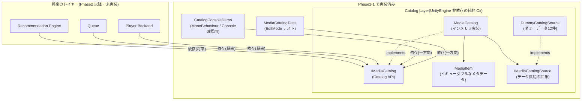
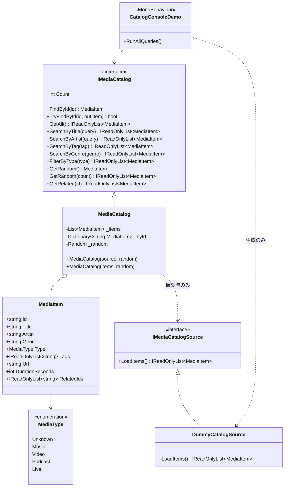

# Phase1-1: Catalog System 設計・実装ドキュメント

Smart Media Platform の土台となる Catalog System(メディア情報の管理・検索基盤)の実装記録です。
このフェーズでは再生・UI・ネットワーク・推薦は一切実装していません。

---

## 1. アーキテクチャ図

Catalog Layer は完全に独立しており、他レイヤーを一切知りません。
将来の上位レイヤーはすべて `IMediaCatalog`(Catalog API)だけを利用します。



依存の向きは常に「外 → Catalog」の一方向。逆方向の参照は asmdef(アセンブリ定義)で物理的に禁止しています(`SmartMediaPlatform.Catalog` は参照ゼロ・`noEngineReferences: true`)。

## 2. クラス図



## 3. ディレクトリ構成

```
Assets/SmartMediaPlatform/Catalog/
├── Runtime/                          … Catalog 本体(純粋 C#・UnityEngine 非依存)
│   ├── SmartMediaPlatform.Catalog.asmdef   (noEngineReferences: true / 参照ゼロ)
│   ├── MediaType.cs                  … メディア種別 enum
│   ├── MediaItem.cs                  … メタデータ(イミュータブル)
│   ├── IMediaCatalog.cs              … Catalog API(上位レイヤーの唯一の入口)
│   ├── IMediaCatalogSource.cs        … データ供給元の抽象
│   ├── MediaCatalog.cs               … インメモリ実装
│   └── Data/
│       └── DummyCatalogSource.cs     … ダミーデータ 12 件
├── Demo/                             … Console 確認用(Catalog に一方向依存)
│   ├── SmartMediaPlatform.Catalog.Demo.asmdef
│   └── CatalogConsoleDemo.cs
└── Tests/EditMode/                   … Unity Test Runner 用テスト(28 ケース)
    ├── SmartMediaPlatform.Catalog.Tests.asmdef
    └── MediaCatalogTests.cs
```

3 つの asmdef に分割した理由:

| asmdef | 役割 | 参照 |
|---|---|---|
| `SmartMediaPlatform.Catalog` | Catalog 本体 | なし(UnityEngine すら参照しない) |
| `SmartMediaPlatform.Catalog.Demo` | Console デモ | Catalog のみ |
| `SmartMediaPlatform.Catalog.Tests` | テスト | Catalog + TestRunner |

Catalog 本体に UnityEngine 参照を足そうとするとコンパイルエラーになるため、「Catalog は他を知らない」という制約が口約束でなくビルド設定として強制されます。

## 4. API 一覧

すべて `IMediaCatalog` 経由で利用します。戻り値のリストは常に非 null(該当なしは空リスト)。

| 要件 | API | 一致条件 | 備考 |
|---|---|---|---|
| ID 検索 | `FindById(id)` / `TryFindById(id, out item)` | 完全一致(大小無視) | 見つからなければ null / false |
| タイトル検索 | `SearchByTitle(query)` | 部分一致(大小無視) | 空・空白クエリは 0 件 |
| アーティスト検索 | `SearchByArtist(query)` | 部分一致(大小無視) | 〃 |
| タグ検索 | `SearchByTag(tag)` | 完全一致(大小無視) | 部分一致しない |
| ジャンル検索 | `SearchByGenre(genre)` | 完全一致(大小無視) | |
| 種別絞り込み | `FilterByType(type)` | enum 一致 | Video 拡張の入口(要件外だが追加) |
| ランダム取得 | `GetRandom()` / `GetRandom(count)` | — | count 版は重複なし・カタログ件数に自動クランプ。乱数はコンストラクタ注入可(テスト用) |
| 関連アイテム取得 | `GetRelated(id)` | RelatedIds を宣言順に解決 | 欠損 ID・自己参照は黙って除外 |
| 全件取得 | `GetAll()` | — | 登録順・読み取り専用ビュー |
| 件数 | `Count` | — | |

## 5. 設計レビュー

### SOLID との対応

- **S(単一責任)** — `MediaItem` はデータ、`MediaCatalog` は検索、`IMediaCatalogSource` は供給、Demo は表示。再生状態・お気に入りなどの「状態」はカタログに存在しない。
- **O(開放閉鎖)** — 新メディア種別は `MediaType` の追加のみ。新データ源(ScriptableObject / JSON)は `IMediaCatalogSource` の新実装のみで、`MediaCatalog` は無変更。
- **L(置換可能)** — `IMediaCatalog` の契約(非 null リスト・空クエリは空結果)を明文化し、テストで固定。
- **I(インターフェース分離)** — 上位レイヤーには読み取り専用の `IMediaCatalog` だけを見せる。書き込み API は存在しない(事前生成カタログ方式と一致)。
- **D(依存性逆転)** — 上位は抽象 `IMediaCatalog` に依存。乱数(`System.Random`)も注入可能でテスト決定性を確保。

### 意図的に「やらなかった」こと

- **転置インデックス等の最適化** — 10〜数百件の線形走査で十分。早すぎる最適化を回避(将来改善点参照)。
- **スコアリング型の関連取得** — 「タグ類似度で関連を計算する」のは Recommendation Engine(Phase4)の責務。カタログは Catalog Builder が事前計算した `RelatedIds` を解決するだけに留め、レイヤー境界を守った。
- **URL の型付け(VRCUrl)** — VRCUrl は実行時生成不可のため Phase1 では文字列メタデータ。VRCUrl 化は Udon 境界(Phase2)で行う。

### 既知のトレードオフ

- タイトル検索は `OrdinalIgnoreCase` の部分一致。日本語の表記ゆれ(ひらがな/カタカナ等)は正規化しない(Catalog Builder 側で検索用正規化文字列を持たせる方が正しい)。
- `MediaCatalog` は構築後イミュータブル。実行時のカタログ更新は要件外(事前生成方式)なので非対応が正。

## 6. 将来改善点

1. **検索インデックス** — 件数が数千を超えたらタグ/ジャンル/アーティストの `Dictionary<string, List<MediaItem>>` 転置インデックスを `MediaCatalog` 内部に追加(API 無変更で入替可能)。
2. **検索用正規化** — Catalog Builder がタイトル読み仮名・正規化文字列を `MediaItem` に事前生成し、日本語の表記ゆれに対応。
3. **ページング** — カタログ大規模化時に `GetAll(offset, limit)` 追加を検討。
4. **シリアライズ形式** — `MediaItem` は現在コンストラクタ生成のみ。Phase2 で JSON / ScriptableObject との相互変換 DTO を追加。
5. **UdonSharp 適応層** — 下記「引き継ぎ事項」参照。C# の interface / Dictionary は UdonSharp では使えないため、ワールド内実行用の変換層が必要。

## 7. Phase1-2 へ向けた引き継ぎ事項

1. **上位レイヤーの入口は `IMediaCatalog` のみ。** Recommendation Engine のプロトタイプは `new MediaCatalog(new DummyCatalogSource())` を受け取ればそのまま開発を始められる(`GetRelated` + `SearchByTag` + `GetRandom` が推薦の種)。
2. **データ供給の差し替え口は `IMediaCatalogSource`。** Catalog Builder(PC ツール)の出力(JSON 等)を読む `JsonCatalogSource` を実装すれば、`MediaCatalog` と全上位コードは無変更で本番データに切り替わる。
3. **VRChat ワールド内(Udon)では現行コードはそのまま動かない。** UdonSharp は interface・ジェネリック Dictionary・カスタムクラスの制約が強い。ワールド持ち込み時は、
   - Catalog Builder が本コードと同じデータモデルから **並列配列(string[] ids, titles… + VRCUrl[])** を生成して UdonSharpBehaviour に焼き込む、または
   - VRC の `DataDictionary` / `DataList` に変換する
   適応層(アダプタ)を Phase2/3 で追加する。**検索仕様(部分一致・大小無視などの契約)は本実装とテストを正として移植すること。**
4. **`RelatedIds` の整合性は Catalog Builder の責務。** ランタイムは欠損 ID を黙ってスキップする防御的実装だが、ビルド時に全 ID 解決チェックを行うこと(テスト `DummyData_AllRelatedIdsResolve` が雛形)。
5. **ダミーデータは削除しない。** テストとデモが依存している。本番ソース追加後も `DummyCatalogSource` は開発用として維持。

## 8. 提案書(Smart Media Platform)全体の実現可能性

提案書の構想は **VRChat SDK の制約の範囲で実現可能** です。ポイントごとの評価:

| 構想 | 可否 | 根拠・条件 |
|---|---|---|
| 事前生成カタログ方式 | ✅ 可能 | VRCUrl は実行時生成不可(提案書の調査どおり)。エディタ時に `VRCUrl[]` を焼き込む方式は定番で確実 |
| Catalog Builder(PC ツール) | ✅ 可能 | YouTube Data API 等でメタデータ取得 → 本リポジトリのデータモデルへ変換。Catalog 層が UnityEngine 非依存なのでツール側でもそのまま再利用可 |
| おすすめ・自動連続再生・シャッフル | ✅ 可能 | カタログ内で完結するロジック。Udon で十分動く |
| 検索 UI・プレイリスト・履歴 | ✅ 可能 | Udon + UI。履歴・お気に入りの永続化は PlayerData(VRC Persistence)で可能 |
| 共有キュー・DJ モード・投票 | ⚠️ 条件付き | Udon の同期変数で実現可能だが同期容量に上限があるため、「カタログの ID(短い文字列/int)だけを同期する」設計が必須。本実装の ID 方式はそれを見越している |
| カタログの後日更新 | ⚠️ 条件付き | `VRCStringDownloader` で JSON メタデータの実行時取得は可能。ただし **再生 URL 自体はワールドに焼き込んだ VRCUrl に限られる**ため、「URL はビルド時固定・メタデータのみ更新」というハイブリッドが現実解 |
| AI 推薦(Phase6) | ⚠️ 条件付き | ワールド内でのモデル実行は非現実的。Catalog Builder 側で事前計算(埋め込み類似度→ RelatedIds に焼き込み)する方式なら可能。本実装の `RelatedIds` はその受け皿 |

結論: **提案書の全機能は「事前計算を PC 側に寄せ、ワールド内は ID 参照で完結させる」方針なら到達可能。** 本 Phase の Catalog System はその方針に沿って設計済み。

## 9. Unity でのテスト方法

### 前提

Unity プロジェクト(VCC で作成した VRChat ワールドプロジェクトでも、素の Unity プロジェクトでも可)の `Assets/` に本リポジトリの `Assets/SmartMediaPlatform` フォルダをコピー(またはリポジトリ自体をプロジェクトとして開く)。VRChat SDK は不要(Phase1 は SDK 非依存)。

### A. 自動テスト(Unity Test Runner)— 推奨

1. メニュー **Window > General > Test Runner** を開く
2. **EditMode** タブを選択
3. `SmartMediaPlatform.Catalog.Tests` 配下に 28 テストが表示される
4. **Run All** を押す → 全件緑になれば OK(Play 不要・数秒で完了)

CLI で回す場合(CI 用):

```
Unity -batchmode -projectPath <path> -runTests -testPlatform EditMode -testResults results.xml
```

### B. Console での動作確認(完了条件の確認)

1. 適当なシーンで空の GameObject を作成(例: `CatalogDemo`)
2. `CatalogConsoleDemo` コンポーネントをアタッチ
3. **Play を押す** → Console に全 API の実行結果が出力される
   - もしくは Play せずに、コンポーネント右上の **⋮ メニュー > Run All Queries** でも実行可能
4. Inspector の各クエリ欄(タイトル・アーティスト・タグ等)を書き換えて再実行すると、任意の検索を試せる

出力例:

```
=== Smart Media Platform / Catalog Demo (items: 12) ===
GetAll() -> 12 件
    [music-001] Neon Skyline / Aurora Drive (Music, Synthwave)
    ...
SearchByTitle("neon") -> 2 件
    [music-001] Neon Skyline / Aurora Drive (Music, Synthwave)
    [video-001] Neon Skyline (Official Video) / Aurora Drive (Video, Synthwave)
GetRelated("music-001") -> 2 件
    [music-002] Midnight Circuit / Aurora Drive (Music, Synthwave)
    [music-007] Static Bloom / Glasshouse Signal (Electronic)
```

### 参考: Unity なしでの検証

Catalog 本体は UnityEngine 非依存の純粋 C# のため、mono / .NET だけでもコンパイル・実行できます(本 Phase の開発時も mono 上で全 API の動作検証を実施済み)。
