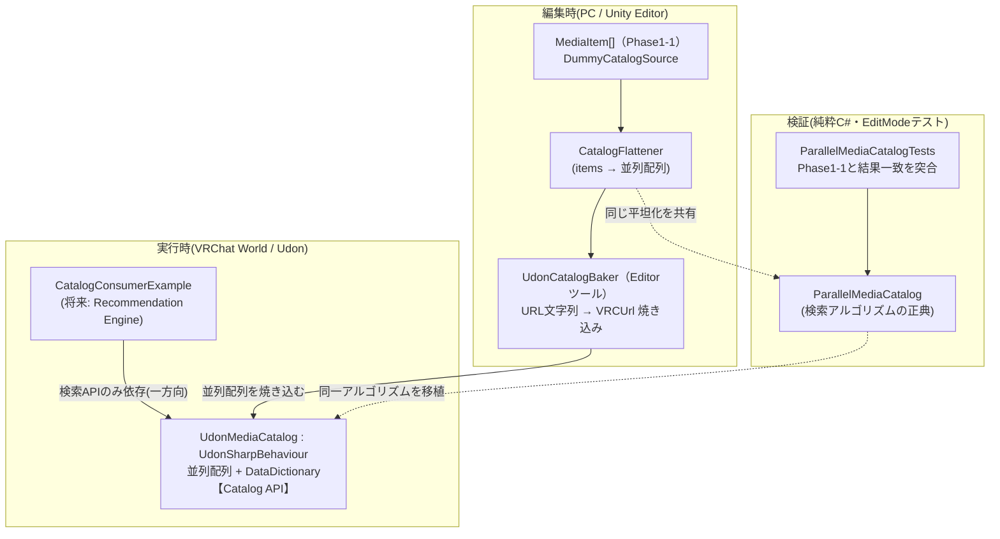
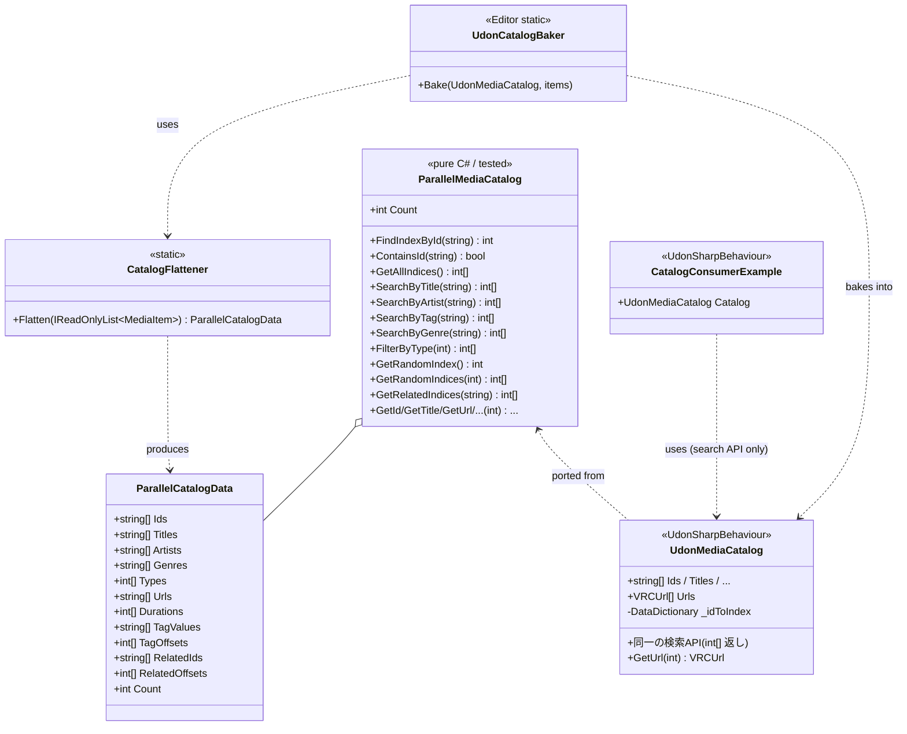

# Phase1-2: Udon Compatibility Layer 設計・実装ドキュメント

Phase1-1 の Catalog Layer(純粋 C# のオブジェクトモデル)を、**設計思想を維持したまま UdonSharp で利用できる Adapter 層**に変換した記録です。

再生・UI・ネットワーク・推薦本体は引き続き実装していません(Phase1-1 の禁止事項を継続)。

---

## 0. なぜ Adapter 層が必要か

Phase1-1 は「Catalog は他レイヤーを知らない」を守るため、`interface` / ジェネリック `Dictionary` / カスタムクラス(`MediaItem`)で構築しました。しかし VRChat ワールド内で動く **UdonSharp はこれらをそのまま扱えません**:

| Phase1-1 で使った構造 | UdonSharp | Phase1-2 の代替 |
|---|---|---|
| `interface IMediaCatalog` | ❌ 不可 | 具象 `UdonSharpBehaviour`(`UdonMediaCatalog`) |
| `Dictionary<string, MediaItem>` | ❌ ジェネリック不可 | VRChat の `DataDictionary`(id→index) |
| `MediaItem`(カスタムクラス)の配列返し | ❌ 不可 | **並列配列 + index(`int[]`)返し** |
| `string[][]`(タグのジャグ配列) | △ 不安定 | **CSR(平坦化配列 + オフセット)** |
| `IReadOnlyList<T>` | ❌ 不可 | `int[]` |

Adapter 層は Phase1-1 を**書き換えず**、その隣に「Udon が食べられる形」を用意します。Phase1-1 はオーサリング/ビルド側の正典(Catalog Builder のドメイン)として残り、Udon 層は焼き込み後のランタイム標的になります。これは Phase1-1 引き継ぎ事項 §7 の設計そのものです。

## 1. アーキテクチャ図



- **依存方向は常に一方向**: Consumer(将来の Recommendation Engine)→ `UdonMediaCatalog`。カタログは上位を知らない(Phase1-1 の思想を維持)。
- **検索ロジックの二重化は Udon 制約上不可避**(Udon はユーザ静的クラスを呼べない)。そこで純粋 C# の `ParallelMediaCatalog` を**テスト済みの正典**として置き、`UdonMediaCatalog` はそれを行単位で移植。両者は同じ並列配列レイアウト・同じ手順。
- **平坦化(items→配列)は 1 箇所に集約**(`CatalogFlattener`)。ベイカーとテストが共有する。

## 2. クラス図



## 3. ディレクトリ構成(Phase1-2 追加分)

```
Assets/SmartMediaPlatform/Catalog/
├── Runtime/                              … Phase1-1(純粋C#・変更なし)
│   ├── (MediaItem / IMediaCatalog / MediaCatalog ...)
│   └── Parallel/                         ★ Phase1-2 追加(純粋C#・UnityEngine非依存)
│       ├── MediaTypeCode.cs              … MediaType の int ワイヤー値
│       ├── ParallelCatalogData.cs        … 並列配列フォーマット(CSR)
│       ├── CatalogFlattener.cs           … MediaItem[] → 並列配列(変換の唯一の口)
│       └── ParallelMediaCatalog.cs       … 検索アルゴリズムの正典(テスト対象)
├── Udon/                                 ★ Phase1-2 追加(UdonSharp / VRChat SDK 依存)
│   ├── UdonMediaCatalog.cs               … Adapter 本体(並列配列+DataDictionary)
│   ├── CatalogConsumerExample.cs         … Rec Engine 想定の利用サンプル(Console確認)
│   └── Editor/
│       └── UdonCatalogBaker.cs           … Phase1-1 → Udon 焼き込みツール
├── Demo/                                 … Phase1-1
└── Tests/EditMode/
    ├── MediaCatalogTests.cs              … Phase1-1
    └── ParallelMediaCatalogTests.cs      ★ Phase1-2 追加(Phase1-1と結果一致を突合)
```

**アセンブリ分離の意図:**

- `Parallel/` は Phase1-1 と同じ `SmartMediaPlatform.Catalog` asmdef(`noEngineReferences: true`)に属す → UnityEngine 非依存を維持、そのまま EditMode テスト可能。
- `Udon/` は **asmdef を置かず** 既定の `Assembly-CSharp` に載せる。これが UdonSharp/VRChat SDK が最も確実に効く配置(SDK の asmdef 名に依存しないため、SDK バージョン差で壊れにくい)。
- `Udon/Editor/` は `Assembly-CSharp-Editor` に載り、`SmartMediaPlatform.Catalog`(auto-referenced)と `UdonMediaCatalog` の両方を参照できる。

## 4. API 一覧(Phase1-1 ↔ Udon 対応表)

Udon はカスタムクラスを返せないため、**全検索 API は「カタログ内 index の配列(`int[]`)」を返し**、値はアクセサ(`GetTitle(index)` 等)で取り出します。index はカタログ不変ゆえ安定で、**同期に最適**(共有キューは重い文字列でなく index/ID を同期できる)。

| Phase1-1 (`IMediaCatalog`) | Udon (`UdonMediaCatalog`) | 意味論 |
|---|---|---|
| `FindById(id) : MediaItem` | `FindIndexById(id) : int`（未found=-1） | 完全一致・大小無視 |
| `TryFindById(...)` | `ContainsId(id) : bool` | 〃 |
| `GetAll()` | `GetAllIndices() : int[]` | 登録順 |
| `SearchByTitle(q)` | `SearchByTitle(q) : int[]` | 部分一致・大小無視・空→0件 |
| `SearchByArtist(q)` | `SearchByArtist(q) : int[]` | 〃 |
| `SearchByTag(tag)` | `SearchByTag(tag) : int[]` | 完全一致・大小無視 |
| `SearchByGenre(g)` | `SearchByGenre(g) : int[]` | 完全一致・大小無視 |
| `FilterByType(MediaType)` | `FilterByType(int) : int[]` | int ワイヤー値(`TypeMusic` 等) |
| `GetRandom()` | `GetRandomIndex() : int` | 空=-1 |
| `GetRandom(count)` | `GetRandomIndices(count) : int[]` | 重複なし・件数クランプ |
| `GetRelated(id)` | `GetRelatedIndices(id) : int[]` | 宣言順・自己参照/欠損スキップ |
| `Count` | `Count` | — |
| `item.Title` 等 | `GetTitle(index)` / `GetArtist` / `GetGenre` / `GetMediaType` / `GetDurationSeconds` / `GetTagCount`+`GetTag(index,i)` | フィールドアクセサ |
| `item.Url`(string) | `GetUrl(index) : VRCUrl` | Player backend が直接消費 |

検索の意味論は Phase1-1 と**完全一致**することを、`ParallelMediaCatalogTests` が Phase1-1 の `MediaCatalog` と結果を突合して(順序込みで)保証しています。

### Recommendation Engine からの使い方(実例)

`CatalogConsumerExample` が「次に再生する候補」を Catalog API だけで組み立てる最小推薦を実演します:

```csharp
int seed = Catalog.FindIndexById("music-001");
int[] related = Catalog.GetRelatedIndices("music-001");        // まず関連
int[] sameGenre = Catalog.SearchByGenre(Catalog.GetGenre(seed)); // 次に同ジャンル
int[] fallback = Catalog.GetRandomIndices(Catalog.Count);       // 最後にランダム
// → 重複を除いて N 件に詰める(seed 自身は除外)
VRCUrl next = Catalog.GetUrl(picked);                           // Player へ渡す
```

将来の Recommendation Engine は `UdonMediaCatalog` への参照を 1 本持てば、この形でそのまま開発を始められます。

## 5. 設計レビュー

### Phase1-1 の設計思想をどう維持したか

- **Catalog は他レイヤーを知らない** — `UdonMediaCatalog` は `CatalogConsumerExample` や Rec Engine を一切参照しない。依存は Consumer → Catalog の一方向のみ。
- **読み取り専用・事前生成** — 実行時にカタログは変化しない。データは編集時にベイクされ、ランタイムは検索するだけ。書き込み API は存在しない。
- **検索契約の同一性** — 部分一致/完全一致/大小無視/空クエリ0件/関連の自己参照・欠損スキップ、すべて Phase1-1 と一致(テストで突合)。

### SOLID の Udon への読み替え

- **S(単一責任)**: データ保持(並列配列)・変換(`CatalogFlattener`)・検索(`UdonMediaCatalog`)・利用(`CatalogConsumerExample`)を分離。
- **O(開放閉鎖)**: 新メディア種別は int 定数追加のみ。新データ源は `CatalogFlattener` の入力を差し替えるだけで `UdonMediaCatalog` は無変更。
- **D(依存性逆転)**: Udon では interface が使えないため、**具象コンポーネント参照**が抽象の役割を担う。Rec Engine は `UdonMediaCatalog` 型フィールド越しにだけ触る(実装詳細=並列配列/DataDictionary には触れない)。

### 意図的なトレードオフ

- **index 返し** — MediaItem を返せない代償だが、同期親和性という副次利益がある(提案書の共有キュー/DJ/投票に効く)。
- **検索ロジックの二重定義**(`ParallelMediaCatalog` と `UdonMediaCatalog`)— Udon がユーザ静的メソッドを呼べない制約上、避けられない。**リスクは「テスト済みの純粋版を正典にし、Udon 版はその移植」**という関係で抑えている。両者がずれれば、純粋版のテストが仕様、Udon 版がそれに追従する。
- **線形探索** — タグ/ジャンル/タイトルは O(n) 走査。カタログ数百件までは十分。ID だけは頻出のため DataDictionary で O(1) 化。

## 6. 実現可能性の確認(このフェーズで確かめたこと)

- **UdonSharp で interface/Dictionary/カスタムクラスを使わずに Catalog API を再現できるか** → **可能**。並列配列 + `int[]` 返し + `DataDictionary` で全 API を表現でき、意味論も Phase1-1 と一致(純粋版テストで実証)。
- **VRCUrl 制約との整合** → URL 文字列からの `VRCUrl` 生成は**編集時のベイカー内でのみ**行い、ランタイムは焼き込み済み `VRCUrl[]` を index で引く。実行時生成不可(Phase0 の結論)を侵さない。
- **Recommendation Engine から使えるか** → **可能**。`CatalogConsumerExample` が関連+同ジャンル+ランダムで「次の候補」を組む実例を提示済み。

## 7. Unity でのテスト方法

### A. アルゴリズム検証(VRChat SDK 不要)— Unity Test Runner

`Parallel/` と Tests は純粋 C# のため、**SDK なしのプレーンな Unity プロジェクトでも**回せます。

1. `Assets/SmartMediaPlatform` をプロジェクトへコピー
2. **Window > General > Test Runner > EditMode**
3. `ParallelMediaCatalogTests`(約30ケース)を **Run All**
4. 全緑 = 並列配列版が Phase1-1 と同一結果、を意味する

CLI(CI):
```
Unity -batchmode -projectPath <path> -runTests -testPlatform EditMode -testResults results.xml
```

> 参考: 本フェーズの開発時、この環境の mono 上で `ParallelMediaCatalog` を Phase1-1 `MediaCatalog` と全 API 突合し **ALL PASS** を確認済み(タイトル/アーティスト/タグ/ジャンル/種別/関連/ランダムを順序込みで一致)。UdonSharp 自体のコンパイルは SDK が必要なため Unity 側で行う。

### B. 実機(Udon)動作確認 — VRChat SDK + UdonSharp が必要

前提: **VCC で作成した VRChat World プロジェクト**に、UdonSharp(VRChat Worlds SDK に同梱)が入っていること。`Assets/SmartMediaPlatform` をそのプロジェクトへコピー。

1. Hierarchy に空の GameObject を作成(例 `MediaCatalog`)
2. `UdonMediaCatalog`(UdonSharpBehaviour)をアタッチ
3. その GameObject を選択したまま、メニュー **Tools > Smart Media Platform > Bake Dummy Catalog Into Selected** を実行
   → Phase1-1 のダミー12件が並列配列 + `VRCUrl[]` としてコンポーネントに焼き込まれる(Console に `Baked 12 items` と出る)
4. 別の空 GameObject に `CatalogConsumerExample` をアタッチし、Inspector の `Catalog` に手順2のコンポーネントを割り当て
5. **Play** を押す → Console に全 API の結果と「次の候補」が出力される

出力イメージ:
```
=== Smart Media Platform / Udon Catalog Demo (items: 12) ===
GetAllIndices() -> 12 件
    [music-001] Neon Skyline / Aurora Drive (type=1, Synthwave, url=https://example.com/media/neon-skyline)
    ...
SearchByTag("night") -> 5 件
    ...
Recommendation from "Neon Skyline" -> 3 件
    next: [music-002] Midnight Circuit / Aurora Drive (...)
    next: [music-007] Static Bloom / Glasshouse Signal (...)
    next: ...
```

> 手順3のベイクは、UdonSharp のプロキシ同期をリフレクションで呼びます(バージョン差で壊れないよう設計)。同期がスキップされた場合でも、シーン保存/ビルド時に UdonSharp が自動反映します。Inspector で並列配列を直接編集して焼き込みなしで使うことも可能です。

## 8. Phase1-3 へ向けた引き継ぎ事項

1. **Recommendation Engine は `UdonMediaCatalog` への参照 1 本だけ持てばよい。** `CatalogConsumerExample` の推薦ロジックがそのまま出発点。カタログの内部表現(並列配列/DataDictionary)には触れず、`Get*Indices` / `Get*(index)` だけを使うこと。
2. **同期は index か ID で。** Queue / 共有キューを作る際、`MediaItem` ではなく **index(int)または ID(short string)を同期**する。`UdonMediaCatalog` は index↔ID↔フィールドの相互変換を提供済み。
3. **本番データへの差し替えは `CatalogFlattener` の入力を替えるだけ。** Catalog Builder(YouTube 等)が出力する `MediaItem[]` 相当を用意し、`UdonCatalogBaker.Bake(target, items)` に渡せば `UdonMediaCatalog` は無変更で本番データになる。VRCUrl はベイク時に生成される。
4. **URL はビルド時固定が原則。** メタデータの後日更新(`VRCStringDownloader` + `VRCJson` → 並列配列再構築)は将来可能だが、**再生 URL 自体はワールドに焼き込んだ `VRCUrl[]` に限られる**。「URL 固定・メタデータ可変」のハイブリッドを Phase 側で設計すること。
5. **検索仕様の正典は `ParallelMediaCatalog` + そのテスト。** Udon 版に手を入れるときは、まず純粋版とテストを更新し、Udon 版をそれに追従させる(二重定義のドリフト防止)。
6. **`MediaTypeCode` / `UdonMediaCatalog.Type*` / Phase1-1 `MediaType` の 3 者は値を一致させ続けること**(Music=1…Live=4)。
