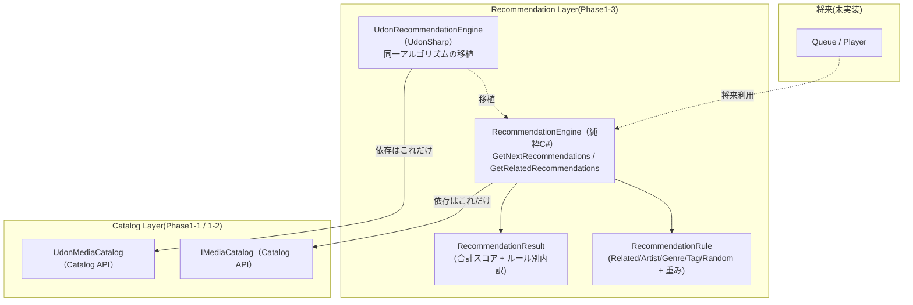
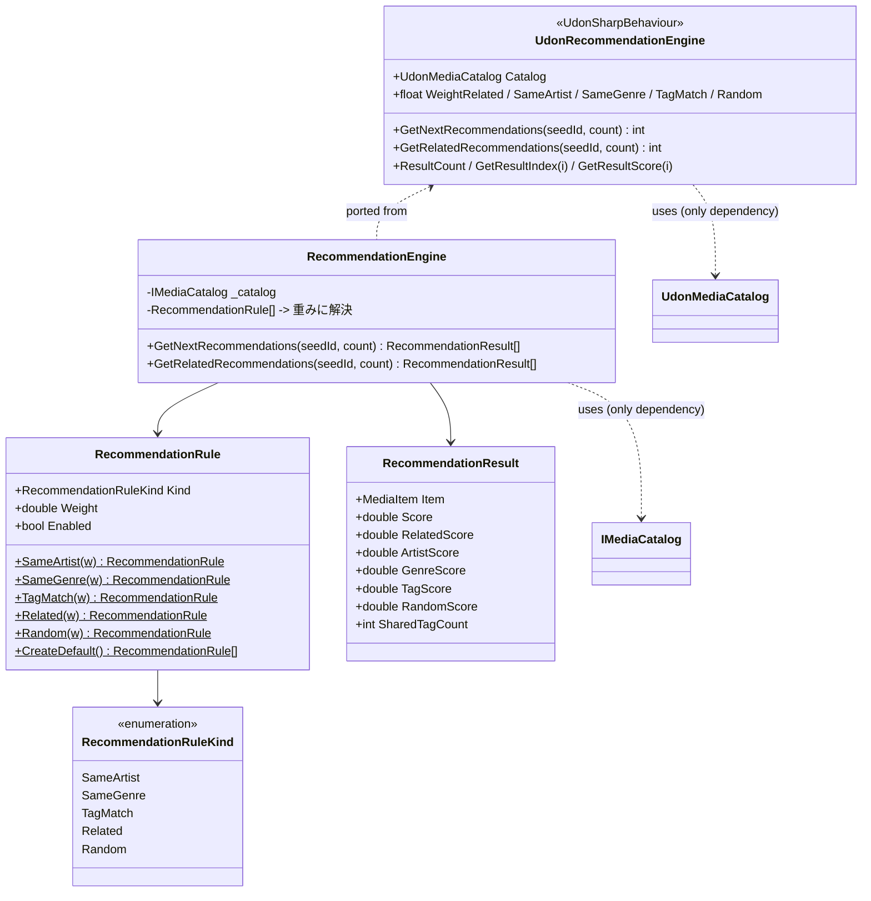

# Phase1-3: Recommendation Engine 設計・実装ドキュメント

Catalog System の上に、**ルールベース(AI 非使用)のおすすめエンジン**を実装した記録です。
このフェーズの目的は「おすすめ機能の土台」を作ることで、Player / Queue / UI / AI / ネットワークは実装していません。

Phase1-2 と同じ方針で、**純粋 C# 版(テスト・Console確認の正典)と Udon 版(実機)** の二層で提供します。

---

## 1. アーキテクチャ図

Recommendation Engine は Catalog API の**上に**乗り、Catalog にのみ依存します。逆に Catalog は Recommendation を知りません(依存は上向き一方向)。



- **「Catalog 依存以外を持たない」を asmdef で物理的に強制。** `SmartMediaPlatform.Recommendation` の参照は `SmartMediaPlatform.Catalog` **のみ**、かつ `noEngineReferences: true`。Player/Queue/UI/ネットワーク/UnityEngine を参照しようとするとコンパイルエラーになる。
- 純粋版と Udon 版はスコア式・既定重み・並び順を一致させ、純粋版のテストが仕様、Udon 版がそれに追従する(Phase1-2 と同じ規律)。

## 2. クラス図



## 3. ディレクトリ構成(Phase1-3 追加分)

```
Assets/SmartMediaPlatform/Recommendation/
├── Runtime/                                   … 純粋C#(UnityEngine非依存 / Catalogのみ参照)
│   ├── SmartMediaPlatform.Recommendation.asmdef   (references: [SmartMediaPlatform.Catalog] のみ)
│   ├── RecommendationRuleKind.cs
│   ├── RecommendationRule.cs
│   ├── RecommendationResult.cs
│   └── RecommendationEngine.cs
├── Demo/                                      … Console確認(純粋版・SDK不要)
│   ├── SmartMediaPlatform.Recommendation.Demo.asmdef
│   └── RecommendationConsoleDemo.cs
├── Udon/                                      … UdonSharp(既定Assembly-CSharp)
│   ├── UdonRecommendationEngine.cs
│   └── UdonRecommendationConsoleDemo.cs
└── Tests/EditMode/
    ├── SmartMediaPlatform.Recommendation.Tests.asmdef
    └── RecommendationEngineTests.cs
```

## 4. API 一覧

### 純粋 C#(`RecommendationEngine`)

| API | 戻り値 | 説明 |
|---|---|---|
| `GetNextRecommendations(seedId, count)` | `RecommendationResult[]` | カタログ全体から次のおすすめ上位 count 件。seed 自身は除外。未知 seed / count≤0 は空 |
| `GetRelatedRecommendations(seedId, count)` | `RecommendationResult[]` | seed の RelatedIds だけを対象にスコア付けした上位 count 件。関連なしは空 |

`RecommendationResult` は合計スコア(`Score`)とルール別内訳(`RelatedScore` / `ArtistScore` / `GenreScore` / `TagScore` / `RandomScore` / `SharedTagCount`)を保持し、Console で順位と内訳を確認できる。

### Udon(`UdonRecommendationEngine`)

Udon はカスタムクラス配列を返せないため、結果は内部バッファに格納し件数を返す:

| API | 戻り値 | 説明 |
|---|---|---|
| `GetNextRecommendations(seedId, count)` | `int`(件数) | 結果を内部バッファに格納 |
| `GetRelatedRecommendations(seedId, count)` | `int`(件数) | 〃 |
| `ResultCount` / `GetResultIndex(i)` / `GetResultScore(i)` / `GetResultId(i)` | — | 直近結果の読み取り |

## 5. スコアリング仕様

各候補について、有効なルールの寄与(重み × 素の信号)を合計する。並び順は **スコア降順 → カタログ登録順(index 昇順)** で決定的。

| ルール | 素の信号 | 既定重み |
|---|---|---|
| Related | 候補が seed の RelatedIds に含まれる(1/0) | **10.0** |
| SameArtist | アーティスト一致(1/0、大小無視) | 5.0 |
| SameGenre | ジャンル一致(1/0、大小無視) | 3.0 |
| TagMatch | seed と共有するタグ数 | 1.0 / 個 |
| Random | [0, 重み) の乱数(同点崩し) | 0.5 |

RelatedIds を最重視するのは、それが Catalog Builder が事前に選んだ「キュレーション済みの信号」だから。Random は小さく保ち、明確な差がある順位を覆さない。

### ダミーデータでの期待順位(seed = `music-001`「Neon Skyline」/ Aurora Drive / Synthwave / tags[night,drive,retro] / related[music-002, music-007])

`GetNextRecommendations("music-001", 6)`(Random=0):

| 順位 | ID | Related | Artist | Genre | Tag | 合計 |
|---|---|---|---|---|---|---|
| 1 | music-002 | 10 | 5 | 3 | 1 (night) | **19** |
| 2 | music-007 | 10 | – | – | – | **10** |
| 3 | video-001 | – | 5 | 3 | 2 (night,retro) | **10** |
| 4 | music-003 | – | – | – | 1 (night) | 1 |
| 5 | music-006 | – | – | – | 1 (night) | 1 |
| 6 | music-008 | – | – | – | 1 (retro) | 1 |

2 位と 3 位は同点 10 → カタログ登録順で music-007(先)→ video-001(後)。

`GetRelatedRecommendations("music-001", 10)` → 対象は related[music-002, music-007] のみ:

| 順位 | ID | 合計 |
|---|---|---|
| 1 | music-002 | 19 |
| 2 | music-007 | 10 |

この順位・スコアは `RecommendationEngineTests` が固定値で突き合わせて保証している(この環境の mono でも同結果を確認済み)。

## 6. 設計レビュー

### 完了条件との対応

- **ダミーデータで期待通りの順位になる** → §5 の表を `RecommendationEngineTests` が固定値検証。
- **Console で順位とスコアを確認できる** → 純粋版 `RecommendationConsoleDemo`(SDK 不要)/ Udon 版 `UdonRecommendationConsoleDemo`。内訳付きで出力。
- **Catalog API のみを利用** → engine は `IMediaCatalog` の `FindById` / `GetAll` / `GetRelated` だけを使う。
- **Catalog への依存以外を持たない** → asmdef 参照を `SmartMediaPlatform.Catalog` のみに制限 + `noEngineReferences: true`。Player/Queue/UI/AI/ネットワークはアセンブリレベルで参照不能。

### SOLID

- **S**: ルール(`RecommendationRule`)/ 結果(`RecommendationResult`)/ 合成(`RecommendationEngine`)を分離。
- **O**: 新しいスコア基準は `RecommendationRuleKind` 追加 + engine の switch に 1 分岐足すだけ。既存ルールの重み変更・無効化はコード変更なし(データ駆動)。
- **D**: engine は具象 `MediaCatalog` でなく抽象 `IMediaCatalog` に依存。乱数も注入可能でテスト決定的。

### トレードオフ

- **ルール = ポリモーフィズムではなくデータ(種類+重み)**。純粋版では戦略パターンも選べたが、Udon はデリゲート/多態配列を扱えないため、両版の一致を優先して「種類 enum + 重み + engine 側 switch」にした。
- **線形スキャン**。`GetNextRecommendations` はカタログ全件を走査 O(n)。数百件までは十分。大規模化時は候補を関連/同タグに事前絞り込みする余地(将来改善)。

## 7. Unity でのテスト方法

### A. アルゴリズム検証(SDK不要)— Test Runner

1. `Assets/SmartMediaPlatform` をプロジェクトへコピー
2. **Window > General > Test Runner > EditMode**
3. `SmartMediaPlatform.Recommendation.Tests > RecommendationEngineTests` を **Run All**
4. 全緑 = §5 の期待順位・スコア・同点崩し・重み効果・乱数範囲が満たされている

### B. Console 確認(純粋版・SDK不要)

1. 空の GameObject に `RecommendationConsoleDemo` をアタッチ
2. **Play**、または ⋮ メニュー > **Run Recommendations**
3. Console 出力例:
   ```
   === Recommendation Demo (seed: [music-001] Neon Skyline / Aurora Drive (Music, Synthwave)) ===
   GetNextRecommendations("music-001", 5) -> 5 件
     #1  music-002    score= 19.00  (related=10, artist=5, genre=3, tag=1×1, rand=0.00)  Midnight Circuit / Aurora Drive
     #2  music-007    score= 10.xx  ...
     ...
   ```
4. Inspector で seed / count / 各重みを変えて再実行できる

### C. 実機(Udon)— VRChat SDK + UdonSharp

1. Phase1-2 の手順で `UdonMediaCatalog` を用意しダミーデータをベイク
2. 空の GameObject に `UdonRecommendationEngine` をアタッチし、`Catalog` に手順1のコンポーネントを割り当て(重みは Inspector で調整可)
3. 別の GameObject に `UdonRecommendationConsoleDemo` をアタッチし、`Engine` に手順2を割り当て
4. **Play** → Console におすすめ順位とスコアが出力される

## 8. Phase1-4 以降へ向けた引き継ぎ事項

1. **Queue / Player は `RecommendationEngine`(または `UdonRecommendationEngine`)の出力を消費するだけ**にする。エンジンは Queue を知らないので、「次に積む」判断は上位が行う。
2. **重みチューニングはデータで完結**。`RecommendationRule` の重み(Udon は Inspector の float)を変えるだけで挙動を調整できる。コードは触らない。
3. **AI 推薦(Phase6)への拡張点**は 2 つ:(a) `RecommendationRuleKind` に新ルール(例: 埋め込み類似度)を追加、(b) 類似度は Catalog Builder が事前計算して `RelatedIds` / 新フィールドに焼き込み、ランタイムは既存の Related ルールで受ける。ワールド内での重い計算は避ける。
4. **スコア仕様の正典は `RecommendationEngine` + そのテスト**。Udon 版に手を入れるときは、まず純粋版とテストを更新し、Udon 版を追従させる(ドリフト防止)。
5. **既定重みは純粋版 `RecommendationRule.CreateDefault()` と Udon 版 `UdonRecommendationEngine` の float 初期値を一致させ続けること**(Related10 / Artist5 / Genre3 / Tag1 / Random0.5)。
