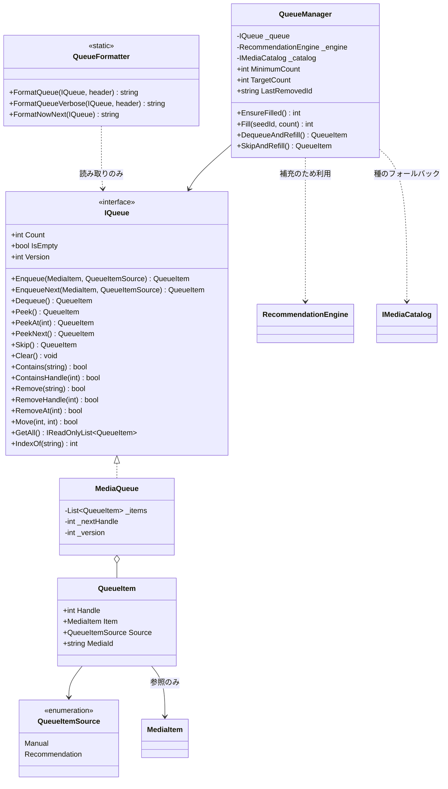
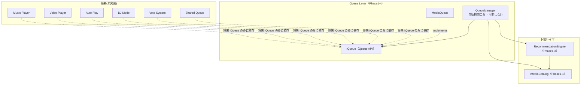

# Phase1-4: Queue System 設計・実装ドキュメント

Recommendation Engine が決定した曲を管理する **純粋な Queue System** の実装記録です。
再生・UI・ネットワーク・VRChat SDK には一切依存しません(再生は Phase1-5 以降)。

---

## 1. クラス図



### 依存関係(レイヤー図)



**Queue は Catalog と Recommendation しか知りません。** asmdef の参照を
`SmartMediaPlatform.Catalog` と `SmartMediaPlatform.Recommendation` のみに限定し、
`noEngineReferences: true` を設定しているため、Player・UI・ネットワーク・UnityEngine・VRChat SDK は
**アセンブリ参照レベルで到達不能**です(書こうとするとコンパイルエラーになります)。

## 2. ディレクトリ構成(Phase1-4 追加分)

```
Assets/SmartMediaPlatform/Queue/
├── Runtime/                                  … 純粋C#(UnityEngine/VRChat SDK 非依存)
│   ├── SmartMediaPlatform.Queue.asmdef       (references: Catalog, Recommendation のみ)
│   ├── QueueItemSource.cs                    … 積まれた経緯(Manual / Recommendation)
│   ├── QueueItem.cs                          … キュー1エントリ(Handle で個体識別)
│   ├── IQueue.cs                             … Queue API(上位はこれだけに依存)
│   ├── MediaQueue.cs                         … IQueue の実装
│   ├── QueueManager.cs                       … Recommendation 連携(自動補充のみ)
│   └── QueueFormatter.cs                     … Console 表示用の整形(純粋C#)
├── Demo/
│   ├── SmartMediaPlatform.Queue.Demo.asmdef
│   └── QueueConsoleDemo.cs                   … Console だけで状態確認できるデモ
└── Tests/EditMode/
    ├── SmartMediaPlatform.Queue.Tests.asmdef
    ├── MediaQueueTests.cs                    … 25 ケース
    ├── QueueManagerTests.cs                  … 13 ケース
    └── QueueFormatterTests.cs                … 6 ケース
```

## 3. Queue API 一覧

**位置の約束**: index 0 が「Now(現在の先頭)」、index 1 が「Next」。

| 要件 | API | 挙動 |
|---|---|---|
| Enqueue | `Enqueue(item, source = Manual)` | 末尾に追加。追加した `QueueItem` を返す |
| EnqueueNext | `EnqueueNext(item, source = Manual)` | **Now の直後(index 1)に割り込む**。空なら先頭 |
| Dequeue | `Dequeue()` | 先頭を取り出して取り除く。空なら null |
| Peek | `Peek()` | 先頭(= Now)を取り除かずに見る。空なら null |
| Skip | `Skip()` | 先頭を捨てて次へ。**戻り値は新しい先頭(次の Now)**。空になったら null |
| Clear | `Clear()` | 全消去 |
| Count | `Count` | 要素数(プロパティ) |
| Contains | `Contains(mediaId)` | Catalog ID で存在確認(大文字小文字無視) |
| Remove | `Remove(mediaId)` | その ID の**最初の1件**を削除。成功で true |
| Move | `Move(fromIndex, toIndex)` | 並べ替え。範囲外・同一位置は false |
| GetAll | `GetAll()` | 先頭から全件(読み取り専用ビュー) |

### 補助 API(拡張性のために追加)

| API | 目的 |
|---|---|
| `IsEmpty` | 空判定の明示 |
| `Version` | 変更のたびに増える版番号。**将来の同期・差分検知用**(UI 非依存の純粋カウンタ) |
| `PeekAt(index)` / `PeekNext()` | 任意位置 / Next の参照 |
| `ContainsHandle(handle)` / `RemoveHandle(handle)` | **同じ曲が複数ある場合に個体を一意に指す**。Vote / DJ Mode で必須になる |
| `RemoveAt(index)` | 位置指定削除 |
| `IndexOf(mediaId)` | 位置の取得 |

### 自動追加 API(`QueueManager`)

| API | 挙動 |
|---|---|
| `EnsureFilled()` | `Count < MinimumCount` なら `TargetCount` まで補充。追加件数を返す |
| `Fill(seedId, count)` | 種を明示して count 件補充(初期投入にも使う) |
| `DequeueAndRefill()` | 先頭を取り出し、その後に必要なら補充。取り出した曲を返す |
| `SkipAndRefill()` | 先頭を捨てて次へ進み、必要なら補充。新しい Now を返す |
| `MinimumCount` / `TargetCount` | 補充のしきい値と目標数(既定 2 / 5) |
| `LastRemovedId` | 直近に取り除いた曲。**キューが空でも「直前の曲」を種に補充を継続できる** |

補充の種は **「キュー末尾 → 直近に取り除いた曲 → カタログからランダム」** の順に決まり、
すでにキューにある曲は積みません。カタログを使い切った場合は何も追加せず終了します(無限ループしない)。

> **これは自動“再生”ではありません。** 曲を積むところまでで、再生は一切行いません。

## 4. Console 出力例

`QueueConsoleDemo` の **Run Queue Scenario**(課題指定のシナリオを再現):

```
=== Queue Scenario ===
Queue
1. music-001
2. music-004
3. music-010

Skip

Now
music-004
Next
music-010

Enqueue
music-003

Queue
1. music-004
2. music-010
3. music-003
```

**Run Auto Refill Scenario**(Recommendation Engine 連携):

```
=== Auto Refill Scenario ===
Queue (initial)
1. music-001  Neon Skyline / Aurora Drive  [Manual]

EnsureFilled() -> 4 件追加 (minimum=2, target=5)
Queue (after refill)
1. music-001  Neon Skyline / Aurora Drive  [Manual]
2. music-002  Midnight Circuit / Aurora Drive  [Recommendation]
3. music-007  Static Bloom / Glasshouse Signal  [Recommendation]
4. video-001  Neon Skyline (Official Video) / Aurora Drive  [Recommendation]
5. music-003  Paper Lanterns / Kohaku  [Recommendation]

SkipAndRefill()
Now
music-002
Next
music-007

Queue (after skip)
1. music-002  Midnight Circuit / Aurora Drive  [Recommendation]
...
```

`[Manual]` / `[Recommendation]` の表示で、**手動で積んだ曲と自動補充された曲が区別できます**。

## 5. 設計レビュー

### 完了条件との対応

| 完了条件 | 対応 |
|---|---|
| Queue が正常に動作する | `MediaQueueTests` 25 ケースで全 API を検証 |
| Recommendation Engine と連携できる | `QueueManager` + `QueueManagerTests` 13 ケース |
| Queue API が完成している | 指定 11 API すべて実装(§3) |
| ConsoleDemo がある | `QueueConsoleDemo`(2 シナリオ) |
| EditMode Test がすべて PASS | Queue 44 ケース、リポジトリ全体で **120 ケース PASS** |
| Player・UI・VRChat SDK に依存していない | asmdef 参照を Catalog/Recommendation のみに限定 + `noEngineReferences: true` |
| 将来 Shared Queue や DJ Mode を追加できる | 下記参照 |

### 将来拡張を支える3つの設計判断

1. **`IQueue` インターフェース** — 将来 Shared Queue(同期実装)を作るときは
   `IQueue` を実装する別クラスを用意するだけで、上位コード(Player / Auto Play / DJ Mode)は無変更。
2. **`QueueItem.Handle`(個体識別)** — 同じ曲を複数回積めるため、ID だけでは
   「どの1件か」を指せない。Vote(この1件に投票)や DJ Mode(この1件を移動)は
   ハンドルが無いと成立しないため、最初から用意した。
3. **`Version`(版番号)** — 変更を検知する手段。将来の同期・表示更新はこれをポーリングすれば足り、
   Queue 側がイベントや UI を知る必要がない(Udon はイベント/デリゲートが使えないため、
   コールバックでなくカウンタにしてある)。

### SOLID

- **S(単一責任)**: 並び順の管理(`MediaQueue`)/ 補充ポリシー(`QueueManager`)/ 表示整形(`QueueFormatter`)を分離。
  補充を Queue 本体に混ぜなかったので、「DJ Mode では補充しない」等は `QueueManager` の差し替えだけで済む。
- **O(開放閉鎖)**: 積まれた経緯は `QueueItemSource` の追加で拡張可能。
- **D(依存性逆転)**: `QueueManager` は具象 `MediaQueue` でなく `IQueue` に依存。

### トレードオフ

- **`GetAll()` はライブな読み取り専用ビュー**(スナップショットではない)。
  コピーを返さないので割り当てが発生しない反面、列挙中に変更すると例外になる。
  Queue は単一スレッド前提なので、性能を優先した。テストでこの挙動を固定している。
- **`Skip()` の戻り値は「新しい先頭」**(捨てた曲ではない)。課題の Console 例が
  Skip 後に `Now` を表示する形式のため、それに合わせた。捨てた曲が必要なら
  `Peek()` してから `Skip()` するか、`DequeueAndRefill()` を使う。

## 6. 将来改善点

1. **シャッフル / リピート** — 提案書の機能。`IQueue` に `Shuffle()` を足すか、
   並べ替えポリシーを `QueueManager` 側に持たせる(Queue 本体は素直な並びのままが良い)。
2. **履歴(Play History)** — 現在は `LastRemovedId` のみ。Phase1-5 で
   「直前 N 件」を保持する `QueueHistory` を分離して追加するのが自然。
3. **重複ポリシーの選択** — 現在の自動補充は重複を積まないが、
   手動 `Enqueue` は重複を許す。将来「重複を許さないモード」を `QueueManager` の設定に足せる。
4. **容量上限** — 無制限に積める。Shared Queue では同期容量の都合で上限が要る。
5. **Udon 版 Queue** — 本 Phase は「純粋な Queue」が要件なので未実装。
   ワールド持ち込み時は Phase1-2 と同じ方式(並列配列 + index)で移植する。

## 7. Phase1-5 への引き継ぎ事項

1. **Player は `IQueue` だけを見ること。** 再生開始は `Peek()` で取得、曲が終わったら
   `Skip()`(または `QueueManager.SkipAndRefill()`)を呼ぶ。Queue は再生状態を持たないので、
   再生位置・再生中フラグは Player 側が持つ。
2. **自動再生は Player の責務。** Queue は「積む」までしかしない。
   `QueueManager.SkipAndRefill()` は補充するが再生はしないので、
   Auto Play は「曲終了イベント → SkipAndRefill() → 新しい Now を再生」で組む。
3. **Udon へ持ち込むときは Phase1-2 の方式に従う。** `IQueue` は Udon で使えないため、
   `UdonMediaQueue : UdonSharpBehaviour` を作り、並列配列 + index で移植する。
   **API 仕様の正典は本実装とそのテスト**なので、まず純粋版を直してから Udon 版を追従させること。
4. **同期は index / ID / Handle で。** Shared Queue を作る際、`QueueItem` オブジェクトではなく
   カタログ index(int)と Handle(int)を同期する。`Version` を同期すれば差分検知に使える。
5. **`QueueItem.Handle` は Queue インスタンス内でのみ一意**(1 始まりの連番)。
   Shared Queue では全プレイヤーで一致させる必要があるため、
   ホストが採番して配布するか、採番規則を同期する設計にすること。

## 8. テスト方法

### A. 自動テスト(EditMode)— VRChat SDK 不要

1. `Assets/SmartMediaPlatform` を Unity プロジェクトの `Assets/` 直下にコピー
2. **Window > General > Test Runner** を開く
3. **EditMode** タブを選択
4. ツリーに以下が表示される:
   - `SmartMediaPlatform.Catalog.Tests`(63 ケース)
   - `SmartMediaPlatform.Recommendation.Tests`(13 ケース)
   - `SmartMediaPlatform.Queue.Tests`(44 ケース)
     - `MediaQueueTests`(25)/ `QueueManagerTests`(13)/ `QueueFormatterTests`(6)
5. **Run All** を押す → **全 120 ケースが緑**になれば完了

CLI(CI 用):
```
Unity -batchmode -projectPath <path> -runTests -testPlatform EditMode -testResults results.xml -logFile -
```

> 本 Phase の開発時、この環境の mono 上で NUnit 相当のランナーを用意し、
> 上記 6 テストクラス **120 ケースすべての PASS を実測確認済み**です。

### B. Console 確認 — VRChat SDK 不要

1. 適当なシーンで空の GameObject を作成(例 `QueueDemo`)
2. `QueueConsoleDemo` をアタッチ
3. **Play** を押す → 課題指定のシナリオが Console に出力される
   - Play せずに確認したい場合は、コンポーネント右上の **⋮ メニュー > Run Queue Scenario**
4. Recommendation 連携を見る場合は **⋮ メニュー > Run Auto Refill Scenario**
5. Inspector から次を変更して再実行できる:
   - `Initial Ids`(最初に積む曲)/ `Enqueue Id`(途中で足す曲)
   - `Seed Id` / `Minimum Count` / `Target Count`(自動補充の設定)

### C. 依存関係の検証(設計の確認)

「Player・UI・VRChat SDK に依存していない」ことは目視でなく**ビルドで確認**できます:

1. `Assets/SmartMediaPlatform/Queue/Runtime/` のいずれかのファイルに `using UnityEngine;` を書き足す
2. Unity がコンパイルエラーを出す(`noEngineReferences: true` のため)
3. 確認できたら書き足した行を戻す

同様に、Queue から Player/UI のアセンブリを参照しようとしても asmdef に無いため解決できません。
