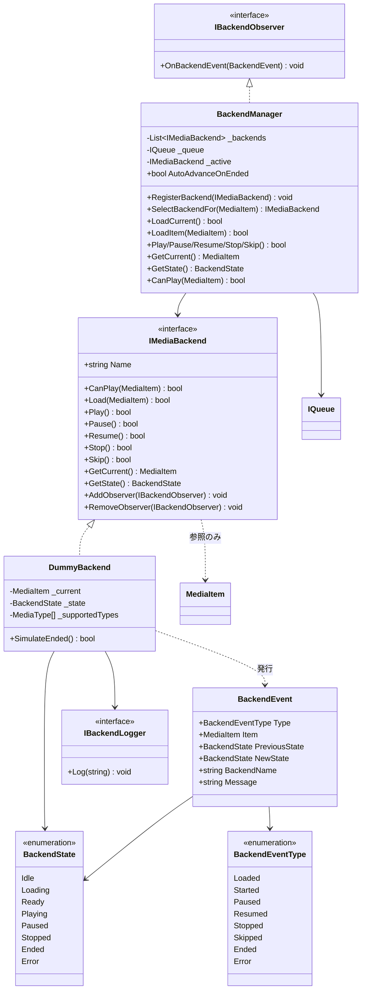
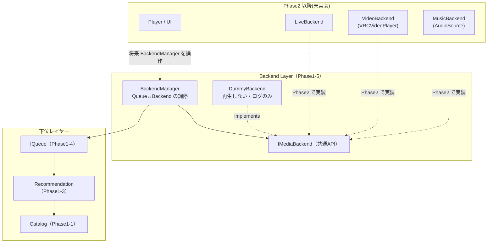
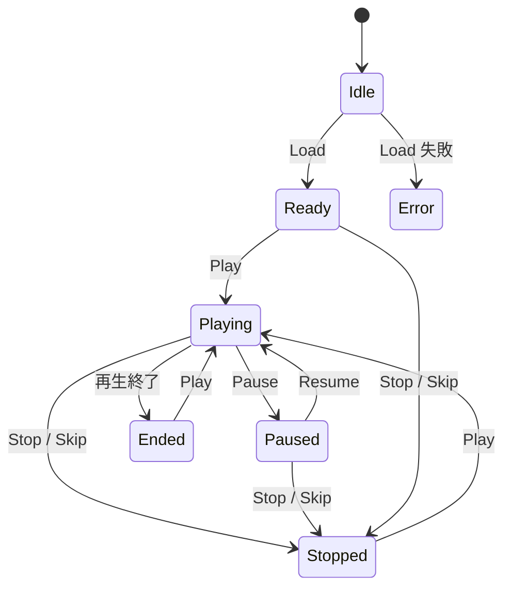

# Phase1-5: Backend Interface 設計・実装ドキュメント

Queue と Player の間に位置する **共通 Backend Interface** の実装記録です。
Music / Video / Live / Podcast のどれでも同じ API で扱えることを目的とし、
**実際の再生は行いません**(`Play()` はログを出すだけ)。

AudioSource / VideoPlayer / VRCVideoPlayer / UI / ネットワーク / VRChat SDK は一切使用していません。

---

## 1. クラス図



### レイヤー図



**Backend は Catalog・Recommendation・Queue しか知りません。**
asmdef の参照をその3つに限定し `noEngineReferences: true` を設定しているため、
UnityEngine・VRChat SDK・UI・ネットワークは**アセンブリ参照レベルで到達不能**です。

## 2. ディレクトリ構成(Phase1-5 追加分)

```
Assets/SmartMediaPlatform/Backend/
├── Runtime/                                    … 純粋C#(UnityEngine/VRChat SDK 非依存)
│   ├── SmartMediaPlatform.Backend.asmdef       (references: Catalog, Recommendation, Queue のみ)
│   ├── BackendState.cs                         … 再生状態(8状態)
│   ├── BackendEventType.cs                     … 通知の種類
│   ├── BackendEvent.cs                         … 通知1件(前後の状態を含む)
│   ├── IBackendObserver.cs                     … 通知の受け手
│   ├── IBackendLogger.cs                       … ログ出力先の抽象 + Null/List 実装
│   ├── IMediaBackend.cs                        … 共通 Backend API
│   ├── DummyBackend.cs                         … 再生しないテスト用実装(ログのみ)
│   └── BackendManager.cs                       … Queue 連携・バックエンド選択
├── Demo/
│   ├── SmartMediaPlatform.Backend.Demo.asmdef
│   └── BackendConsoleDemo.cs                   … Console 確認(3シナリオ)
└── Tests/EditMode/
    ├── SmartMediaPlatform.Backend.Tests.asmdef
    ├── RecordingObserver.cs                    … テスト用の通知記録
    ├── DummyBackendTests.cs                    … 25 ケース
    └── BackendManagerTests.cs                  … 19 ケース
```

## 3. API 一覧

### `IMediaBackend`(共通 Backend API)

各操作は **例外を投げず bool を返します**。不正な遷移では**状態を変えずに false** を返すため、
上位は現在の状態を気にせず安全に呼べます。

| API | 呼べる状態 | 遷移後 | 説明 |
|---|---|---|---|
| `CanPlay(item)` | 任意 | — | このバックエンドが扱える種別か。**拡張性の中心** |
| `Load(item)` | 任意 | `Ready` | 読み込み。null / 非対応種別は false |
| `Play()` | `Ready` / `Stopped` / `Ended` | `Playing` | **音を鳴らさずログのみ出力** |
| `Pause()` | `Playing` | `Paused` | |
| `Resume()` | `Paused` | `Playing` | |
| `Stop()` | 読み込み済み | `Stopped` | 読み込みは保持 |
| `Skip()` | 読み込み済み | `Stopped` | 現在を中断。**次に何を出すかは知らない**(上位の責務) |
| `GetCurrent()` | 任意 | — | 現在のメディア。無ければ null |
| `GetState()` | 任意 | — | 現在の状態 |
| `AddObserver` / `RemoveObserver` | 任意 | — | 通知の購読 |

`DummyBackend` のみの追加 API:

| API | 説明 |
|---|---|
| `SimulateEnded()` | 自然終了を擬似的に発生させる。**実機バックエンドでは再生完了時に自動で飛ぶ通知**を、再生しない今でも検証できるようにするためのフック(`IMediaBackend` には含めない) |

### `BackendManager`(Queue 連携)

| API | 説明 |
|---|---|
| `RegisterBackend(backend)` | バックエンドを登録。**登録順に `CanPlay` を問い合わせ、最初に扱えると答えたものを使う** |
| `UnregisterBackend(backend)` | 登録解除 |
| `SelectBackendFor(item)` | そのメディアを扱えるバックエンド。無ければ null |
| `CanPlay(item)` | いずれかのバックエンドが扱えるか |
| `LoadCurrent()` | Queue の先頭(Now)を読み込む |
| `LoadItem(item)` | 指定メディアを読み込む(必要ならバックエンドを切り替える) |
| `Play` / `Pause` / `Resume` / `Stop` | アクティブなバックエンドへ委譲 |
| `Skip()` | 現在を中断 → **Queue を進める** → 新しい先頭を読み込む(再生中だったら続けて再生) |
| `GetCurrent()` / `GetState()` | アクティブなバックエンドの状態 |
| `AutoAdvanceOnEnded` | 自然終了で自動的に次へ進むか。**既定 false**(Phase1-5 では自動再生を実装しないため) |

### 状態遷移図



## 4. Console 出力例

`BackendConsoleDemo` の **Run Backend Scenario**(課題指定のシナリオ。実測値):

```
=== Backend Scenario (no actual playback) ===

Load music-001
  [MusicBackend] Load music-001  (Neon Skyline / Aurora Drive, Music)

Play
  [MusicBackend] Play music-001  (再生はしません / no actual playback)

Current
music-001

Pause
  [MusicBackend] Pause music-001

Resume
  [MusicBackend] Resume music-001

Skip
  [MusicBackend] Skip music-001
  [MusicBackend] Load music-004  (Rainy Platform / Kohaku, Music)
  [MusicBackend] Play music-004  (再生はしません / no actual playback)

Current
music-004

Stop
  [MusicBackend] Stop music-004
State: Stopped
```

**Run Backend Selection Scenario**(拡張性の確認。実測値):

```
=== Backend Selection (CanPlay) ===
music-001  (Music)  -> MusicBackend
video-001  (Video)  -> VideoBackend
podcast-001  (Podcast)  -> (扱えるバックエンドなし)

Load + Play + Skip:
  [MusicBackend] Load music-001  (Neon Skyline / Aurora Drive, Music)
  [MusicBackend] Play music-001  (再生はしません / no actual playback)
  [MusicBackend] Skip music-001
  [VideoBackend] Load video-001  (Neon Skyline (Official Video) / Aurora Drive, Video)
  [VideoBackend] Play video-001  (再生はしません / no actual playback)
Active backend: VideoBackend
```

**Music から Video へ、上位のコードを一切変えずにバックエンドが切り替わっています。**
これが「Music・Video・Live・Podcast を同じ API で扱う」という要件の実証です。

**Run Auto Advance Scenario**(自然終了で次へ進む配線):

```
=== Auto Advance on Ended ===
Current: music-001
After Ended -> Current: music-004
State: Playing
```

## 5. 設計レビュー

### 完了条件との対応

| 完了条件 | 対応 |
|---|---|
| Backend Interface が完成している | `IMediaBackend` に指定9 API すべて実装(§3) |
| DummyBackend が正常動作する | `DummyBackendTests` 25 ケース(状態遷移・拒否条件・通知) |
| Queue と連携できる | `BackendManager` + `BackendManagerTests` 19 ケース |
| ConsoleDemo がある | `BackendConsoleDemo`(3 シナリオ) |
| EditMode Test がすべて PASS | Backend 44 ケース、リポジトリ全体 **164 ケース PASS** |
| Player 実装へそのまま流用できる | 下記参照 |

### 「Player 実装へそのまま流用できる」ための3つの判断

1. **`CanPlay()` によるバックエンド選択** — メディア種別ごとの差異を
   実装クラスの内部ではなく **API 上の問い合わせ** として表現した。
   Phase2 で `MusicBackend`(AudioSource)と `VideoBackend`(VRCVideoPlayer)を作り
   `RegisterBackend` するだけで、`BackendManager` も上位コードも**変更不要**。
   デモで Music → Video の切り替えが実際に動くことを確認済み。

2. **`Ended` 通知による自動送り配線** — DummyBackend は実際には再生しないので
   自然終了が起きない。そこで `SimulateEnded()` を用意し、
   **実機で再生が終わったときとまったく同じ通知経路**を今のうちに検証できるようにした。
   Phase2 の実機バックエンドは再生完了時にこの通知を出すだけでよく、
   `BackendManager.OnBackendEvent` の自動送りロジックはそのまま動く。

3. **`bool` 返却 + 状態不変の拒否** — 不正操作で例外を投げないため、
   Player 側は「今 Pause できるか」を判定せずに呼べる。
   実機バックエンドでも同じ契約を守れば、Player のコードは書き換え不要。

### SOLID

- **S(単一責任)**: 再生手段の抽象(`IMediaBackend`)/ 状態機械(`DummyBackend`)/
  Queue との調停(`BackendManager`)/ ログ出力(`IBackendLogger`)を分離。
- **O(開放閉鎖)**: 新しいメディア種別は `IMediaBackend` の新実装を登録するだけ。
  既存クラスの変更は不要。
- **L(置換可能)**: 「不正操作は状態を変えず false」という契約を明文化し、
  25 ケースのテストで固定。実機実装もこの契約を満たせば置換できる。
- **I(インターフェース分離)**: 通知の受け手(`IBackendObserver`)とログ出力先(`IBackendLogger`)を
  別インターフェースに分けた。片方だけ必要な実装が余計なメソッドを実装せずに済む。
- **D(依存性逆転)**: `BackendManager` は具象 `DummyBackend` でなく `IMediaBackend` に依存。
  ログ出力先も注入。

### 設計上のトレードオフ

- **ログ出力の抽象化(`IBackendLogger`)** — Backend 層は UnityEngine を参照できない
  (`noEngineReferences: true`)ため `Debug.Log` を直接呼べない。
  出力先を注入する形にしたことで「純粋 C# のままログを出す」要件を満たしつつ、
  テストではログ内容を検証できるようになった(`Play_LogsWithoutActualPlayback`)。
  抽象が1つ増える代わりに、レイヤー独立性とテスト可能性を両取りしている。
- **`event` ではなく `IBackendObserver`** — C# の event / delegate は Udon で使えない。
  将来 Udon へ移植する際に SendCustomEvent へ置き換えられるよう、
  最初から明示的な観測者リストにした。
- **`Skip()` が Backend と Manager の両方にある** — 意味が異なる。
  `IMediaBackend.Skip()` は「今のメディアを中断する」だけ(次を知らない)。
  `BackendManager.Skip()` が「中断 → Queue を進める → 次を読み込む」を担う。
  Backend が Queue を知らないというレイヤー分離を守るための分担。
- **`AutoAdvanceOnEnded` の既定は false** — Phase1-5 では自動再生を実装しない方針に従い、
  配線は用意しつつ既定では無効。有効化は利用側の明示的な選択に委ねている。

### 実装中に見つけて直した問題

バックエンド切り替え時、すでに停止済みのバックエンドに `Stop()` を呼んでいたため、
**正常な切り替えなのに観測者へ `Error` 通知が飛んでいた**。
止める必要がある状態(`Playing` / `Paused` / `Ready` / `Ended`)のときだけ `Stop()` を
呼ぶよう修正済み(`BackendManager.NeedsStop`)。

## 6. テスト方法

### A. 自動テスト(EditMode)— VRChat SDK 不要

1. `Assets/SmartMediaPlatform` を Unity プロジェクトの `Assets/` 直下にコピー
2. **Window > General > Test Runner > EditMode**
3. **Run All** → **全 164 ケースが緑**になれば完了

| テストクラス | ケース数 |
|---|---|
| Catalog: `MediaCatalogTests` / `ParallelMediaCatalogTests` | 25 / 38 |
| Recommendation: `RecommendationEngineTests` | 13 |
| Queue: `MediaQueueTests` / `QueueManagerTests` / `QueueFormatterTests` | 25 / 13 / 6 |
| **Backend: `DummyBackendTests` / `BackendManagerTests`** | **25 / 19** |
| **合計** | **164** |

> 本 Phase の開発時、この環境の mono 上で NUnit 相当のランナーを用意し、
> **164 ケースすべての PASS を実測確認済み**です。

### B. Console 確認 — VRChat SDK 不要

1. 空の GameObject に `BackendConsoleDemo` をアタッチ
2. **Play**、または ⋮ メニューから各シナリオを実行:
   - **Run Backend Scenario** — Load → Play → Current → Pause → Resume → Skip → Current → Stop
   - **Run Backend Selection Scenario** — 種別ごとにバックエンドが選ばれる様子
   - **Run Auto Advance Scenario** — 自然終了で次へ進む配線
3. Inspector から `Queue Ids` / `Use Separate Backends` を変更して再実行できる

## 7. Phase2 への引き継ぎ事項

1. **実機バックエンドは `IMediaBackend` を実装するだけ。**
   `MusicBackend`(AudioSource)、`VideoBackend`(VRCVideoPlayer)を作り
   `BackendManager.RegisterBackend()` に渡せば、`BackendManager` と上位コードは無変更で動く。
   **`CanPlay()` で担当種別を表明すること**が唯一の約束。

2. **守るべき契約は3つ。** 実機実装でもこれを外すと上位が壊れる:
   - 不正な操作では**例外を投げず、状態を変えずに false** を返す
   - 状態遷移は `BackendState` の定義どおり(§3 の遷移図)
   - 再生が自然終了したら **`BackendEventType.Ended` を通知する**
     (これが自動送りの起点。`DummyBackend.SimulateEnded()` が同じ通知を出すので、
     配線は Phase1-5 の時点で検証済み)

3. **VRCUrl は Backend の内側で扱う。** `MediaItem.Url` は文字列だが、
   実機では Phase1-2 でベイクした `VRCUrl[]` を index で引く。
   その変換は `VideoBackend` の内部に閉じ込め、`IMediaBackend` の API には出さないこと
   (Catalog の Udon 適応層と同じ方針)。

4. **Udon へ移植するときは interface が使えない。**
   Phase1-2 と同じ方式で、`UdonMediaBackend : UdonSharpBehaviour` として具象化し、
   観測者通知は `SendCustomEvent` に置き換える。
   **API 仕様の正典は本実装とそのテスト**なので、まず純粋版を直してから Udon 版を追従させること。

5. **自動再生を実装するとき**は `BackendManager.AutoAdvanceOnEnded = true` にするだけ。
   ロジックは実装済みでテスト済み(`AutoAdvance_WhenEnabled_MovesToNextOnEnded`)。
   キューの補充は Phase1-4 の `QueueManager.EnsureFilled()` と組み合わせる。

6. **`Loading` 状態は未使用。** 実機の非同期ロード(動画の読み込み待ち)のために
   確保してある。`VideoBackend` は `Load()` で `Loading` に入り、
   読み込み完了で `Ready` へ遷移させること。上位は既に `Loading` を受け取れる。
