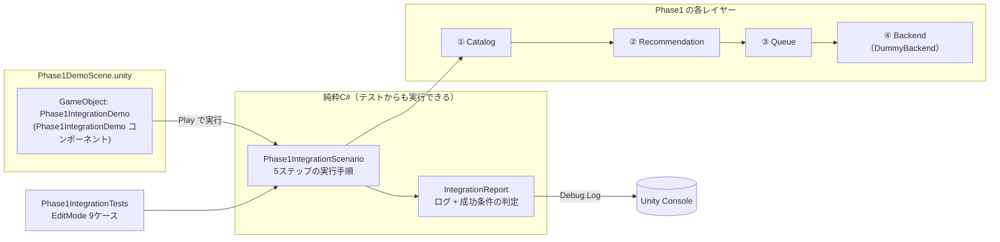

# Phase1 最終統合テスト — DemoScene

Catalog → Recommendation → Queue → Backend を **1 つの Unity シーンで連携** させ、
Console だけで一連の動作を確認できる統合テストです。

実際の音楽再生や VideoPlayer は使用しません(`DummyBackend` がログを出すだけ)。

---

## 1. 構成



**シナリオ本体を純粋 C# にした理由** — シーンで目視確認する内容と、
CI で自動検証する内容を**同一のコード**にするためです。
`Phase1IntegrationDemo`(MonoBehaviour)は `Phase1IntegrationScenario` を呼んで
結果を `Debug.Log` するだけの薄い層になっています。

## 2. ディレクトリ構成(追加分)

```
Assets/SmartMediaPlatform/Integration/
├── Runtime/                                       … 純粋C#(UnityEngine 非依存)
│   ├── SmartMediaPlatform.Integration.asmdef      (references: Catalog/Recommendation/Queue/Backend)
│   ├── IntegrationReport.cs                       … ログと成功条件の判定を蓄積(IBackendLogger も実装)
│   └── Phase1IntegrationScenario.cs               … 5ステップの統合シナリオ
├── Demo/
│   ├── SmartMediaPlatform.Integration.Demo.asmdef
│   ├── Phase1IntegrationDemo.cs                   … シーンに置く MonoBehaviour
│   └── Phase1IntegrationDemo.cs.meta              … シーンから参照するため GUID を固定
├── Editor/
│   └── Phase1DemoSceneBuilder.cs                  … シーンの生成/再生成、Console 実行メニュー
├── Scenes/
│   ├── Phase1DemoScene.unity                      … ★ DemoScene 本体
│   └── Phase1DemoScene.unity.meta
└── Tests/EditMode/
    ├── SmartMediaPlatform.Integration.Tests.asmdef
    └── Phase1IntegrationTests.cs                  … 9 ケース
```

## 3. 実行方法

### A. DemoScene で実行(推奨)

1. `Assets/SmartMediaPlatform` を Unity プロジェクトの `Assets/` 直下にコピー
2. `Assets/SmartMediaPlatform/Integration/Scenes/Phase1DemoScene.unity` を開く
   - メニュー **Tools > Smart Media Platform > Open Phase1 Demo Scene** でも開けます
3. **Play** を押す
4. Console に全ステップのログと成功条件の判定が出力されます

> シーンには `Phase1IntegrationDemo` オブジェクトだけを置いています(出力先が Console のため、
> カメラやライトは不要)。Game ビューに「No cameras rendering」と出ますが、動作に影響はありません。

**シーンが開けない場合**(Unity のバージョン差でシーンファイルが読めない、スクリプト参照が外れている等):
メニュー **Tools > Smart Media Platform > Create Phase1 Demo Scene (再生成)** を実行してください。
Unity 自身にシーンを作らせるので確実に動きます。

### B. Play を押さずに Console で実行

メニュー **Tools > Smart Media Platform > Run Phase1 Integration Test (Console)**
シーンを開く必要も Play する必要もありません。

または、`Phase1IntegrationDemo` コンポーネントの Inspector 右上 **⋮ メニュー >
Run Phase1 Integration Test**。

### C. 自動テスト(EditMode)

**Window > General > Test Runner > EditMode > Run All**
`SmartMediaPlatform.Integration.Tests > Phase1IntegrationTests`(9 ケース)を含む
**全 173 ケース**が緑になれば完了です。

### Inspector で変えられる設定

| 項目 | 既定 | 説明 |
|---|---|---|
| `Seed Id` | `music-001` | おすすめとキュー投入の起点にする曲 |
| `Queue Target Count` | 5 | 自動補充後に目指すキューの長さ |
| `Random Seed` | 1 | 乱数の種。固定なので毎回同じ結果になる |
| `Run On Start` | true | Play 時に自動実行するか |

## 4. Console 出力(実測値)

```
===== Phase1 Integration Test / Smart Media Platform =====
Catalog -> Recommendation -> Queue -> Backend
(実際の再生は行いません / no actual playback)

───── STEP 1 / Catalog — メディア情報の管理・検索 ─────
  MediaCatalog を構築しました (items: 12)
  FindById("music-001") -> [music-001] Neon Skyline / Aurora Drive (Music, Synthwave)
  起点の曲 FindById("music-001") -> [music-001] Neon Skyline / Aurora Drive (Music, Synthwave)
  SearchByTag("night") -> 5 件: music-001, music-002, music-003, music-006, video-001
  FilterByType: Video 1 件 / Podcast 1 件
  [PASS] カタログに 10 件以上のメディアがある
  [PASS] ID 検索が正しいメディアを返す
  [PASS] 起点の曲 "music-001" がカタログに存在する
  [PASS] タグ検索が結果を返す
  [PASS] Music 以外(Video / Podcast)も扱える構造になっている

───── STEP 2 / Recommendation — おすすめ順位の決定 ─────
  RecommendationEngine を構築しました (Related10 / Artist5 / Genre3 / Tag1 / Random0)
  GetNextRecommendations("music-001", 3):
    #1  music-002    score= 19.00  (related=10, artist=5, genre=3, tag=1×1, rand=0.00)  Midnight Circuit / Aurora Drive
    #2  music-007    score= 10.00  (related=10, artist=0, genre=0, tag=0×0, rand=0.00)  Static Bloom / Glasshouse Signal
    #3  video-001    score= 10.00  (related=0, artist=5, genre=3, tag=2×2, rand=0.00)  Neon Skyline (Official Video) / Aurora Drive
  [PASS] Catalog を使っておすすめを取得できる
  [PASS] 結果がスコアの降順に並んでいる
  [PASS] 起点の曲自体は候補に含まれない
  [PASS] 最上位の候補は起点と何らかの関連を持つ(スコア > 0)
  [PASS] スコア最上位が期待どおり(music-002: 関連+同アーティスト+同ジャンル+タグ一致)

───── STEP 3 / Queue — 再生順の管理と自動補充 ─────
  起点の曲を手動で Enqueue しました: music-001 (Count: 1)
  EnsureFilled() -> 4 件を自動補充 (Count: 5)
  キューの内容:
  Queue
  1. music-001  Neon Skyline / Aurora Drive  [Manual]
  2. music-002  Midnight Circuit / Aurora Drive  [Recommendation]
  3. music-007  Static Bloom / Glasshouse Signal  [Recommendation]
  4. video-001  Neon Skyline (Official Video) / Aurora Drive  [Recommendation]
  5. music-003  Paper Lanterns / Kohaku  [Recommendation]
  [PASS] Recommendation Engine と連携して自動補充できる
  [PASS] キューが目標件数(5)まで補充されている
  [PASS] 補充されたキューに重複がない
  [PASS] 自動補充された曲は Recommendation 由来として記録されている
  [PASS] 先頭(Now)は手動で積んだ起点の曲のまま

───── STEP 4 / Backend — 再生制御(実際には再生しない) ─────
  MusicBackend / VideoBackend を登録しました(いずれも再生はしません)
  SelectBackendFor(music-001) -> MusicBackend
  [PASS] CanPlay により、メディア種別(Music)に対応したバックエンドが選ばれる
  Load:
    [MusicBackend] Load music-001  (Neon Skyline / Aurora Drive, Music)
  [PASS] Queue の先頭を Backend に読み込める (State: Ready)
  Play:
    [MusicBackend] Play music-001  (再生はしません / no actual playback)
  [PASS] Play で再生状態になる (State: Playing)
  Pause:
    [MusicBackend] Pause music-001
  [PASS] Pause で一時停止する (State: Paused)
  Resume:
    [MusicBackend] Resume music-001
  [PASS] Resume で再生に戻る (State: Playing)
  Skip:
    [MusicBackend] Skip music-001
    [MusicBackend] Load music-002  (Midnight Circuit / Aurora Drive, Music)
    [MusicBackend] Play music-002  (再生はしません / no actual playback)
  Current: music-001 -> music-002
  [PASS] Skip で次のメディアへ進む
  [PASS] Skip 後の Backend の曲と Queue の先頭が一致している
  [PASS] 再生中のスキップでは、次の曲も再生状態になる
  Stop:
    [MusicBackend] Stop music-002
  [PASS] Stop で停止する (State: Stopped)

───── STEP 5 / End-to-End — レイヤー間の一貫性 ─────
  Backend が保持している曲: [music-002] Midnight Circuit / Aurora Drive (Music, Synthwave)
  [PASS] Backend の曲は Catalog に存在する ID である
  [PASS] Catalog → Recommendation → Queue → Backend が同一のメディア実体を共有している
  [PASS] Backend の曲は Queue 経由で渡ってきている
  [PASS] Queue には後続の曲が残っている(継続再生の準備ができている)

═════ RESULT ═════
  28 / 28 conditions passed
  ✅ Phase1 統合テスト: 成功
     Catalog → Recommendation → Queue → Backend の連携をすべて確認しました。
```

続けて、総合結果が 1 行で出ます(失敗時は `Debug.LogError` になり Console で赤く目立ちます):

```
[Phase1 Integration] SUCCESS — 28/28 conditions passed
```

## 5. 成功条件の一覧(全 28 項目)

| ステップ | 成功条件 |
|---|---|
| **1 Catalog** | カタログに 10 件以上のメディアがある |
| | ID 検索が正しいメディアを返す |
| | 起点の曲がカタログに存在する |
| | タグ検索が結果を返す |
| | Music 以外(Video / Podcast)も扱える構造になっている |
| **2 Recommendation** | Catalog を使っておすすめを取得できる |
| | 結果がスコアの降順に並んでいる |
| | 起点の曲自体は候補に含まれない |
| | 最上位の候補は起点と何らかの関連を持つ(スコア > 0) |
| | スコア最上位が期待どおり(music-002) |
| **3 Queue** | Recommendation Engine と連携して自動補充できる |
| | キューが目標件数まで補充されている |
| | 補充されたキューに重複がない |
| | 自動補充された曲は Recommendation 由来として記録されている |
| | 先頭(Now)は手動で積んだ起点の曲のまま |
| **4 Backend** | CanPlay により、メディア種別に対応したバックエンドが選ばれる |
| | Queue の先頭を Backend に読み込める (Ready) |
| | Play で再生状態になる (Playing) |
| | Pause で一時停止する (Paused) |
| | Resume で再生に戻る (Playing) |
| | Skip で次のメディアへ進む |
| | Skip 後の Backend の曲と Queue の先頭が一致している |
| | 再生中のスキップでは、次の曲も再生状態になる |
| | Stop で停止する (Stopped) |
| **5 End-to-End** | Backend の曲は Catalog に存在する ID である |
| | Catalog → Recommendation → Queue → Backend が同一のメディア実体を共有している |
| | Backend の曲は Queue 経由で渡ってきている |
| | Queue には後続の曲が残っている(継続再生の準備ができている) |

**STEP 5 が統合テストの核心です。** 各レイヤーが単体で動くだけでなく、
`ReferenceEquals` で **Backend が持っている `MediaItem` が Catalog の実体そのもの**であることを
確認しています。これにより、途中でデータが複製・変換されずにレイヤーを貫通していることが保証されます。

## 6. EditMode テスト(9 ケース)

| テスト | 検証内容 |
|---|---|
| `AllIntegrationConditions_Pass` | 全 28 条件が PASS する(失敗時は条件名とレポート全文を表示) |
| `Report_ContainsEveryStep` | 5 ステップすべてがレポートに出力される |
| `Report_ContainsResultSummary` | 総合結果が出力される |
| `EveryConditionIsReportedWithVerdict` | すべての条件が `[PASS]`/`[FAIL]` 付きで出力される |
| `BackendLogs_AppearInReport_WithoutActualPlayback` | Backend のログが混ざる & 「再生しない」ことが記録される |
| `Scenario_IsDeterministic` | 何度実行しても同じレポートになる |
| `Scenario_RespectsCustomSeedItem` | 起点の曲を変えられる |
| `Scenario_RespectsQueueTargetCount` | キュー長を変えても全条件を満たす |
| `UnknownSeed_IsReportedAsFailureNotCrash` | 不正な設定でも**例外を投げず**失敗として報告される |

### テスト全体(リポジトリ全体で 173 ケース)

| 層 | ケース数 |
|---|---|
| Catalog(`MediaCatalogTests` / `ParallelMediaCatalogTests`) | 25 / 38 |
| Recommendation(`RecommendationEngineTests`) | 13 |
| Queue(`MediaQueueTests` / `QueueManagerTests` / `QueueFormatterTests`) | 25 / 13 / 6 |
| Backend(`DummyBackendTests` / `BackendManagerTests`) | 25 / 19 |
| **Integration(`Phase1IntegrationTests`)** | **9** |
| **合計** | **173** |

> この環境の mono 上で NUnit 相当のランナーを用意し、
> **173 ケースすべての PASS を実測確認済み**です。

## 7. 統合作業で見つけて直した不具合

統合してみて初めて分かった問題が 2 件ありました。いずれも修正済みです。

1. **不正な Seed ID でデモがクラッシュしていた**
   Inspector で存在しない ID を打つと `MediaQueue.Enqueue(null)` が
   `ArgumentNullException` を投げていました。
   起点の曲が見つからない場合は**例外を投げずに失敗として報告し、以降の手順を中止する**よう修正。
   (`UnknownSeed_IsReportedAsFailureNotCrash` で回帰を防止)

2. **Seed を変えると無関係な検証条件が落ちていた**
   STEP 1 の「ID 検索が正しい」、STEP 2 の「最上位は music-002」、
   STEP 4 の「MusicBackend が選ばれる」が既定 Seed 前提でハードコードされており、
   `video-001` を起点にすると誤って FAIL していました。
   - ID 検索の検証は Seed と切り離した基準メディアで行う
   - 順位の固定値検証は既定 Seed のときだけ行う
   - バックエンド選択の期待値はメディア種別から導く
   に修正し、`music-003` / `video-001` を起点にしても全条件が PASS することを確認しました。

## 8. Phase2 への引き継ぎ事項

1. **この統合テストは Phase2 でもそのまま使えます。**
   `DummyBackend` を実機バックエンド(`MusicBackend` / `VideoBackend`)に差し替えても、
   `Phase1IntegrationScenario` は `IMediaBackend` 越しにしか触っていないため**変更不要**です。
   実機実装が Phase1-5 の契約(状態遷移・bool 返却・Ended 通知)を守っているかの
   受け入れテストとして機能します。

2. **成功条件を増やすときは `IntegrationReport.Check()` を使ってください。**
   Console 出力とテストの判定が自動的に両方に反映されます。

3. **シーンのスクリプト参照は GUID 固定です。**
   `Phase1IntegrationDemo.cs.meta` の GUID(`7a3f9c1e...`)を変更すると
   シーンの参照が外れます。変更が必要な場合は
   **Tools > Smart Media Platform > Create Phase1 Demo Scene (再生成)** でシーンを作り直してください。

4. **CI で回す場合**は EditMode テストを使ってください:
   ```
   Unity -batchmode -projectPath <path> -runTests -testPlatform EditMode -testResults results.xml -logFile -
   ```
   `Phase1IntegrationTests.AllIntegrationConditions_Pass` が失敗すると、
   どの条件が落ちたかとレポート全文がテスト結果に出ます。
