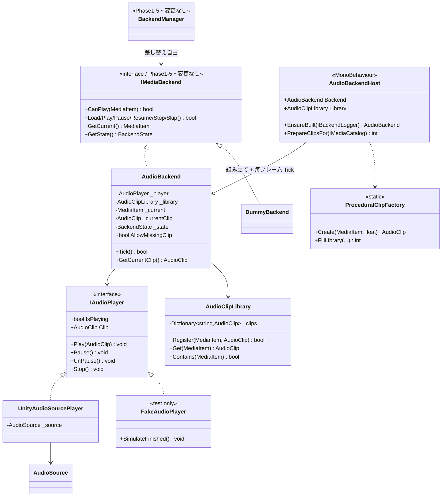
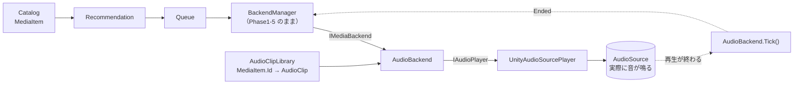

# Phase2-1: Audio Backend 設計・実装ドキュメント

Unity の `AudioSource` を使って **実際に音楽を再生する** Backend の実装記録です。

VRChat SDK / VideoPlayer / UI / 同期 / ネットワークは実装していません。
`BackendManager`・`Queue`・`Recommendation`・`Catalog` は **1 行も変更していません**。

---

## 1. クラス図



### 再生経路



## 2. ディレクトリ構成(追加分)

```
Assets/SmartMediaPlatform/Audio/
├── Runtime/
│   ├── SmartMediaPlatform.Audio.asmdef      (references: Catalog, Backend / UnityEngine 参照あり)
│   ├── IAudioPlayer.cs                      … 音を鳴らす手段の抽象
│   ├── UnityAudioSourcePlayer.cs            … AudioSource の実装(音が出る唯一の場所)
│   ├── AudioClipLibrary.cs                  … MediaItem.Id ↔ AudioClip の対応表
│   ├── AudioBackend.cs                      … IMediaBackend 実装 + Ended 検出
│   ├── AudioBackendHost.cs                  … MonoBehaviour(組み立て + 毎フレーム Tick)
│   └── ProceduralClipFactory.cs             … 音源ファイル無しでも鳴らせる補助
├── Demo/
│   ├── SmartMediaPlatform.Audio.Demo.asmdef
│   ├── AudioBackendConsoleDemo.cs           … ConsoleDemo(制御 / 実再生)
│   └── Phase2AudioIntegrationDemo.cs        … IntegrationDemo(全経路 + 成功条件判定)
└── Tests/EditMode/
    ├── SmartMediaPlatform.Audio.Tests.asmdef
    ├── FakeAudioPlayer.cs                   … 音を鳴らさない IAudioPlayer
    ├── RecordingObserver.cs
    ├── AudioBackendTests.cs                 … 25 ケース
    ├── AudioBackendManagerTests.cs          … 9 ケース
    └── AudioClipLibraryTests.cs             … 12 ケース
```

## 3. 設計の要点

### ① `BackendManager` を変更せずに済む理由

`AudioBackend` は Phase1-5 の `IMediaBackend` を実装しているだけです。
`BackendManager` は `IMediaBackend` 越しにしか触らないため、
登録するバックエンドを差し替えるだけで動きます。

```csharp
// DummyBackend の場合(Phase1-5)
manager.RegisterBackend(new DummyBackend("Dummy", logger, MediaType.Music));

// AudioBackend の場合(Phase2-1)— manager 側のコードは同一
manager.RegisterBackend(audioBackendHost.Backend);
```

`DummyAndAudioBackend_AreInterchangeable` テストで、**同じ操作列を両方に流して
外から見える状態遷移が完全に一致する**ことを確認しています。

### ② `IAudioPlayer` を挟んだ理由

`AudioBackend` が `AudioSource` を直接触ると、EditMode テストで検証できません
(EditMode では再生が時間で進まないため)。
音を鳴らす手段を `IAudioPlayer` に切り出したことで:

- 実行時 → `UnityAudioSourcePlayer`(本物の AudioSource)
- テスト時 → `FakeAudioPlayer`(`SimulateFinished()` で曲の終わりを再現)

となり、**Ended 検出や状態遷移を Unity の再生時間に依存せず決定的に検証**できます。
Phase1 で `IBackendLogger` を挟んだのと同じ考え方です。

### ③ `MediaItem` と `AudioClip` の関連付け

Catalog は「どんなメディアがあるか」しか持たず、再生実体(AudioClip)は持ちません。
その橋渡しを `AudioClipLibrary`(`MediaItem.Id` → `AudioClip`)が担います。
**Catalog を一切変更せずに再生資源を紐づけられる**のがねらいです。

割り当て方は 2 通り:

| 方法 | 用途 |
|---|---|
| `AudioBackendHost` の Inspector の `Clips` に登録 | 本物の音源を使う |
| `ProceduralClipFactory` が ID から短い音を自動生成 | 音源ファイルが無くても動作確認できる |

自動生成は **すでに登録済みの ID を上書きしません**(本物が優先されます)。

### ④ Ended の検出方法

`AudioSource.isPlaying` は曲が終わると false になります。
`AudioBackendHost.Update()` が毎フレーム `AudioBackend.Tick()` を呼び、
**状態が `Playing` なのに `IsPlaying` が false** になっていたら自然終了と判定して
`BackendEventType.Ended` を通知します。

自分で止めた場合(Stop / Skip / Pause)は状態が `Playing` でなくなるため、
自然終了と誤検出されません(`Tick_AfterManualStop_DoesNotRaiseEnded` などで固定)。

`UnityAudioSourcePlayer` はコンストラクタで `loop = false` を強制します
(ループしていると曲が終わらず Ended が永久に発火しないため)。

### ⑤ `CanPlay` は音源の有無まで見る

`AudioBackend.CanPlay()` は「種別が Music」かつ「AudioClip が登録済み」のときだけ true を返します。
音源が無いのに「扱える」と答えると再生できずに詰まるため、正直に false を返して
`BackendManager` に**別のバックエンドを探させます**。

この挙動が邪魔な場合は `AllowMissingClip = true` で無効化できます。

## 4. 使い方

### 最小構成

1. 空の GameObject を作る
2. `AudioBackendHost` をアタッチ(`AudioSource` は自動で付きます)
3. コードから:

```csharp
var host = GetComponent<AudioBackendHost>();
host.EnsureBuilt();
host.PrepareClipsFor(catalog);          // 音源が無ければ自動生成

var manager = new BackendManager(queue);
manager.RegisterBackend(host.Backend);  // ← ここだけが Dummy との違い

manager.LoadCurrent();
manager.Play();                          // 実際に音が鳴る
```

### 本物の音源を使う

`AudioBackendHost` の Inspector にある **Clips** に、
`Media Id`(例 `music-001`)と `Clip`(AudioClip アセット)の組を登録します。

## 5. テスト方法

### A. EditMode 自動テスト(音を鳴らさず検証)

**Window > General > Test Runner > EditMode > Run All**

| テストクラス | ケース数 | 内容 |
|---|---|---|
| `AudioBackendTests` | 25 | 状態遷移、AudioSource 操作、Ended 検出 |
| `AudioBackendManagerTests` | 9 | BackendManager 連携、Dummy との差し替え |
| `AudioClipLibraryTests` | 12 | MediaItem↔AudioClip の対応、手続き生成 |
| **Phase2-1 小計** | **46** | |
| Phase1 既存(Catalog/Recommendation/Queue/Backend/Integration) | 173 | |
| **合計** | **219** | |

> この環境で UnityEngine のスタブと NUnit 相当のランナーを用意し、
> **219 ケースすべての PASS を実測確認済み**です
> (既存 173 件が無傷であることも確認しました)。

### B. ConsoleDemo(実際に音が鳴る)

1. 空の GameObject に `AudioBackendConsoleDemo` をアタッチ
   (`AudioBackendHost` と `AudioSource` は自動で付きます)
2. **Play** を押す → Queue の曲が順に再生され、Console に経過が出ます
3. 音を鳴らさず状態遷移だけ見たい場合は ⋮ メニュー > **Run Control Scenario (no waiting)**

出力イメージ:

```
=== AudioBackend Playback Scenario (実際に音が鳴ります) ===
  Queue: 3 曲 / clips: 10 件
  [AudioBackend] Load music-001  (Neon Skyline / Aurora Drive)  clip: tone-music-001
  [AudioBackend] Play music-001  (AudioSource 再生開始 / clip: tone-music-001)
  [AudioBackend] Ended music-001  (曲が最後まで再生されました)
  -> State: Ended (1.52s 経過)
  次の曲へ:
  [AudioBackend] Skip music-001
  [AudioBackend] Load music-002  (Midnight Circuit / Aurora Drive)  clip: tone-music-002
  [AudioBackend] Play music-002  (AudioSource 再生開始 / clip: tone-music-002)
```

### C. IntegrationDemo(全経路 + 成功条件判定)

1. 空の GameObject に `Phase2AudioIntegrationDemo` をアタッチ
2. **Play** を押す
3. Console に STEP1-7 のログと成功条件の判定、最後に
   `SUCCESS — n/n conditions passed` が出ます

確認している成功条件:

| STEP | 条件 |
|---|---|
| 1-3 | Recommendation から Queue が構築される |
| 4 | BackendManager が AudioBackend を選ぶ(コード変更なしで差し替わる) |
| 4 | Queue の先頭に対応する AudioClip が登録されている |
| 5 | Queue の先頭を AudioBackend に読み込める / Play が成功する / State が Playing |
| 5 | **AudioSource に AudioClip が渡っている / 実際に再生している** |
| 6 | **曲が最後まで再生されると Ended になる** / AudioSource は停止している |
| 7 | Skip で次の曲へ進む / 次の曲も実際に鳴る / Stop で停止する |

## 6. 実装中に判明したこと(重要)

**`AutoAdvanceOnEnded` は次の曲を「読み込む」までで、再生は始めません。**

`BackendManager.Skip()` は「再生中だったか」を現在の状態から判定しますが、
Ended ハンドラから呼ばれる時点で状態はすでに `Ended` になっているため、
`wasPlaying` が false と判定されます。結果、次の曲は `Ready` で止まります。

今回は **「BackendManager を変更せず」** という要件に従い、
BackendManager には手を入れていません。連続再生は呼び出し側で

```csharp
manager.Skip();
manager.Play();   // ← これを続けて呼ぶ
```

とすれば成立します(ConsoleDemo / IntegrationDemo はこの形にしてあります)。

この挙動は `AutoAdvance_LoadsNextTrackButDoesNotStartItAutomatically` テストで
仕様として固定しました。Phase2-2 で連続再生を扱う際は、次のいずれかを選ぶことになります:

- **(推奨)** `BackendManager.Skip()` が `Ended` も「再生中だった」として扱うようにする(1 行の変更)
- 上位に連続再生ドライバを置き、`AutoAdvanceOnEnded = false` のまま Ended を受けて `Skip()` + `Play()` する

## 7. Phase2-2 への引き継ぎ事項

1. **Video バックエンドも同じ形で追加できます。**
   `IMediaBackend` を実装し、`MediaItem.Id → 動画 URL / VideoClip` の対応表を持たせ、
   `CanPlay` で `MediaType.Video` を表明して `RegisterBackend` するだけです。
   `BackendManager` は今回同様、変更不要です。

2. **`IAudioPlayer` と同じ形の抽象を用意してください。**
   実再生手段を直接触ると EditMode でテストできなくなります。
   Video なら `IVideoPlayer`(`IsPlaying` / `Play` / `Stop`)を切り、
   偽実装で終了検出を検証できるようにするのが定石です。

3. **連続再生を実装する場合は §6 を参照してください。**
   仕様としてテストで固定してあるので、変更するときはそのテストも更新します。

4. **`ProceduralClipFactory` は本番用ではありません。**
   本物の音源が揃ったら `AudioBackendHost` の `Generate Procedural Clips` を
   false にしてください(自動生成は登録済みの ID を上書きしないので、
   混在させても本物が優先されます)。

5. **VRChat 対応(Udon 化)はまだ先です。**
   `AudioBackend` は C# の interface / Dictionary / delegate を使っており、
   そのままでは UdonSharp で動きません。Phase1-2 と同じ方式
   (並列配列 + index、具象 UdonSharpBehaviour)で適応層を作る必要があります。
