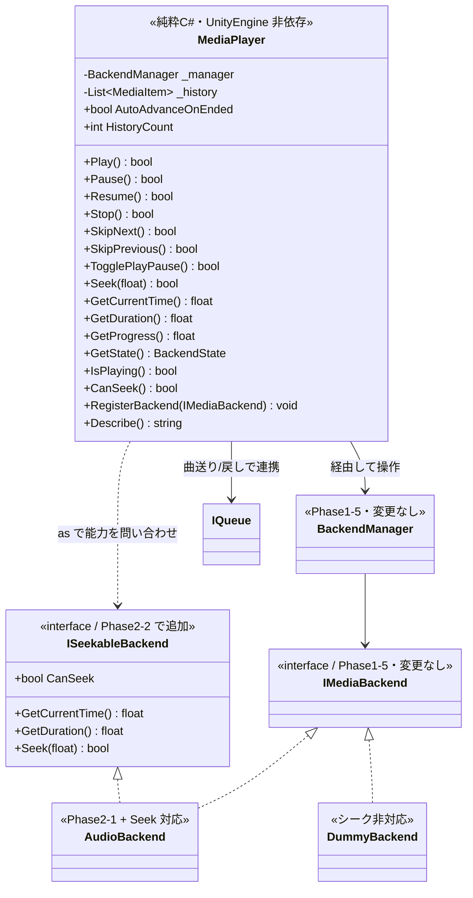
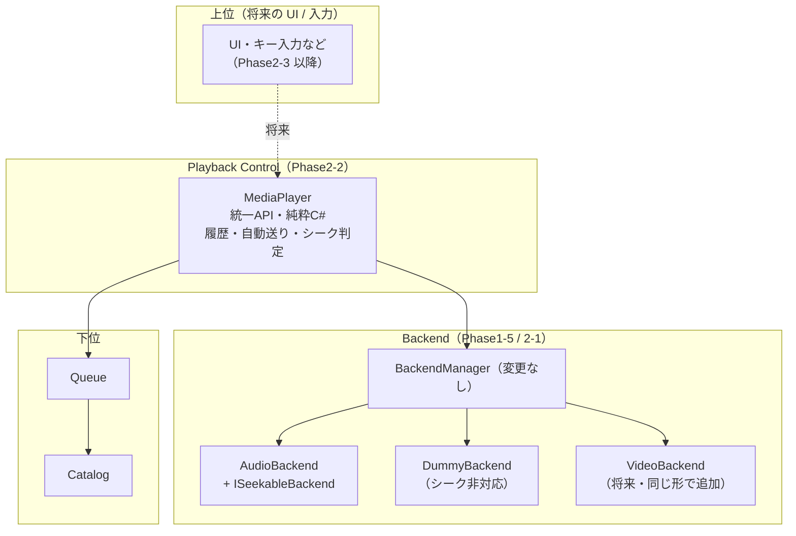

# Phase2-2: Playback Control 設計・実装ドキュメント

「実際に使える音楽プレイヤー」にするための再生制御層(`MediaPlayer`)の実装記録です。

UI / VRChat同期 / VideoPlayer / ネットワーク / おすすめアルゴリズム / プレイリスト編集は実装していません。
**`BackendManager` は 1 行も変更していません。**

---

## 1. クラス図



### レイヤー図



## 2. ディレクトリ構成(追加分)

```
Assets/SmartMediaPlatform/
├── Backend/Runtime/
│   └── ISeekableBackend.cs               ★ 追加(IMediaBackend は変更なし)
└── Player/
    ├── Runtime/
    │   ├── SmartMediaPlatform.Player.asmdef   (refs: Catalog/Queue/Backend, noEngineReferences: true)
    │   └── MediaPlayer.cs                 … 再生制御の統一API(純粋C#)
    ├── Demo/
    │   ├── SmartMediaPlatform.Player.Demo.asmdef
    │   ├── PlaybackConsoleDemo.cs         … ConsoleDemo
    │   └── PlaybackConsoleDemo.cs.meta    … シーンから参照するため GUID 固定
    ├── Editor/
    │   └── Phase2DemoSceneBuilder.cs      … シーンの生成/再生成メニュー
    ├── Scenes/
    │   ├── Phase2PlaybackDemoScene.unity  ★ DemoScene
    │   └── Phase2PlaybackDemoScene.unity.meta
    └── Tests/EditMode/
        ├── SmartMediaPlatform.Player.Tests.asmdef
        ├── SeekableTestBackend.cs         … シーク対応の検証用バックエンド
        └── MediaPlayerTests.cs            … 35 ケース
```

## 3. API 一覧

すべて `MediaPlayer` が提供し、内部では `BackendManager` を経由します。

### 再生制御

| API | 動作 |
|---|---|
| `Play()` | 何も読み込んでいなければ Queue の先頭を読み込んでから再生。**一時停止中なら再開として扱う** |
| `Pause()` | 再生中のみ一時停止 |
| `Resume()` | 一時停止中のみ再開 |
| `Stop()` | 停止(読み込みは保持するのでそのまま `Play()` で再開できる) |
| `SkipNext()` | 次の曲へ。再生中だったら続けて再生。**次が無ければ何もしない**(非破壊) |
| `SkipPrevious()` | 前の曲へ。履歴から取り出して Queue の先頭に戻す |
| `TogglePlayPause()` | 再生中→一時停止 / 一時停止中→再開 / それ以外→再生 |
| `Seek(float)` | 再生位置を 0.0〜1.0 で指定。範囲外は丸める。非対応バックエンドでは false |

### 問い合わせ

| API | 戻り値 |
|---|---|
| `GetCurrentTime()` | 現在の再生位置(秒)。分からなければ 0 |
| `GetDuration()` | 長さ(秒)。バックエンドが答えられなければ **Catalog のメタデータで補う** |
| `GetProgress()` | 0.0〜1.0 の進み具合 |
| `GetState()` | `BackendState`(Idle/Ready/Playing/Paused/Stopped/Ended…) |
| `IsPlaying()` | 再生中か |
| `CanSeek()` | 今シークできるか |
| `GetCurrent()` | 現在のメディア |
| `Describe()` | Console 表示用の 1 行サマリ |

### 設定

| プロパティ | 既定 | 説明 |
|---|---|---|
| `AutoAdvanceOnEnded` | **true** | 曲が終わったら自動で次へ進み、再生を続ける |
| `MaxHistory` | 50 | 曲戻しで遡れる上限 |

## 4. 設計の要点

### ① `IMediaBackend` を変更せず、能力を別 interface に分けた

要件「Backend インターフェースは今後変更不要な形にしてください」への回答です。

シーク機能を `IMediaBackend` に足すこともできましたが、**そうしませんでした**。
理由は、DummyBackend や将来の Live 配信バックエンドが**本質的に再生位置を持たない**ためです。
コアの インターフェース に押し込むと、実装できないメソッドを嘘の値や例外で埋めることになり、
置換可能性(Liskov の原則)が壊れます。

代わりに `ISeekableBackend` という**任意実装の能力 interface** を追加しました:

```csharp
// AudioBackend は「再生位置を扱える」と表明する
public sealed class AudioBackend : IMediaBackend, ISeekableBackend { ... }

// DummyBackend は表明しない → CanSeek() が自然に false になる
public sealed class DummyBackend : IMediaBackend { ... }
```

`MediaPlayer` は `backend as ISeekableBackend` で問い合わせるだけです。
**この方式なら、今後どんな能力(再生速度・音量・字幕…)が必要になっても
`IMediaBackend` 自体は二度と変更しなくて済みます。**

### ② `MediaPlayer` は純粋 C#(UnityEngine 非依存)

`SmartMediaPlatform.Player` の asmdef は `noEngineReferences: true` です。
つまり **AudioBackend でも将来の VideoBackend でも、まったく同じコードが動きます**。

要件「VideoBackend を追加する際に Playback Control のコードをコピーしなくても済む設計」は
これで満たされます。VideoBackend 側は `IMediaBackend`(+ 必要なら `ISeekableBackend`)を
実装して `RegisterBackend` するだけで、この層は 1 行も変わりません。

`SameControlSequence_WorksOnDifferentBackendTypes` テストで、
**種類の違うバックエンドに同じ操作列を流して結果が一致する**ことを確認しています。

### ③ 曲戻し(SkipPrevious)のための履歴

Queue(Phase1-4)は前方向にしか進まないため、`MediaPlayer` が再生履歴を持ちます。

`SkipPrevious()` は履歴から 1 曲取り出し、既存の Queue API だけで先頭に戻します:

```csharp
queue.EnqueueNext(previous);        // Now の直後に入る
if (queue.Count > 1) queue.Move(1, 0);  // 先頭へ動かす
```

**Queue にメソッドを追加せずに実現しました**(`Queue` も変更していません)。
`SkipPrevious_RestoresQueueOrder` テストで、戻したあとの Queue の並びが
元どおりになることを確認しています。

### ④ Ended → 自動送り(Phase2-1 の課題を解消)

Phase2-1 で「`AutoAdvanceOnEnded` は次を読み込むが再生は始めない」という問題を報告しました。
今回 `MediaPlayer` がこれを引き取ります:

- コンストラクタで `manager.AutoAdvanceOnEnded = false` にして二重反応を防ぐ
- `MediaPlayer` 自身が Ended を受けて `SkipNext()` を呼ぶ
- `SkipNext()` は **Ended 状態も「再生中だった」とみなす**ので、次の曲も鳴り出す

**BackendManager には手を入れずに**連続再生が成立しました。

### ⑤ 十分なログ

すべての操作が前後の状態つきでログに出ます。Console だけで状態遷移を追えます:

```
── Play
  [DummyBackend] Load music-001  (Neon Skyline / Aurora Drive, Music)
  [DummyBackend] Play music-001
  [MediaPlayer] Play music-001: Ready -> Playing
  => [Playing] music-001 (Neon Skyline) 0.0s/254.0s 0%
```

## 5. Console 出力例(実測値)

```
=== Phase2-2 Playback Control Demo ===

── Play
  [DummyBackend] Load music-001  (Neon Skyline / Aurora Drive, Music)
  [DummyBackend] Play music-001  (再生はしません / no actual playback)
  [MediaPlayer] Play music-001: Ready -> Playing
  => [Playing] music-001 (Neon Skyline) 0.0s/254.0s 0%

── Pause
  [DummyBackend] Pause music-001
  [MediaPlayer] Pause music-001: Playing -> Paused
  => [Paused] music-001 (Neon Skyline) 0.0s/254.0s 0%

── Resume
  [DummyBackend] Resume music-001
  [MediaPlayer] Resume music-001: Paused -> Playing
  => [Playing] music-001 (Neon Skyline) 0.0s/254.0s 0%

── SkipNext
  [DummyBackend] Skip music-001
  [DummyBackend] Load music-002  (Midnight Circuit / Aurora Drive, Music)
  [DummyBackend] Play music-002
  [MediaPlayer] SkipNext: music-001 -> music-002 (State: Playing)
  => [Playing] music-002 (Midnight Circuit) 0.0s/231.0s 0%

── SkipPrevious
  [DummyBackend] Load music-001  (Neon Skyline / Aurora Drive, Music)
  [DummyBackend] Play music-001
  [MediaPlayer] SkipPrevious: music-002 -> music-001 (State: Playing, 履歴残り: 0)
  => [Playing] music-001 (Neon Skyline) 0.0s/254.0s 0%

── Seek 0.5 (CanSeek = False)
  [MediaPlayer] Seek 無視: 現在のバックエンドはシークに対応していません
  => [Playing] music-001 (Neon Skyline) 0.0s/254.0s 0%

── Stop
  [DummyBackend] Stop music-001
  [MediaPlayer] Stop music-001: Playing -> Stopped
  => [Stopped] music-001 (Neon Skyline) 0.0s/254.0s 0%
```

> 上は DummyBackend を使った例なので `CanSeek = False` になっています。
> **AudioBackend を使う実際のデモではシークが働きます**(`ISeekableBackend` を実装しているため)。
> `GetDuration()` が DummyBackend でも 254.0s と出ているのは、
> バックエンドが答えられない長さを Catalog のメタデータで補っているためです。

## 6. テスト方法

### A. EditMode 自動テスト

**Window > General > Test Runner > EditMode > Run All**

| テストクラス | ケース数 |
|---|---|
| **`MediaPlayerTests`(Phase2-2)** | **35** |
| `AudioBackendTests`(Seek 対応分を追加) | 33 |
| `AudioBackendManagerTests` / `AudioClipLibraryTests` | 9 / 12 |
| Phase1 既存(Catalog/Recommendation/Queue/Backend/Integration) | 173 |
| **合計** | **262** |

> この環境で UnityEngine のスタブと NUnit 相当のランナーを用意し、
> **262 ケースすべての PASS を実測確認済み**です(既存 173 件も無傷)。

### B. ConsoleDemo

1. 空の GameObject に `PlaybackConsoleDemo` をアタッチ
   (`AudioBackendHost` と `AudioSource` は自動で用意されます)
2. **Play** を押す → 実際に音が鳴りながら、次が順に実行されます:
   - Play / Pause / Resume / TogglePlayPause ×2
   - SkipNext ×2 / SkipPrevious
   - Seek 0.5(AudioBackend なので有効)
   - Stop → Play(停止後の復帰)
   - 曲の終わりを待って **Ended → 自動送り**
   - `video-001` を割り込ませて **Backend 切替**(Dummy が担当し `CanSeek` が false になる)
3. 音を待たずに状態遷移だけ見る場合は ⋮ メニュー > **Run Control Scenario (no waiting)**

### C. DemoScene

`Assets/SmartMediaPlatform/Player/Scenes/Phase2PlaybackDemoScene.unity` を開いて **Play**。

- メニュー **Tools > Smart Media Platform > Open Phase2 Playback Demo Scene** でも開けます
- シーンが開けない場合は **Tools > Smart Media Platform > Create Phase2 Playback Demo Scene (再生成)**

### 確認できる項目の対応表

| 確認項目 | 確認方法 |
|---|---|
| Play / Pause / Resume / Stop | ConsoleDemo 前半、`MediaPlayerTests` の各テスト |
| Next / Previous | ConsoleDemo、`SkipNext_*` / `SkipPrevious_*` |
| Seek | ConsoleDemo(AudioBackend)、`Seek_MovesPlaybackPosition` |
| Ended → Auto Next | ConsoleDemo 中盤、`Ended_AutomaticallyAdvancesAndKeepsPlaying` |
| Queue との連携 | `SkipNext_AdvancesQueueAndKeepsPlaying`、`SkipPrevious_RestoresQueueOrder` |
| Backend 切替 | ConsoleDemo 終盤、`BackendSwitching_IsHandledByBackendManager` |

## 7. 実装中に見つけて直した問題

**キューが尽きたときの `SkipNext` が破壊的だった。**

`BackendManager.Skip()` は「次が無い」と分かる前に、現在の曲(`backend.Skip()`)と
Queue(`queue.Skip()`)を消費してしまいます。そのため最後の曲が終わったときに

- 状態が `Ended`(再生完了)ではなく `Stopped` になる
- Queue が空になり、もう一度 `Play()` できなくなる

という挙動になっていました。

`MediaPlayer.SkipNext()` が**先に次曲の有無を確認**し、無ければ何もしないよう修正しました。
これで最後の曲が終わっても `Ended` のまま残り、「再生完了」が判別できます。
`SkipNext_WithNoNextTrack_IsNonDestructive` テストで固定しています。

## 8. Phase2-3 以降への引き継ぎ事項

1. **UI を作るときは `MediaPlayer` だけを見てください。**
   ボタンは `Play()` / `TogglePlayPause()` / `SkipNext()` / `SkipPrevious()` を呼び、
   シークバーは `GetProgress()` を表示して `Seek()` を呼ぶだけです。
   `CanSeek()` が false のときはシークバーを無効化してください。

2. **VideoBackend は同じ形で追加できます。**
   `IMediaBackend` を実装し、シークできるなら `ISeekableBackend` も実装して
   `MediaPlayer.RegisterBackend()` に渡すだけです。
   **`MediaPlayer` も `BackendManager` も変更不要**です。

3. **新しい能力が要るときは、`IMediaBackend` を変更せず新しい能力 interface を足してください。**
   例: 音量なら `IVolumeControllable`、再生速度なら `IPlaybackRateControllable`。
   `MediaPlayer` 側は `as` で問い合わせ、非対応なら機能を無効化します。

4. **`MediaPlayer` は純粋 C# を維持してください。**
   UnityEngine に依存させると VideoBackend との共通化や EditMode テストが崩れます。
   Unity 固有の処理が要る場合は、Phase2-1 の `AudioBackendHost` のように
   薄い MonoBehaviour を別に立ててください。

5. **Udon 化はまだです。**
   `MediaPlayer` は interface / ジェネリック List / `as` キャストを使っており、
   UdonSharp ではそのまま動きません。Phase1-2 と同じ方式(具象 UdonSharpBehaviour +
   並列配列)で適応層を作る必要があります。
