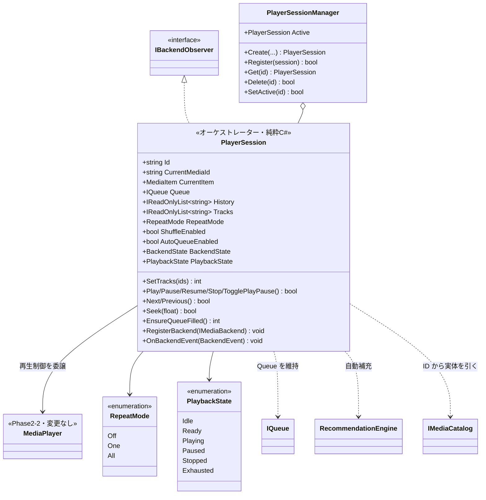
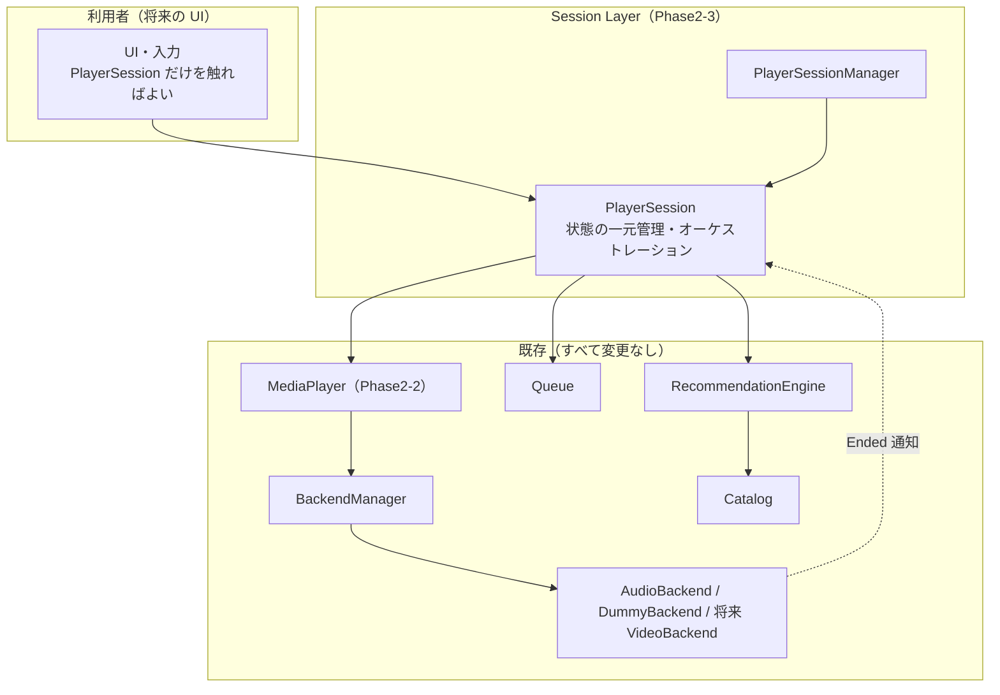
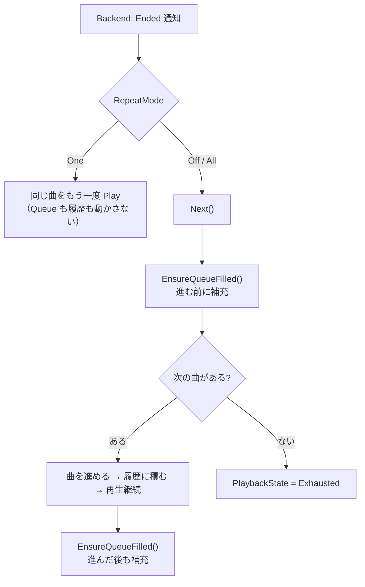

# Phase2-3: Player Session 設計・実装ドキュメント

プレイヤーの再生状態を一元管理する中核 `PlayerSession` の実装記録です。

Playlist / UI / VRChat同期 / VideoPlayer / ネットワーク / お気に入り / 履歴保存は実装していません。
**Backend・Queue・Recommendation・Catalog・MediaPlayer は 1 行も変更していません。**

---

## 1. クラス図



### レイヤー図



## 2. ディレクトリ構成(追加分)

```
Assets/SmartMediaPlatform/Session/
├── Runtime/                                     … 純粋C#(UnityEngine 非依存)
│   ├── SmartMediaPlatform.Session.asmdef        (refs: Catalog/Recommendation/Queue/Backend/Player)
│   ├── RepeatMode.cs                            … Off / One / All
│   ├── PlaybackState.cs                         … セッションから見た再生状態
│   ├── PlayerSession.cs                         … 中核。状態管理 + オーケストレーション
│   └── PlayerSessionManager.cs                  … セッションの作成/削除/切り替え
├── Demo/
│   ├── SmartMediaPlatform.Session.Demo.asmdef
│   ├── PlayerSessionConsoleDemo.cs              … ConsoleDemo(8 シナリオ)
│   └── PlayerSessionConsoleDemo.cs.meta         … シーンから参照するため GUID 固定
├── Editor/
│   └── Phase2SessionSceneBuilder.cs             … シーンの生成/再生成メニュー
├── Scenes/
│   ├── Phase2SessionDemoScene.unity             ★ DemoScene
│   └── Phase2SessionDemoScene.unity.meta
└── Tests/EditMode/
    ├── SmartMediaPlatform.Session.Tests.asmdef
    ├── SessionTestBackend.cs                    … 検証用バックエンド
    ├── PlayerSessionTests.cs                    … 41 ケース
    └── PlayerSessionManagerTests.cs             … 17 ケース
```

## 3. 保持している状態

要件で挙げられた状態をすべて公開しています。

| 状態 | プロパティ | 型 |
|---|---|---|
| 現在再生中の MediaId | `CurrentMediaId` | `string`(実体は `CurrentItem`) |
| 現在の Queue | `Queue` | `IQueue` |
| 再生履歴 | `History` | `IReadOnlyList<string>`(新しいものが末尾) |
| RepeatMode | `RepeatMode` | `Off` / `One` / `All` |
| Shuffle 状態 | `ShuffleEnabled` | `bool` |
| Auto Queue 状態 | `AutoQueueEnabled` | `bool` |
| 現在の Backend 状態 | `BackendState` | `BackendState`(Backend が報告する低レベル) |
| 現在の Playback 状態 | `PlaybackState` | `PlaybackState`(利用者に見せる状態) |

### BackendState と PlaybackState を分けた理由

- `BackendState` は Backend が報告する低レベルの状態(Idle/Loading/Ready/Playing/Paused/Stopped/Ended/Error)
- `PlaybackState` は利用者に見せる状態。違いが出るのは主に 2 点:
  - `Loading` / `Ready` はまとめて `Ready` として扱う
  - Backend が `Ended` でも**次の曲があれば再生は続く**ので、
    「もう流すものが無い」ときだけ `Exhausted` になる

`Exhausted` があることで、UI は「プレイリストを流し終えた」と「利用者が止めた」を区別できます。

## 4. API 一覧

### 再生制御(`MediaPlayer` へ委譲)

| API | 説明 |
|---|---|
| `Play()` | **先に Queue を補充してから**再生する(1 曲しか無くても途切れない) |
| `Pause()` / `Resume()` / `Stop()` / `TogglePlayPause()` | そのまま |
| `Next()` | 次の曲へ。進む前後に Queue を補充するので尽きても続く。履歴に積む |
| `Previous()` | 前の曲へ戻る。履歴から取り出す |
| `Seek(0..1)` / `CanSeek()` / `GetCurrentTime()` / `GetDuration()` / `GetProgress()` | 再生位置 |

### 曲と Queue の管理

| API | 説明 |
|---|---|
| `SetTracks(ids)` | セッションで流す曲を設定し、Queue を作り直す(Shuffle 有効ならランダム順) |
| `RebuildQueue()` | いまの曲一覧から Queue を作り直す |
| `Enqueue(mediaId)` | 曲を 1 つ足す |
| `ClearQueue()` | Queue を空にする(曲一覧は残す) |
| `EnsureQueueFilled()` | モードに応じて Queue を保つ。積んだ件数を返す |

### 設定

| プロパティ | 既定 | 説明 |
|---|---|---|
| `MinimumQueueCount` / `TargetQueueCount` | 2 / 5 | 補充のしきい値と目標 |
| `RecentMemory` | 5 | 同じ曲を続けて推薦しないために覚えておく件数 |
| `MaxHistory` | 50 | 履歴の上限 |

### `PlayerSessionManager`

| API | 説明 |
|---|---|
| `Create(player, catalog, engine, id, name, random, logger)` | セッションを作って登録。最初の 1 つが `Active` になる |
| `Register(session)` | すでに作ってあるセッションを登録 |
| `Get(id)` / `Contains(id)` / `Sessions` | 取得 |
| `Delete(id)` / `Clear()` | 削除(有効なものを消すと残りが自動で有効になる) |
| `SetActive(id)` | 操作対象を切り替える。**切り替え前のセッションは停止**して音が重ならない |

複数セッションに対応したのは、将来ワールド内に複数のプレイヤー(部屋ごと・スクリーンごと)を
置いても上位コードを変えずに済むようにするためです。いまは 1 つ作って `Active` を使えば足ります。

## 5. Ended を受けたときの流れ

これが Queue / Recommendation / Playback をつなぐ中心です。



`EnsureQueueFilled()` の中身:

1. **まだ流していない曲**があればそれを積む
2. 足りず、かつ `RepeatMode == All` なら**もう一巡ぶん積み直す**
3. 足りず、かつ `AutoQueueEnabled` なら**おすすめで補う**

おすすめは既存 API(`RecommendationEngine.GetNextRecommendations`)をそのまま使い、
次を守っています:

- いま再生中の曲を**種**にする(関連曲が来る)
- Queue にすでにある曲は積まない
- 直近に推薦した曲・再生中の曲は積まない(同じ曲が続かない)

## 6. Console 出力例(実測値)

```
=== Phase2-3 PlayerSession Demo ===

── 1. 状態管理と状態遷移
  SetTracks -> [Idle] (none) Queue=3 履歴=0
  Play      -> [Playing] music-001 Queue=3 履歴=0
  Pause     -> [Paused] music-001 Queue=3 履歴=0
  Resume    -> [Playing] music-001 Queue=3 履歴=0
  Stop      -> [Stopped] music-001 Queue=3 履歴=0
  Play      -> [Playing] music-001 Queue=3 履歴=0
    BackendState = Playing / PlaybackState = Playing

── 2. Queue 管理と履歴
  開始   : [Playing] music-001 Queue=3 履歴=0  Queue=[music-001, music-002, music-003]
  Next   : [Playing] music-002 Queue=2 履歴=1  履歴=[music-001]
  Next   : [Playing] music-003 Queue=1 履歴=2  履歴=[music-001, music-002]
  Previous: [Playing] music-002 Queue=2 履歴=1  履歴=[music-001]

── 3. Repeat One
  開始 : [Playing] music-001 Queue=3 履歴=0
  1 曲目の再生終了 -> [Playing] music-001 Queue=3 履歴=0 (同じ曲のまま)
  2 曲目の再生終了 -> [Playing] music-001 Queue=3 履歴=0 (同じ曲のまま)

── 4. Repeat All
  開始 : [Playing] music-001 Queue=3 履歴=0
  再生終了 -> [Playing] music-002 Queue=2 履歴=1
  再生終了 -> [Playing] music-003 Queue=4 履歴=2
  再生終了 -> [Playing] music-001 Queue=3 履歴=3
  再生終了 -> [Playing] music-002 Queue=2 履歴=4
    最後まで行くと先頭に戻る

── 5. Shuffle
  Shuffle OFF: [music-001, music-002, music-003]
  Shuffle ON : [music-002, music-003, music-001]

── 6. Auto Queue(おすすめ連携)
  AutoQueue ON : 1 曲だけ設定 -> Queue=[music-001, music-002, music-007, video-001, music-003]
    補充分: [music-002, music-007, video-001, music-003]
    再生終了 -> [Playing] music-002 Queue=4 履歴=1 (おすすめで再生が続く)
  AutoQueue OFF: 再生終了 -> [Exhausted] music-001 Queue=1 履歴=0 (Exhausted で止まる)

── 7. PlayerSessionManager(複数セッション)
  作成: 2 セッション / 有効 = room-1
    room-1 再生開始 -> [Playing] music-001 Queue=2 履歴=0
  有効を room-2 へ切り替え -> 有効 = room-2
    room-1: [Stopped] music-001 Queue=2 履歴=0 (切り替え時に停止する)
    room-2: [Idle] (none) Queue=1 履歴=0 (設定は独立: Repeat=One)
```

続けて 8 番目のシナリオで、AudioBackend を使い実際に音を鳴らします。

## 7. 設計の要点

### ① PlayerSession は Backend の詳細を知らない

- 具体的なバックエンド(`AudioBackend` / 将来の `VideoBackend`)の**型を一切参照しません**
- `AudioSource` などの再生手段にも触れません
- やり取りするのは `IMediaBackend` と `BackendEvent` という抽象だけです

`Session_DoesNotDependOnBackendType` テストで、**種類の違うバックエンドに同じ操作を流して
状態遷移が一致する**ことを確認しています。Video バックエンドを足しても
このクラスは変更不要です。

### ② 利用者は PlayerSession だけを触ればよい

`MediaPlayer` / `BackendManager` / `Queue` / `RecommendationEngine` を
直接触る必要はありません。再生制御・状態取得・Queue 管理・モード設定を
すべて `PlayerSession` が提供します。

`RegisterBackend()` も `MediaPlayer` への登録と Ended の購読をまとめて行うので、
呼ぶ側は 1 回で済みます。

### ③ Ended の扱いをセッションに集約

`MediaPlayer.AutoAdvanceOnEnded` をコンストラクタで false にし、
Ended はセッションが受け取ります。これにより

- Repeat One = 同じ曲を再生(Queue も履歴も動かさない)
- Repeat Off / All = 次へ進む

という判断を 1 か所で行えます。二重に反応しないことも
`Ended_MediaPlayerAutoAdvanceIsHandedOverToSession` で固定しています。

### ④ Repeat One は Queue を動かさない

`MediaPlayer.Play()` は `Ended` 状態から呼ぶと最初から再生し直します
(Phase2-2 で確認済みの挙動)。これを利用して、Repeat One は
**Queue を一切いじらずに** `Play()` を呼ぶだけで実現しています。

そのため Repeat One 中は Queue も履歴も増えず、解除すればそのまま次の曲へ進めます。

### ⑤ 純粋 C#(UnityEngine 非依存)

`SmartMediaPlatform.Session` の asmdef は `noEngineReferences: true` です。
Music でも Video でも同じコードが動き、EditMode で決定的にテストできます。

## 8. 既存の AutoQueueService との関係(重要)

前フェーズで実装した `AutoQueueService`(Playlists 層)と、
今回の `PlayerSession` は**モード制御と自動補充の機能が重なっています**。

意図的に別実装にしました:

- 本フェーズの対象外である Playlist に `PlayerSession` を依存させたくなかった
- Playlist はセッションの**上位**の概念(セッションに曲を供給する側)であり、
  下位から参照するとレイヤーが逆転する

現状の使い分け:

| | 用途 |
|---|---|
| `PlayerSession` | プレイヤー全体の状態管理。**通常はこちらを使う** |
| `AutoQueueService` | Playlist を Queue に流し込む部分だけが必要なとき |

将来 Playlist と Session をつなぐときは、
**`Playlist.MediaIds` を `PlayerSession.SetTracks()` に渡す**のが素直です
(その時点で `AutoQueueService` は役目を終えて整理できます)。
この判断は Phase2-4 で改めて相談させてください。

## 9. テスト方法

### A. EditMode 自動テスト

**Window > General > Test Runner > EditMode > Run All**

| テストクラス | ケース数 |
|---|---|
| **`PlayerSessionTests`** | **41** |
| **`PlayerSessionManagerTests`** | **17** |
| 既存(Catalog / Recommendation / Queue / Backend / Integration / Audio / Player / Playlists) | 332 |
| **合計** | **390** |

> この環境で UnityEngine のスタブと NUnit 相当のランナーを用意し、
> **390 ケースすべての PASS を実測確認済み**です(既存 332 件も無傷)。

### B. ConsoleDemo

1. 空の GameObject に `PlayerSessionConsoleDemo` をアタッチ
2. **Play** を押す → §6 の内容が出力され、最後に実際に音が鳴ります
3. 音を鳴らさず確認したい場合は ⋮ メニュー > **Run Session Scenarios (no audio)**

Inspector で `Track Ids` / `Play Audio At The End` / `Listen Seconds` を変えられます。

### C. DemoScene

`Assets/SmartMediaPlatform/Session/Scenes/Phase2SessionDemoScene.unity` を開いて **Play**。

- メニュー **Tools > Smart Media Platform > Open Phase2 Session Demo Scene** でも開けます
- 開けない場合は **Tools > Smart Media Platform > Create Phase2 Session Demo Scene (再生成)**

### 確認項目の対応表

| 確認項目 | 確認方法 |
|---|---|
| Queue 管理 | ConsoleDemo §2、`SetTracks_*` / `Enqueue_*` |
| Repeat One | ConsoleDemo §3、`RepeatOne_*`(3 ケース) |
| Repeat All | ConsoleDemo §4、`RepeatAll_*`(3 ケース) |
| Shuffle | ConsoleDemo §5、`Shuffle_*`(3 ケース) |
| Auto Queue | ConsoleDemo §6、`AutoQueue_*`(6 ケース) |
| Ended 連携 | ConsoleDemo §3・§4・§6、`Ended_*`(4 ケース) |
| Recommendation 連携 | `AutoQueue_UsesCurrentTrackAsSeed` ほか |
| 履歴管理 | ConsoleDemo §2、`Next_AdvancesAndRecordsHistory` / `Previous_*` / `History_IsCapped` |
| 状態遷移 | ConsoleDemo §1、`PlaybackState_TracksTheBackend` |

## 10. Phase2-4 以降への引き継ぎ事項

1. **UI は `PlayerSession` だけを見てください。**
   ボタンは `Play()` / `TogglePlayPause()` / `Next()` / `Previous()`、
   シークバーは `GetProgress()` と `Seek()`、
   表示は `CurrentMediaId` / `PlaybackState` / `Queue` / `History` で足ります。

2. **Playlist とつなぐときは `SetTracks()` に ID を渡すだけです。**
   `PlayerSession` は曲の出どころを知らないので、
   Playlist でも検索結果でもおすすめでも同じように渡せます(§8 も参照)。

3. **VideoBackend を足しても Session は変更不要です。**
   `IMediaBackend` を実装して `RegisterBackend()` に渡すだけです。

4. **履歴の保存は未実装です**(本フェーズの対象外)。
   `History` はメモリ上のみです。保存するときは
   Playlist の `IPlaylistStore` と同じ形で保存先を抽象化するのが素直です。

5. **Udon 化はまだです。** `PlayerSession` は interface・ジェネリック List・
   `as` キャストを使っており、UdonSharp ではそのまま動きません。
   Phase1-2 と同じ方式(具象 UdonSharpBehaviour + 並列配列)で適応層が必要です。
