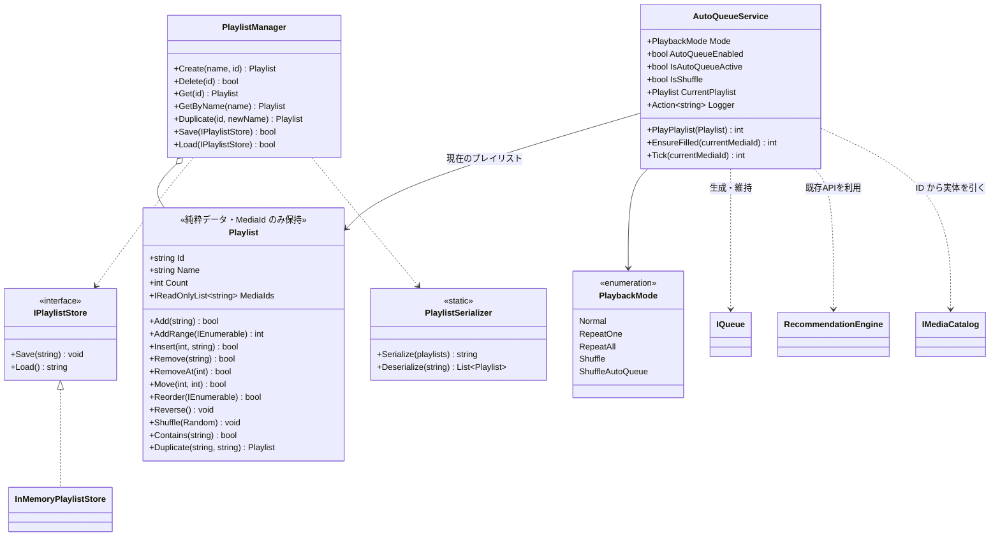
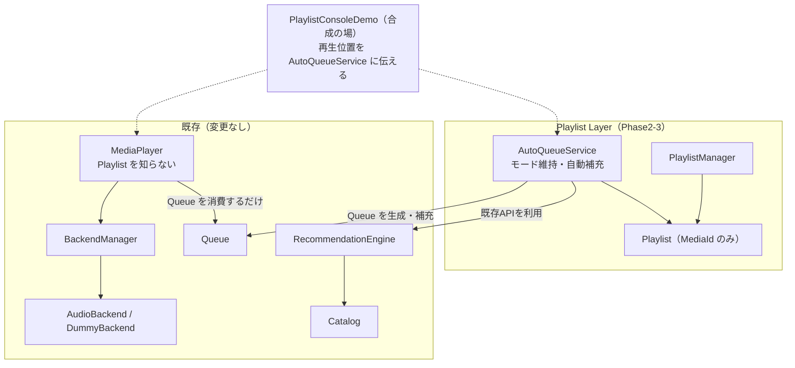

# Phase2-3: Playlist & Auto Queue 設計・実装ドキュメント

Playlist・Queue・Recommendation をつなぎ、「ユーザーが聴き続けられるプレイヤー」にするための実装記録です。

UI / VRChat同期 / VideoPlayer / ネットワーク / お気に入り / 履歴は実装していません。
**Backend・Catalog・AudioBackend・MediaPlayer は 1 行も変更していません。**

---

## 1. クラス図



### レイヤー図



**依存の向きが重要です。** `AutoQueueService` は Queue を作るだけで、
`MediaPlayer` は Queue を消費するだけ。両者は直接つながっていません。
そのため **MediaPlayer は Playlist の存在を知らないまま**動きます。

## 2. ディレクトリ構成(追加分)

```
Assets/SmartMediaPlatform/Playlists/
├── Runtime/                                       … 純粋C#(UnityEngine 非依存)
│   ├── SmartMediaPlatform.Playlists.asmdef        (refs: Catalog, Recommendation, Queue のみ)
│   ├── Playlist.cs                                … MediaId の並び + 編集操作
│   ├── PlaylistManager.cs                         … 作成/削除/複製/保存/読み込み
│   ├── IPlaylistStore.cs                          … 保存先の抽象 + InMemory + Serializer
│   ├── PlaybackMode.cs                            … 5 つの再生モード
│   └── AutoQueueService.cs                        … Playlist→Queue、モード維持、自動補充
├── Demo/
│   ├── SmartMediaPlatform.Playlists.Demo.asmdef
│   ├── PlaylistConsoleDemo.cs                     … ConsoleDemo(6 シナリオ)
│   └── PlaylistConsoleDemo.cs.meta                … シーンから参照するため GUID 固定
├── Editor/
│   └── Phase2PlaylistSceneBuilder.cs              … シーンの生成/再生成メニュー
├── Scenes/
│   ├── Phase2PlaylistDemoScene.unity              ★ DemoScene
│   └── Phase2PlaylistDemoScene.unity.meta
└── Tests/EditMode/
    ├── SmartMediaPlatform.Playlists.Tests.asmdef
    ├── PlaylistTests.cs                           … 23 ケース
    ├── PlaylistManagerTests.cs                    … 18 ケース
    └── AutoQueueServiceTests.cs                   … 29 ケース
```

> 名前空間は `SmartMediaPlatform.Playlists`(複数形)です。
> `Playlist` クラスと同名にすると C# で型と名前空間の曖昧参照が起きるため、
> 意図的にずらしています。

## 3. API 一覧

### `Playlist`(MediaId のみを持つ)

| 分類 | API |
|---|---|
| 曲追加 | `Add(mediaId)` / `AddRange(ids)` / `Insert(index, mediaId)` |
| 曲削除 | `Remove(mediaId)` / `RemoveAt(index)` / `Clear()` |
| 曲移動 | `Move(fromIndex, toIndex)` |
| 並び替え | `Reorder(orderedIds)` / `Reverse()` / `Shuffle(random)` |
| 検索 | `Contains(mediaId)` / `IndexOf(mediaId)` / `GetAt(index)` |
| 複製 | `Duplicate(newId, newName)` |

- **同じ曲は 2 度入りません**(`Add` が false を返す)
- `Reorder` は指定に含まれない曲を末尾に残すので、**並び替えで曲を失いません**
- `Shuffle(Random)` は乱数を渡せるのでテストで結果を固定できます

### `PlaylistManager`(プレイリスト単位の管理)

| API | 説明 |
|---|---|
| `Create(name, id = null)` | 作成。ID 省略で自動採番(`playlist-001`…) |
| `Delete(id)` / `Delete(playlist)` | 削除 |
| `Get(id)` / `GetByName(name)` / `Contains(id)` | 取得(大文字小文字を区別しない) |
| `Duplicate(id, newName, newId)` | 複製して登録 |
| `Save(store)` / `Load(store)` | 保存 / 読み込み |
| `Playlists` | 全件(読み取り専用ビュー) |

### `AutoQueueService`(Playlist ↔ Queue ↔ Recommendation)

| API / プロパティ | 説明 |
|---|---|
| `PlayPlaylist(playlist)` | **Queue を作り直す**。シャッフル系ならランダム順。積んだ件数を返す |
| `EnsureFilled(currentMediaId)` | 再生モードに応じて Queue を維持・補充。積んだ件数を返す |
| `Tick(currentMediaId)` | Queue に変化があったときだけ `EnsureFilled` を実行(毎フレーム呼んでよい) |
| `Mode` | 再生モード(既定 `Normal`) |
| `AutoQueueEnabled` | 自動補充の ON/OFF(既定 true) |
| `IsAutoQueueActive` | モードによる強制も加味した実際の有効/無効 |
| `MinimumQueueCount` / `TargetQueueCount` | 補充のしきい値と目標(既定 2 / 5) |
| `RecentMemory` | 「同じ曲を続けて推薦しない」ために覚えておく件数(既定 5) |
| `Logger` | ログ出力先(`Action<string>`) |

## 4. 再生モードの挙動

| モード | Queue の作られ方 | 尽きそうなときの動き |
|---|---|---|
| `Normal` | プレイリスト順 | 未再生の曲があれば積む。無ければ Auto Queue が ON のときだけおすすめで補充 |
| `RepeatOne` | — | **いまの曲をもう 1 つ積む**ので、次に進んでも同じ曲が鳴る |
| `RepeatAll` | プレイリスト順 | **プレイリストを丸ごと 1 巡ぶん積み直す**(1 曲だけでも詰まらない) |
| `Shuffle` | ランダム順 | Normal と同じ(補充もランダム順) |
| `ShuffleAutoQueue` | ランダム順 | `AutoQueueEnabled` の設定に関わらず**必ずおすすめで補充**する |

`ShuffleAutoQueue` は「シャッフル + 自動補充」をひとまとめにした指定です。
`AutoQueueEnabled = false` にしていてもこのモードでは補充が働きます
(`IsAutoQueueActive` が true になる)。

## 5. Recommendation との連携(守っている決まり)

`AutoQueueService.RefillFromRecommendation` は
`RecommendationEngine.GetNextRecommendations`(既存 API)をそのまま使い、
絞り込みだけを自前で行います。

| 要件 | 実装 |
|---|---|
| 現在再生中の曲を考慮する | 再生中の ID を**種**にして関連曲を取得(無ければ Queue 末尾 → プレイリスト先頭 → カタログからランダム) |
| 同じ曲を連続推薦しない | 直近 `RecentMemory` 件の推薦を覚えて除外。再生中の曲そのものも除外 |
| Queue に存在する曲は推薦しない | `queue.Contains(id)` で除外 |
| Playlist 内の曲を優先する | まず**プレイリストに含まれる候補だけ**で埋め、足りない分を次の段階へ |
| Playlist が尽きたら Catalog 全体から | プレイリスト内で埋まらなければ、順位付け済みの全候補から補う |

## 6. Console 出力例(実測値)

```
=== Phase2-3 Playlist & Auto Queue Demo ===

── 1. Playlist の編集
  作成: お気に入り [playlist-001] (0 曲)
  曲追加: music-001, music-002, music-003
  曲追加(1曲): music-001, music-002, music-003, music-010
  曲削除(music-002): music-001, music-003, music-010
  曲移動(0 -> 2): music-003, music-010, music-001
  並び替え(逆順): music-001, music-010, music-003
  並び替え(シャッフル): music-003, music-010, music-001
  複製: お気に入り(コピー) [playlist-002] (3 曲) -> music-003, music-010, music-001
  削除: 残り 1 件

── 2. Playlist の保存と読み込み
  保存: 2 件
  読み込み: 2 件
    朝 [morning] (2 曲) -> music-001, music-009
    夜 [night] (2 曲) -> music-003, music-006

── 3. Playlist から Queue を生成
  Playlist: music-001, music-002, music-003
  Queue   : music-001, music-002, music-003

── 4. 再生モード
  Shuffle    : music-002, music-003, music-001
  RepeatOne  : music-003, music-003 (次も同じ曲)
  RepeatAll  : music-003, music-001, music-002, music-003 (もう一巡ぶん積まれる)

── 5. Auto Queue(おすすめによる自動補充)
  AutoQueue ON : 4 曲を補充 -> music-003, music-001, music-002, music-004, music-009
    補充分の内訳: music-001, music-002, music-004, music-009
  AutoQueue OFF: 0 曲を補充 -> music-003 (増えない)
  Shuffle+Auto : 4 曲を補充 (IsAutoQueueActive = True)
```

続けて、実際に音を鳴らす 6 番目のシナリオが走ります(Queue を作って `MediaPlayer` で再生)。

## 7. 設計の要点

### ① Playlist は MediaId だけを持つ

`MediaItem` を抱え込まないことで:

- 保存・読み込みが単純な文字列で済む(外部 JSON ライブラリ不要)
- Catalog が差し替わってもプレイリストは壊れない
- **Music / Video の区別を持たない**ので、将来 VideoBackend でもそのまま使える

### ② MediaPlayer は Playlist を知らない

`AutoQueueService` は Queue を**作る**だけ、`MediaPlayer` は Queue を**消費する**だけで、
両者は直接つながっていません。合成(どちらも呼ぶ)はデモ側が担当します。

これにより、`MediaPlayer` を 1 行も変えずにプレイリスト再生が成立しました。

### ③ Playlist 層は Backend に依存しない

asmdef の参照は `Catalog` / `Recommendation` / `Queue` のみで、
`Backend` は入っていません(`noEngineReferences: true` も維持)。

そのためログ出力に `IBackendLogger`(Backend 層のもの)は使えません。
ほぼ同型の インターフェース を二重に作るのは避け、`Action<string>` を受け口にしました。
デモ側では `service.Logger = logger.Log;` の 1 行で既存のログ収集につながります。

### ④ 補充の駆動に Backend イベントを使わない

Queue の `Version`(Phase1-4 でポーリング用に用意したカウンタ)で変化を検知します。
`Tick()` は変化が無ければ即座に何もしないので、毎フレーム呼んでも安全です。
Backend の通知に依存しないため、Music でも Video でも同じ仕組みが使えます。

## 8. 実装中に見つけて直した問題

**Auto Queue を切っても Queue が補充されていた。**

`Normal` モードで再生し終えた曲は Queue から消えるため、
「Queue に含まれていない」という理由でプレイリストから**再投入**されていました。
その結果 `AutoQueueEnabled = false` にしても Queue が増えてしまいます。

一巡したら止まるのが `Normal` の正しい挙動で、積み直しは `RepeatAll` の役割です。
**プレイリストから Queue へ出した曲を記録**し、`Normal` / `Shuffle` では
二度目を積まないよう修正しました(`RepeatAll` は新しい巡の開始時にこの記録を消します)。

`AutoQueue_CanBeTurnedOff` テストで固定しています。

## 9. テスト方法

### A. EditMode 自動テスト

**Window > General > Test Runner > EditMode > Run All**

| テストクラス | ケース数 |
|---|---|
| **`PlaylistTests`** | **23** |
| **`PlaylistManagerTests`** | **18** |
| **`AutoQueueServiceTests`** | **29** |
| 既存(Catalog / Recommendation / Queue / Backend / Integration / Audio / Player) | 262 |
| **合計** | **332** |

> この環境で UnityEngine のスタブと NUnit 相当のランナーを用意し、
> **332 ケースすべての PASS を実測確認済み**です(既存 262 件も無傷)。

### B. ConsoleDemo

1. 空の GameObject に `PlaylistConsoleDemo` をアタッチ
2. **Play** を押す → §6 の内容が Console に出力され、最後に実際に音が鳴ります
3. 音を鳴らさず確認したい場合は ⋮ メニュー > **Run Playlist Scenarios (no audio)**

Inspector で `Playlist Ids`(プレイリストに入れる曲)、`Play Audio At The End`、
`Listen Seconds`(再生を聴かせる時間)を変えられます。

### C. DemoScene

`Assets/SmartMediaPlatform/Playlists/Scenes/Phase2PlaylistDemoScene.unity` を開いて **Play**。

- メニュー **Tools > Smart Media Platform > Open Phase2 Playlist Demo Scene** でも開けます
- シーンが開けない場合は **Tools > Smart Media Platform > Create Phase2 Playlist Demo Scene (再生成)**

### 確認項目の対応表

| 確認項目 | 確認方法 |
|---|---|
| Playlist 作成 | ConsoleDemo §1、`Create_*` テスト |
| 曲追加 / 削除 / 移動 | ConsoleDemo §1、`Add_*` / `Remove_*` / `Move_*` |
| Shuffle | ConsoleDemo §1・§4、`Shuffle_*` |
| Repeat | ConsoleDemo §4、`RepeatOne_*` / `RepeatAll_*` |
| Playlist → Queue 生成 | ConsoleDemo §3、`PlayPlaylist_*` |
| Queue 自動補充 | ConsoleDemo §5、`AutoQueue_RefillsWhenQueueRunsLow` |
| Recommendation 連携 | `AutoQueue_PrefersPlaylistTracks` / `AutoQueue_FallsBackToCatalogWhenPlaylistIsExhausted` ほか |
| Auto Queue ON/OFF | ConsoleDemo §5、`AutoQueue_CanBeTurnedOff` |

## 10. Phase2-4 以降への引き継ぎ事項

1. **UI を作るときは `PlaylistManager` と `AutoQueueService` を見てください。**
   プレイリスト一覧は `PlaylistManager.Playlists`、編集は `Playlist` のメソッド、
   再生開始は `AutoQueueService.PlayPlaylist()`、モード切替は `Mode` / `AutoQueueEnabled` です。

2. **合成(MediaPlayer と AutoQueueService を両方呼ぶ)は上位の仕事です。**
   いまはデモがその役をしています。本格的な Player を作るときは、
   毎フレーム(あるいは曲が変わったときに)
   `autoQueue.Tick(mediaPlayer.GetCurrent()?.Id)` を呼ぶだけです。

3. **保存先は `IPlaylistStore` を差し替えるだけです。**
   Unity ならファイルや `PlayerPrefs`、将来 VRChat なら別の手段に置き換えられます。
   保存形式(`PlaylistSerializer`)は触らなくて済みます。

4. **Video を混ぜても動きます。** Playlist は MediaId しか持たないので、
   Video の ID を入れれば `BackendManager` が VideoBackend を選びます。
   ただし `AutoQueueService` は種別を区別しないため、
   「Music だけのプレイリスト」を作りたい場合は追加時に `Catalog.FindById(id).Type` で
   絞る仕組みを上位に入れてください。

5. **お気に入り・履歴は未実装です。** 今回の禁止事項でしたが、
   `Playlist`(MediaId の集まり)をそのまま流用できます
   (お気に入り = 特別な ID のプレイリスト、履歴 = 追記していくプレイリスト)。

6. **Udon 化はまだです。** `Playlist` / `AutoQueueService` は
   ジェネリック List・`Action<string>`・LINQ を使っており、UdonSharp では動きません。
   Phase1-2 と同じ方式(具象 UdonSharpBehaviour + 並列配列)で適応層が必要です。
