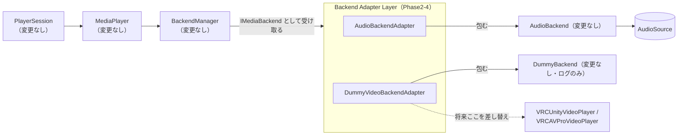
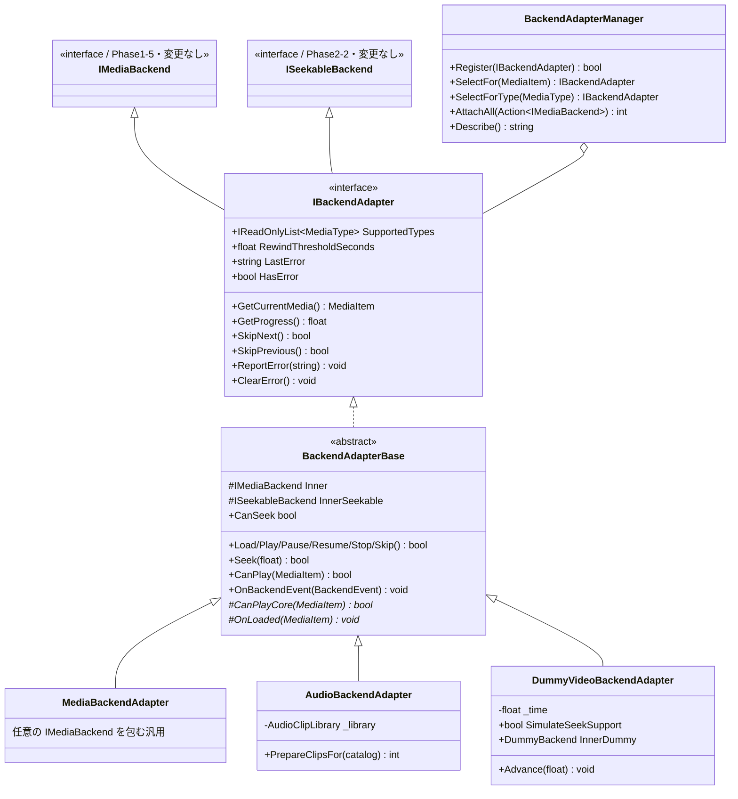

# Phase2-4: Backend Adapter 設計・実装ドキュメント

MusicBackend と VideoBackend を同じ窓口で扱うための Adapter 層の実装記録です。

VRChat SDK / VideoPlayer / UI / ネットワーク / 同期 / VRCUrl / StringDownloader は使っていません。
**PlayerSession・MediaPlayer・BackendManager・Backend・Queue・Catalog は 1 行も変更していません。**

---

## 1. 中心となる設計判断:`IBackendAdapter : IMediaBackend`

要件には「PlayerSession は BackendAdapter のみを利用」「BackendManager は BackendAdapter を利用」
「既存テストを壊さない」が並んでいます。この 3 つを同時に満たすため、
**アダプタを「バックエンドとしても振る舞える型」にしました。**

```csharp
public interface IBackendAdapter : IMediaBackend, ISeekableBackend { ... }
```

こうすると:

- `session.RegisterBackend(adapter)` がそのまま通る
  → **PlayerSession / MediaPlayer / BackendManager は変更不要**
- 上位が受け取るのは常にアダプタ(＝ Backend を直接触らない)
- 既存の 390 テストは 1 つも壊れない

もしアダプタを「バックエンドとは別の型」にしていたら、上位 3 クラスすべての
シグネチャ変更が必要になり、「PlayerSession を変更しない」という目的自体を壊していました。



## 2. クラス図



## 3. ディレクトリ構成(追加分)

```
Assets/SmartMediaPlatform/Adapter/
├── Runtime/                                    … 純粋C#(UnityEngine 非依存)
│   ├── SmartMediaPlatform.Adapter.asmdef       (refs: Catalog, Backend のみ)
│   ├── IBackendAdapter.cs                      … 共通の窓口
│   ├── BackendAdapterBase.cs                   … 委譲・能力補完・通知中継の土台
│   ├── MediaBackendAdapter.cs                  … 任意のバックエンドを包む汎用
│   ├── DummyVideoBackendAdapter.cs             … 動画ダミー(ログのみ・再生位置を肩代わり)
│   └── BackendAdapterManager.cs                … 登録簿と選択
├── Audio/                                      … UnityEngine 依存はここだけ
│   ├── SmartMediaPlatform.Adapter.Audio.asmdef
│   └── AudioBackendAdapter.cs                  … AudioBackend を包む
├── Demo/
│   ├── SmartMediaPlatform.Adapter.Demo.asmdef
│   ├── BackendAdapterConsoleDemo.cs            … ConsoleDemo(7 シナリオ)
│   └── BackendAdapterConsoleDemo.cs.meta       … シーンから参照するため GUID 固定
├── Editor/
│   └── Phase2AdapterSceneBuilder.cs
├── Scenes/
│   ├── Phase2AdapterDemoScene.unity            ★ DemoScene
│   └── Phase2AdapterDemoScene.unity.meta
└── Tests/EditMode/
    ├── SmartMediaPlatform.Adapter.Tests.asmdef
    ├── RecordingObserver.cs
    ├── BackendAdapterTests.cs                  … 25 ケース
    └── AdapterWithPlayerSessionTests.cs        … 10 ケース(PlayerSession 変更不要の証明)
```

> コア(`Adapter/Runtime`)は `noEngineReferences: true` の純粋 C# です。
> UnityEngine が要る `AudioBackendAdapter` だけを別アセンブリに切り出しているので、
> **将来 VideoBackend(VRChat SDK 依存)を足しても、コアは汚れません。**

## 4. Adapter API 一覧

| 要件の API | 実装 | 補足 |
|---|---|---|
| Load | `Load(MediaItem)` | 扱えない種別・null はエラーとして弾く |
| Play / Pause / Resume / Stop | 同名 | 内側へ委譲 |
| Seek | `Seek(float 0..1)` | 非対応なら false。範囲外は丸める |
| SkipNext | `SkipNext()` | **現在のメディアを打ち切る**。次の選択は上位の仕事 |
| SkipPrevious | `SkipPrevious()` | 再生位置が閾値より進んでいれば**頭出し**、そうでなければ打ち切る |
| CanPlay | `CanPlay(MediaItem)` | 種別 + バックエンド固有条件(音源の有無など) |
| CanSeek | `CanSeek`(プロパティ) | 能力の有無をどのアダプタも必ず答える |
| GetState | `GetState()` | `BackendState` |
| GetCurrentMedia | `GetCurrentMedia()` | `GetCurrent()` と同じ |
| Ended 通知 | 内側の Ended を**アダプタ名に付け替えて**中継 | 上位からは 1 つのバックエンドに見える |
| Error 通知 | `ReportError()` / `LastError` / `HasError` / `ClearError()` | `BackendEventType.Error` が飛ぶ |

追加で `SupportedTypes` / `GetProgress()` / `RewindThresholdSeconds` を公開しています。

### `SkipPrevious` の挙動について

多くの音楽プレイヤーと同じく、**曲の途中なら頭出し、始まったばかりなら前の曲**という
動きにしています。「頭出しかどうか」は再生位置を知っているアダプタでしか判断できないため、
ここに置くのが自然でした(閾値は `RewindThresholdSeconds`、既定 3 秒)。

打ち切った場合に「前の曲」を選ぶのは、Queue を持つ上位(PlayerSession)の仕事です。

## 5. 「Backend の違いを吸収する」とは(実例)

同じ `CanSeek` / `Seek` / `GetCurrentTime` を、2 つのアダプタが**別の方法で**満たしています。

| | 内側のバックエンド | 再生位置の出どころ | 上位から見た API |
|---|---|---|---|
| `AudioBackendAdapter` | `AudioBackend`(`ISeekableBackend` を実装) | 内側の AudioSource をそのまま通す | **同じ** |
| `DummyVideoBackendAdapter` | `DummyBackend`(再生位置を持たない) | **アダプタが肩代わりして持つ** | **同じ** |

`DummyVideoBackendAdapter` の内側は再生位置を持ちませんが、実際の動画プレイヤーは
シークできるのが普通なので、アダプタ側が位置を管理して `CanSeek = true` を返します。
`SimulateSeekSupport = false` にすれば、生配信のようにシークできない場合も表現できます。

**上位はこの違いをまったく知りません。** これが Adapter 層の存在意義です。

## 6. Console 出力例(実測値)

```
=== Phase2-4 Backend Adapter Demo ===

── 1. アダプタの登録と選択
  1. AudioAdapter (types: Music)
  2. VideoAdapter (types: Video/Live)
  music-001 (Music) -> AudioAdapter
  video-001 (Video) -> VideoAdapter
  podcast-001 (Podcast) -> (扱えるアダプタなし)

── 2. 能力の違いを吸収する(CanPlay / CanSeek)
  AudioAdapter: CanPlay(music)=True, CanPlay(video)=False, CanSeek=True
    内側の AudioBackend は再生位置を持つので、そのまま通す
  VideoAdapter: CanPlay(video)=True, CanPlay(music)=False, CanSeek=True
    内側は再生位置を持たないが、アダプタが肩代わりして同じ顔をする
  LiveAdapter: CanSeek=False (生配信のようにシークできない場合も表現できる)

── 3. AudioBackendAdapter の状態遷移
  Load    -> True / State=Ready
  Play    -> True / State=Playing
  Pause   -> True / State=Paused
  Resume  -> True / State=Playing
  Seek 0.5-> 0.1s / 0.2s (50%)
  SkipNext-> True / State=Stopped
  Stop    -> False / State=Stopped

── 4. DummyVideoBackendAdapter の状態遷移(映像は出しません)
  Load    -> True / State=Ready
  Play    -> True / State=Playing
  Pause   -> True / State=Paused
  Resume  -> True / State=Playing
  Seek 0.5-> 131.0s / 262.0s (50%)
  SkipNext-> True / State=Stopped
  Stop    -> False / State=Stopped
  Ended を起こす:
    -> State=Ended (上位へ Ended が中継される)

── 5. Error 通知
  AudioAdapter に動画を渡す -> HasError=True
    Load 失敗: AudioAdapter は video-001 (Video) を扱えません
  音源未登録で読み込む -> HasError=True
    Load 失敗: music-001 の AudioClip が登録されていません
  VideoAdapter のエラー -> 動画URLの読み込みに失敗しました(ダミー)
    ClearError 後 -> HasError=False

── 6. PlayerSession は変更不要(Audio と Video を混ぜて再生)
  SetTracks: [music-001, video-001, music-002]
  Play -> [Playing] music-001 Queue=3
  Next -> [Playing] video-001 Queue=2  担当=VideoAdapter
  Next -> [Playing] music-002 Queue=1  担当=AudioAdapter
  種別が変わっても上位は Next() を呼ぶだけ。担当アダプタは自動で切り替わる。
```

> **§3 と §4 を見比べてください。** 音声と動画で、まったく同じ操作列に対して
> まったく同じ形の結果が返っています。`Stop -> False` は直前の `SkipNext` で
> すでに停止しているためで、これも両者で一致しています。

続けて 7 番目のシナリオで、音声だけ実際に鳴らします。

## 7. 使い方

```csharp
// 1. アダプタを作って登録簿にまとめる
var adapters = new BackendAdapterManager(logger);
adapters.Register(new AudioBackendAdapter("AudioAdapter", audioBackend, clipLibrary, logger));
adapters.Register(new DummyVideoBackendAdapter("VideoAdapter", logger));  // ← 増やすのはここだけ

// 2. 上位へまとめて渡す(PlayerSession のコードは変更なし)
adapters.AttachAll(session.RegisterBackend);

// 3. あとはいつもどおり
session.SetTracks(new[] { "music-001", "video-001" });
session.Play();
session.Next();   // 種別が変わっても呼び方は同じ
```

将来 VRChat の動画プレイヤーを使うときは、`DummyVideoBackendAdapter` を
`VRCUnityVideoPlayer` / `VRCAVProVideoPlayer` を包むアダプタに差し替えるだけです。
**登録の 1 行以外、どこも変わりません。**

## 8. テスト方法

### A. EditMode 自動テスト

**Window > General > Test Runner > EditMode > Run All**

| テストクラス | ケース数 |
|---|---|
| **`BackendAdapterTests`** | **25** |
| **`AdapterWithPlayerSessionTests`** | **10** |
| 既存(Catalog / Recommendation / Queue / Backend / Integration / Audio / Player / Playlists / Session) | 390 |
| **合計** | **425** |

> この環境で UnityEngine のスタブと NUnit 相当のランナーを用意し、
> **425 ケースすべての PASS を実測確認済み**です(既存 390 件も無傷)。

`AdapterWithPlayerSessionTests` が本フェーズの主張の証明です:

| テスト | 証明していること |
|---|---|
| `AddingVideoAdapter_RequiresNoSessionChanges` | Audio と Video を混ぜても PlayerSession は無変更で動く |
| `Session_DoesNotSeeAnyDifferenceBetweenAudioAndVideo` | 同じ操作列で状態遷移が一致する |
| `EndedFromVideoAdapter_AdvancesTheSession` | Video の Ended でもセッションが次へ進む |
| `Session_CanSeekThroughBothAdapters` | 能力の違いが吸収されている |
| `AdapterError_ReachesTheSessionObservers` | Error 通知が上位まで届く |

### B. ConsoleDemo

1. 空の GameObject に `BackendAdapterConsoleDemo` をアタッチ
2. **Play** を押す → §6 の内容が出力され、最後に音声だけ実際に鳴ります
3. 音を鳴らさず確認したい場合は ⋮ メニュー > **Run Adapter Scenarios (no audio)**

### C. DemoScene

`Assets/SmartMediaPlatform/Adapter/Scenes/Phase2AdapterDemoScene.unity` を開いて **Play**。

- メニュー **Tools > Smart Media Platform > Open Phase2 Adapter Demo Scene** でも開けます
- 開けない場合は **Tools > Smart Media Platform > Create Phase2 Adapter Demo Scene (再生成)**

### 確認項目の対応表

| 確認項目 | 確認方法 |
|---|---|
| AudioBackendAdapter | ConsoleDemo §3、`BackendAdapterTests` / `Session_PlaysThroughAudioAdapter` |
| DummyVideoBackendAdapter | ConsoleDemo §4、`VideoAdapter_*` / `Session_PlaysThroughVideoAdapter` |
| Backend 切替 | ConsoleDemo §6、`AddingVideoAdapter_RequiresNoSessionChanges` |
| PlayerSession が変更不要 | `AdapterWithPlayerSessionTests` 全体 + git 差分(Session/ に変更なし) |
| Ended 通知 | ConsoleDemo §4、`EndedFromInnerBackend_IsRelayedWithTheAdapterName` |
| Error 通知 | ConsoleDemo §5、`ReportError_*` / `Load_*ReportsAnError` |
| CanPlay | ConsoleDemo §2、`CanPlay_ChecksTypeFirst` |
| CanSeek | ConsoleDemo §2、`NonSeekableBackend_ReportsCanSeekFalse` / `VideoAdapter_SuppliesSeekEven*` |
| 状態遷移 | ConsoleDemo §3・§4、`StateTransitions_MatchTheWrappedBackend` |

## 9. Phase2-5 以降への引き継ぎ事項

1. **本物の VideoBackend を作るときは `BackendAdapterBase` を継承してください。**
   `DummyVideoBackendAdapter` を参考に、内側を VRChat の動画プレイヤーを包む
   バックエンドに差し替えます。上位は一切変更不要です。

2. **VRChat SDK に依存する部分は別アセンブリに切ってください。**
   `AudioBackendAdapter` を `Adapter/Audio/` に分けたのと同じ理由です。
   コア(`Adapter/Runtime`)は純粋 C# のまま保ってください。

3. **URL の扱いは Adapter の内側に閉じ込めてください。**
   `VRCUrl` は実行時生成できないため(Phase0 の結論)、
   ベイク済みの `VRCUrl[]` を index で引く処理はアダプタの中で完結させ、
   `IBackendAdapter` の API には出さないこと。

4. **新しい能力が要るときは `IBackendAdapter` を直接広げず、
   まず「どのアダプタも答えられるか」を考えてください。**
   全アダプタが答えられるなら追加してよく、そうでないなら
   `ISeekableBackend` のような任意実装の能力 interface にするのが筋です
   (Phase2-2 で決めた方針)。

5. **`MediaBackendAdapter` は汎用の逃げ道です。**
   特別な事情が無いバックエンドは、専用アダプタを作らずこれで包めます。
