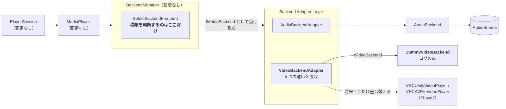
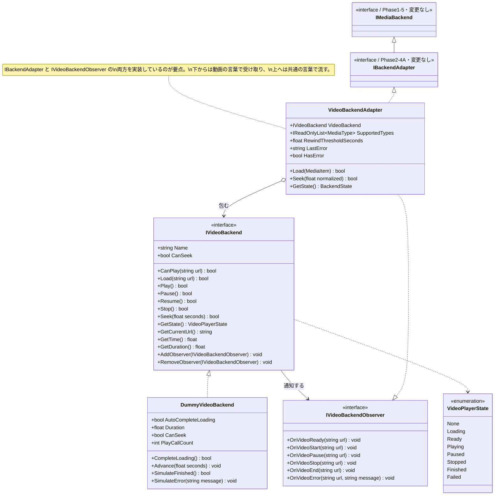

# Phase2-4(B): Video Backend Adapter 設計・実装ドキュメント

**目的は動画を再生することではありません。** MusicBackend と同じ契約(API)で VideoBackend を
扱えるようにし、**VRChat の VideoPlayer に依存するコードを Backend 層だけに閉じ込める**ことです。

実装しなかったもの(要件どおり):

| 項目 | 状態 |
|---|---|
| `VRCUnityVideoPlayer` | 未使用 |
| `VRCAVProVideoPlayer` | 未使用 |
| `VRCUrl` | 未使用 |
| UI | なし |
| ネットワーク・同期 | なし |
| 実際の動画再生 | なし(`DummyVideoBackend` はログのみ) |

**MediaPlayer / PlayerSession / Queue / Recommendation / Catalog は 1 行も変更していません。**
今回の変更は `Assets/SmartMediaPlatform/Video/` の新規追加のみです(`git status` で確認済み)。

---

## 1. 中心となる設計判断:「動画プレイヤーの語彙」をわざと別物にした

一番やってはいけないのは、`IVideoBackend` を `IMediaBackend` のコピーにしてしまうことです。
それでは「違いを吸収するアダプタ」が何も吸収しないので、**将来 VRChat の本物の
VideoPlayer を差し込んだ瞬間に上位まで改修が波及します。**

そこで `IVideoBackend` は、**実機の動画プレイヤーが実際に持っている形**にしました。

| | 上位(`IMediaBackend`) | 動画プレイヤー(`IVideoBackend`) |
|---|---|---|
| 再生対象 | `MediaItem`(カタログの項目) | `string url` |
| 状態 | `BackendState` | `VideoPlayerState`(別 enum) |
| シーク | `Seek(float 0〜1)` 割合 | `Seek(float seconds)` 秒 |
| 通知 | `IBackendObserver` | `IVideoBackendObserver` |
| 読み込み | 同期的に完了する前提 | **非同期**(`Loading` を経由) |

この 5 つのズレを `VideoBackendAdapter` が全部引き受けます。
**ズレがあるからこそ、Adapter 層が「VRChat SDK を閉じ込める壁」として機能します。**



図の破線がこの Phase の成果です。**VRChat SDK が入るのは `IVideoBackend` の実装 1 箇所だけ**で、
アダプタより上は一切知りません。

---

## 2. クラス図



---

## 3. ディレクトリ構成(追加分)

```
Assets/SmartMediaPlatform/Video/
├── Runtime/                                   ← 純粋C#(noEngineReferences: true)
│   ├── SmartMediaPlatform.Video.asmdef        ← 参照は Catalog / Backend / Adapter のみ
│   ├── VideoPlayerState.cs                    ← 動画プレイヤー独自の状態
│   ├── IVideoBackend.cs                       ← 動画プレイヤーの契約 + IVideoBackendObserver
│   ├── DummyVideoBackend.cs                   ← ログのみ(SDK 非依存)
│   └── VideoBackendAdapter.cs                 ← 翻訳の中心
├── Tests/EditMode/
│   ├── SmartMediaPlatform.Video.Tests.asmdef
│   ├── DummyVideoBackendTests.cs              ← 20 ケース
│   └── VideoBackendAdapterTests.cs            ← 29 ケース
├── Demo/
│   ├── SmartMediaPlatform.Video.Demo.asmdef
│   └── VideoBackendConsoleDemo.cs             ← 7 シナリオ
├── Scenes/
│   └── Phase2VideoBackendDemoScene.unity
└── Editor/
    └── Phase2VideoBackendSceneBuilder.cs      ← シーン再生成メニュー
```

`Video/Runtime` の asmdef は **`noEngineReferences: true`** です。
つまり `UnityEngine` を参照できません。将来ここに VRChat SDK を持ち込もうとしても
コンパイラが止めてくれるので、「SDK 依存を Backend 実装の内側に閉じ込める」という
今回の目的が**規約ではなくビルドで守られます。**

---

## 4. API 一覧

### 4.1 `IVideoBackend`(MusicBackend と同じ操作セット)

要件の指定どおり `Load / Play / Pause / Resume / Stop / Seek / GetState / CanPlay` を揃えています。

| API | 戻り値 | 意味 |
|---|---|---|
| `Name` | `string` | ログに出る名前 |
| `CanPlay(string url)` | `bool` | その URL を再生できるか |
| `Load(string url)` | `bool` | 読み込み開始(→ `Loading`) |
| `Play()` | `bool` | 再生開始。読み込み中は拒否 |
| `Pause()` | `bool` | 一時停止 |
| `Resume()` | `bool` | 再開 |
| `Stop()` | `bool` | 停止(位置は 0 に戻る) |
| `Seek(float seconds)` | `bool` | **秒**で指定 |
| `GetState()` | `VideoPlayerState` | 動画プレイヤー側の状態 |
| `GetCurrentUrl()` | `string` | 読み込み中の URL |
| `GetTime()` | `float` | 再生位置(秒) |
| `GetDuration()` | `float` | 長さ(秒) |
| `CanSeek` | `bool` | 生配信なら false |
| `AddObserver` / `RemoveObserver` | `void` | 通知の購読 |

### 4.2 `DummyVideoBackend` の検証用フック

実機の動画プレイヤーは自分で時間が進み、勝手に終わります。
テストから同じ状況を作れるように、以下を用意しました。

| メンバー | 用途 |
|---|---|
| `AutoCompleteLoading`(既定 true) | false にすると**非同期読み込み**を再現できる |
| `CompleteLoading()` | 実機の `OnVideoReady` に相当 |
| `Advance(float seconds)` | 再生位置を進める |
| `SimulateFinished()` | 実機の `OnVideoEnd` に相当 |
| `SimulateError(string)` | 実機の `OnVideoError` に相当 |
| `Duration` / `CanSeek` / `PlayCallCount` | 長さ・生配信・再生回数の検証 |

### 4.3 `VideoBackendAdapter`

`IBackendAdapter`(= `IMediaBackend` + `ISeekableBackend` の拡張)をそのまま実装しているので、
**上位から見ると AudioBackendAdapter と見分けがつきません。**

| API | 上位から見た意味 | 内側での処理 |
|---|---|---|
| `CanPlay(MediaItem)` | 再生できるか | 種別(Video/Live)を確認 → `_video.CanPlay(item.Url)` |
| `Load(MediaItem)` | 読み込み | `item.Url` を取り出して `_video.Load(url)` |
| `Play / Pause / Resume / Stop` | 再生操作 | そのまま委譲し、`BackendEvent` を発行 |
| `Seek(float 0〜1)` | 割合で移動 | `割合 × 長さ` の**秒**に変換 |
| `GetState()` | `BackendState` | `VideoPlayerState` から写す |
| `GetDuration()` | 長さ(秒) | 動画側が 0 を返したら **Catalog のメタデータで補う** |
| `SkipNext()` | 次へ | 現在の動画を止めるだけ(次の選択は上位の仕事) |
| `SkipPrevious()` | 前へ | 3 秒以上進んでいれば頭出し、そうでなければ打ち切り |
| `SupportedTypes` | 扱える種別 | 既定 `Video` / `Live`(コンストラクタで変更可) |

---

## 5. 吸収している 5 つの違い(実装の要点)

### (1) 対象:`MediaItem` ↔ URL

上位はカタログの項目を渡し、動画プレイヤーは URL しか知りません。

```csharp
// VideoBackendAdapter.Load()
if (!_video.Load(item.Url)) { ... }
```

**将来ここが `VRCUrl` を引く箇所になります。** ベイク済み `VRCUrl` テーブルを引く処理は
`IVideoBackend` の実装の内側に置くので、このアダプタも上位も書き換わりません。

### (2) 状態:`VideoPlayerState` ↔ `BackendState`

```csharp
public BackendState GetState()
{
    switch (_video.GetState())
    {
        case VideoPlayerState.Loading:  return BackendState.Loading;
        case VideoPlayerState.Ready:    return BackendState.Ready;
        case VideoPlayerState.Playing:  return BackendState.Playing;
        case VideoPlayerState.Paused:   return BackendState.Paused;
        case VideoPlayerState.Stopped:  return BackendState.Stopped;
        case VideoPlayerState.Finished: return BackendState.Ended;   // ← 名前が違う
        case VideoPlayerState.Failed:   return BackendState.Error;   // ← 名前が違う
        default:                        return BackendState.Idle;
    }
}
```

`Finished → Ended` と `Failed → Error` は名前がずれています。
**このズレを吸収しているからこそ、上位は動画のことを知らずに自動送りできます。**

### (3) シーク:割合(0〜1) ↔ 秒

```csharp
public bool Seek(float normalizedPosition)
{
    if (!CanSeek) { Log("Seek 無視: シークに対応していません"); return false; }

    float clamped = normalizedPosition < 0f ? 0f
        : normalizedPosition > 1f ? 1f : normalizedPosition;

    return _video.Seek(clamped * GetDuration());   // 割合 → 秒
}
```

`CanSeek` を false にすれば生配信の振る舞いになり、シーク要求は握りつぶされます。

### (4) 通知:`IVideoBackendObserver` ↔ `IBackendObserver`

アダプタが**両方のインターフェースを実装**し、下からの通知を上の語彙へ流します。

```csharp
public void OnVideoEnd(string url)
{
    Log($"再生終了の通知: {url}");
    Emit(BackendEventType.Ended, _current, BackendState.Playing);   // 上位の自動送りの起点
}

public void OnVideoError(string url, string message)
{
    ReportError($"動画エラー: {message} ({url})");
}
```

C# の `event` ではなく明示的なインターフェースにしてあるのは、Phase1-2 から通している方針で、
**将来 UdonSharp へ移すときに書き換えずに済ませるため**です。

### (5) 読み込み:同期の期待 ↔ 非同期

実機の動画プレイヤーは `Load` してもすぐには再生できません。
`DummyVideoBackend.AutoCompleteLoading = false` でその状況を再現でき、
アダプタは `Loading` を素直に上へ見せます(勝手に `Ready` を偽装しません)。

---

## 6. 「BackendManager だけが種類を判断する」

要件の「Backend の種類を判断するのは BackendManager のみ」は、
**`SupportedTypes` による自己申告**で実現しています。

- `VideoBackendAdapter` は「自分は Video と Live を扱える」とだけ言う
- `BackendManager.SelectBackendFor(item)` が `item.Type` を見て担当を選ぶ
- **`PlayerSession` / `MediaPlayer` / `Queue` / `Recommendation` には `MediaType` の分岐が 1 つもない**

実測(Console 出力):

```
  music-001   (Music)   -> AudioAdapter
  video-001   (Video)   -> VideoAdapter
  podcast-001 (Podcast) -> (扱えるバックエンドなし)
```

Podcast は担当がいないので `null` が返ります。**例外にはしません** —
Phase3 で PodcastBackend を足せば、この表に 1 行増えるだけで済みます。

---

## 7. Console 出力例(実測値)

`VideoBackendConsoleDemo` の実行結果(抜粋・実際の出力そのまま)。

```
=== Phase2-4 Video Backend Adapter Demo ===

── 1. DummyVideoBackend(動画プレイヤー側の API)
  CanPlay("https://example.com/media/neon-skyline-mv") -> True
  CanPlay("")     -> False
  Load    -> True / State=Ready
  Play    -> True / State=Playing
  Pause   -> True / State=Paused
  Resume  -> True / State=Playing
  Seek 30s-> True / Time=30.0s / 120.0s
  Stop    -> True / State=Stopped
  再生終了 -> State=Finished
    [DummyVideoBackend] Load https://example.com/media/neon-skyline-mv — 動画は再生しません / no actual video
    [DummyVideoBackend] Play https://example.com/media/neon-skyline-mv — 動画は再生しません / no actual video
    [DummyVideoBackend] Seek https://example.com/media/neon-skyline-mv -> 30.00s / 120.00s
    [DummyVideoBackend] 再生終了: https://example.com/media/neon-skyline-mv

── 2. VideoBackendAdapter による翻訳
  対象の翻訳: MediaItem -> URL
    Load(video-001) -> 動画プレイヤーの URL = https://example.com/media/neon-skyline-mv
  状態の翻訳: VideoPlayerState -> BackendState
    動画プレイヤー: Playing   ->  上位から見た状態: Playing
    動画プレイヤー: Finished  ->  上位から見た状態: Ended
  シークの翻訳: 割合(0〜1) -> 秒
    Seek(0.25) -> 動画プレイヤーへは 50.0 秒 (長さ 200.0 秒 / 進捗 25%)

── 3. 非同期の読み込み(実機の動画プレイヤーを再現)
  Load 直後 -> 上位から見た状態 = Loading (まだ読み込み中)
    この間 Play は拒否される -> False
  読み込み完了 -> 上位から見た状態 = Ready
    Play できるようになる -> True / State=Playing
    [AsyncVideoBackend] Play 無視: まだ読み込み中です

── 4. エラーの翻訳
  音楽を動画アダプタに渡す -> HasError=True
    Load 失敗: VideoAdapter は music-001 (Music) を扱えません
  動画プレイヤー側の失敗 -> HasError=True
    動画エラー: URL の読み込みに失敗しました(ダミー) (https://example.com/media/neon-skyline-mv)
    上位から見た状態 = Error

── 5. BackendManager だけが Backend の種類を判断する
  1. AudioAdapter (types: Music)
  2. VideoAdapter (types: Video/Live, video: DummyVideoBackend)
  music-001 (Music) -> AudioAdapter
  video-001 (Video) -> VideoAdapter
  podcast-001 (Podcast) -> (扱えるバックエンドなし)

── 6. PlayerSession / Queue / Recommendation は変更不要
  SetTracks: [video-001, music-001, music-002]
  Play -> [Playing] video-001 Queue=3  担当=VideoAdapter
  Next -> [Playing] music-001 Queue=2  担当=AudioAdapter
  Next -> [Playing] music-002 Queue=1  担当=AudioAdapter
  Queue も Recommendation も動画のことを知らないまま動いている。
```

セクション 6 が**このフェーズの成功条件そのもの**です。
`session.Next()` を呼んでいるだけなのに、担当が `VideoAdapter → AudioAdapter` と
入れ替わっています。上位のコードには動画も音楽も出てきません。

シーン実行時はさらに **7. Audio と Video を混ぜて再生** が続き、
音楽トラックだけ実際に音が鳴ります(動画はログのみ)。

---

## 8. テスト方法

### A. EditMode 自動テスト(一番確実)

1. Unity で `Window > General > Test Runner` を開く
2. **EditMode** タブを選ぶ
3. `SmartMediaPlatform.Video.Tests` を展開して **Run All**

**49 ケース**が追加され、プロジェクト全体で **474 ケース**になります。

| テストクラス | ケース数 | 何を保証しているか |
|---|---|---|
| `DummyVideoBackendTests` | 20 | 状態機械・非同期読み込み・通知・生配信(CanSeek=false)・エラー |
| `VideoBackendAdapterTests` | 29 | 5 つの翻訳・BackendManager 連携・**PlayerSession が無変更で動くこと** |

特に見てほしい 4 ケース:

| テスト名 | 意味 |
|---|---|
| `PlayerSession_PlaysVideoWithoutAnyChanges` | PlayerSession を変更せずに動画を再生できる |
| `PlayerSession_AdvancesOnVideoEnd` | 動画の `Finished` が自動送りにつながる |
| `PlayerSession_QueueAndRecommendationStillWork` | Queue / Recommendation が動画を意識せず動く |
| `Adapter_RegistersWithBackendManagerUnchanged` | BackendManager に無改造で登録できる |

### B. VideoBackendConsoleDemo(Console だけで確認)

1. 空の GameObject を作る
2. `VideoBackendConsoleDemo` をアタッチ
3. Play を押す

Console に上記セクション 1〜6 が出ます。
`Play Audio At The End` を切ると音を鳴らさずに終わります(セクション 7 を省略)。

Inspector から変えられるもの:

| 項目 | 既定値 | 説明 |
|---|---|---|
| `Track Ids` | `video-001, music-001, music-002` | 再生する Catalog の ID |
| `Run On Start` | ON | Play 時に自動実行 |
| `Play Audio At The End` | ON | セクション 7(実際に音を鳴らす)を実行するか |
| `Listen Seconds` | 4 | 音を聴かせる秒数 |

コンポーネントの歯車メニューから **Run Video Backend Scenarios (no audio)** を選ぶと、
Play を押さずにセクション 1〜6 だけ実行できます。

### C. Phase2VideoBackendDemoScene(シーンで確認)

`Assets/SmartMediaPlatform/Video/Scenes/Phase2VideoBackendDemoScene.unity` を開いて Play。

シーンが開けない・スクリプト参照が外れた場合は、メニューの
**Tools > Smart Media Platform > Create Phase2 Video Backend Demo Scene (再生成)**
で作り直せます。

### 確認項目の対応表

| 成功条件 | 確認方法 |
|---|---|
| VideoBackend が MusicBackend と同じ API で扱える | Console 1(Load/Play/Pause/Resume/Stop/Seek が同じ並び) |
| PlayerSession が Music/Video を区別しない | Console 6 / `PlayerSession_PlaysVideoWithoutAnyChanges` |
| BackendManager だけが種類を判断する | Console 5 / `SupportedTypes_DefaultToVideoAndLive` |
| DummyVideoBackend はログのみ | Console 1 の `— 動画は再生しません / no actual video` |
| VRChat SDK に依存していない | `Video/Runtime` の asmdef が `noEngineReferences: true` |
| 既存フェーズが壊れていない | EditMode 474 ケース全パス |

---

## 9. 設計レビュー(自己評価)

### 良かった点

- **`IVideoBackend` を `IMediaBackend` のコピーにしなかった。** 実機の動画プレイヤーの形に
  寄せたので、アダプタが本当に翻訳の仕事をしている。ここを手抜きすると Phase3 で破綻する。
- **`noEngineReferences: true` で SDK 依存の混入をビルドレベルで防いだ。** レビュー任せにしない。
- **非同期読み込みを最初から再現した。** 実機で最初にぶつかる問題を先に潰してある。
- **Podcast を例外にせず `null` で返した。** 未対応種別が増えても壊れない。

### 気になっている点(正直な申告)

1. **`DummyVideoBackendAdapter`(Phase2-4A)と今回の `VideoBackendAdapter` が重複しています。**
   前者は `DummyBackend`(汎用ダミー)を包む暫定物で、後者は動画プレイヤーの API を
   正しく模した本命です。**Phase3 では後者に一本化することを推奨します。**
   今回は「既存を変更しない」という要件を優先して前者を残しました。

2. **`OnVideoStart` / `OnVideoPause` / `OnVideoStop` を空実装にしています。**
   `Play()` / `Pause()` / `Stop()` の呼び出し側で既にイベントを発行しているため、
   二重通知を避ける目的です。ただし**実機の動画プレイヤーが自発的に停止した場合**
   (バッファ切れなど)は通知が上がりません。Phase3 で実機を繋ぐときの要注意点です。

3. **`GetDuration()` が Catalog のメタデータにフォールバックします。**
   動画プレイヤーが長さを答えられない読み込み直後でも進捗が壊れないようにする措置ですが、
   カタログの値が実際の動画とずれていると進捗表示がずれます。

---

## 10. Phase3 以降への引き継ぎ事項

### 実機の VideoPlayer を繋ぐときにやること

**`IVideoBackend` の実装を 1 つ書くだけです。** アダプタも上位も触りません。

```csharp
// Phase3 で追加するイメージ(このリポジトリには未実装)
public class VRCVideoBackend : UdonSharpBehaviour, IVideoBackend   // ※ Udon 化の検討は下記
{
    [SerializeField] private VRCUnityVideoPlayer _player;
    [SerializeField] private VRCUrl[] _bakedUrls;   // ベイク済み(実行時生成は不可)

    public bool Load(string url)
    {
        var vrcUrl = FindBakedUrl(url);   // ← VRCUrl を引くのはここだけ
        if (vrcUrl == null) return false;
        _player.LoadURL(vrcUrl);
        return true;
    }
    // OnVideoReady / OnVideoEnd / OnVideoError を IVideoBackendObserver へ流す
}
```

### 引き継ぐべき注意点

| 項目 | 内容 |
|---|---|
| `VRCUrl` は実行時生成できない | 提案書どおり、事前ベイクした配列から引く。`UdonCatalogBaker`(Phase1-2)と同じ方式が使える |
| `Video/Runtime` は `noEngineReferences: true` | 実機実装は**別 asmdef**に置くこと。ここに SDK を入れるとコンパイルが通らない(意図的) |
| UdonSharp はインターフェースを使えない | 実機実装を Udon 側に置くなら、Phase1-2 と同じく「純粋C#版 + Udon版」の二本立てにする |
| 自発的な停止の通知 | 上記レビュー 2 番。実機を繋ぐ前に `OnVideoStop` の空実装を見直すこと |
| アダプタの一本化 | `DummyVideoBackendAdapter` を廃止し `VideoBackendAdapter` に統合する |
| Live(生配信) | `CanSeek = false` の経路は実装・テスト済み。シーク不可の UI 表現は Phase4 の課題 |

### 次にできること

- **Phase2-5:** 実機 VideoBackend(`VRCUnityVideoPlayer`)の接続
- **Phase3:** UI 層(この Phase までで「上位は種別を知らない」が守られているので、UI も種別分岐なしで書ける)
