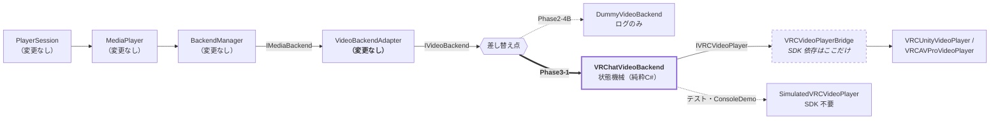

# Phase3-1: VRChat Video Backend 設計・実装ドキュメント

**目的はおすすめ動画を再生することではありません。**
Phase2-4(B) で用意した `DummyVideoBackend`(ログのみ)を、
**VRChat の VideoPlayer を実際に使う実装へ置き換えられること**を証明するのが Phase3-1 です。

| 要件 | 実装 |
|---|---|
| `VRChatVideoBackend` | `Video/Runtime/VRChatVideoBackend.cs`(純粋C#) |
| `VRCUnityVideoPlayer` / `VRCAVProVideoPlayer` の対応 | `Video/VRChat/Runtime/VRCVideoPlayerBridge.cs`(共通基底 `BaseVRCVideoPlayer` を包む) |
| Load / Play / Pause / Resume / Stop / GetState / CanPlay | `VRChatVideoBackend`(`IVideoBackend` の実装) |
| Ended イベント | `NotifyVideoEnd()` + `Tick()` による検出 → `OnVideoEnd` → `BackendEventType.Ended` |
| Error イベント | `NotifyVideoError(VideoErrorKind)` → `OnVideoError` → `BackendEventType.Error` |
| **BackendAdapter は変更しない** | `VideoBackendAdapter.cs` は **1 文字も変更していません** |
| **PlayerSession / Queue / Recommendation を変更しない** | `Session/` `Queue/` `Recommendation/` に差分ゼロ |

### 今回実装していないもの(要件どおり)

おすすめ動画 / Playlist / StringDownloader / VRCUrlInputField / 検索 / 外部API /
ネットワーク / 同期 / UI / **自動URL生成**。

動画 URL は **Catalog に事前登録されたものだけ**を使います。
実行時に `VRCUrl` を生成する処理はコードのどこにもありません(後述 §4)。

---

## 1. 差分の全体像 — 「new する行が 1 つ変わるだけ」

```csharp
// Phase2-4(B)
var video   = new DummyVideoBackend("DummyVideoBackend", logger);
var adapter = new VideoBackendAdapter("VideoAdapter", video, logger);

// Phase3-1 — 変わったのは 1 行目だけ
var video   = new VRChatVideoBackend("VRChatVideoBackend", bridge, urls, logger);
var adapter = new VideoBackendAdapter("VideoAdapter", video, logger);   // ← 同一
```

Phase2-4(B) が `IVideoBackend` を「実機の動画プレイヤーの形」(URL・秒・独自の状態・非同期読み込み)に
しておいたので、**アダプタもその上も一切書き換わりませんでした。**



**SDK の型が出てくるのは `VRCVideoPlayerBridge` / `VRCUrlTable` / `VRChatVideoBackendHost` の 3 ファイルだけ**です。
`VRChatVideoBackend` 本体は `Video/Runtime`(`noEngineReferences: true`)にあるので、
**そこに SDK を持ち込もうとするとコンパイルが通りません** — 規約ではなくビルドで守られています。

---

## 2. ディレクトリ構成(追加分)

```
Assets/SmartMediaPlatform/Video/
├── Runtime/                                ← 純粋C#(noEngineReferences: true)
│   ├── IVideoBackend.cs                    〔既存・変更なし〕
│   ├── VideoBackendAdapter.cs              〔既存・変更なし〕
│   ├── DummyVideoBackend.cs                〔既存・変更なし〕
│   ├── VideoErrorKind.cs                   ★ SDK の VideoError を SDK 非依存で写した enum
│   ├── IVRCVideoPlayer.cs                  ★ BaseVRCVideoPlayer の抽象 + VRCVideoPlayerKind
│   ├── IVideoUrlTable.cs                   ★ 事前登録 URL 表 + CatalogVideoUrlTable
│   ├── SimulatedVRCVideoPlayer.cs          ★ SDK 無しで実機の挙動を再現する代役
│   └── VRChatVideoBackend.cs               ★ 本体(IVideoBackend の実装)
├── VRChat/                                 ★ SDK 依存(defineConstraints: VRC_SDK_VRCSDK3)
│   ├── SmartMediaPlatform.Video.VRChat.asmdef
│   └── Runtime/
│       ├── VRCUrlTable.cs                  ★ ベイク済み VRCUrl 表
│       ├── VRCVideoPlayerBridge.cs         ★ BaseVRCVideoPlayer → IVRCVideoPlayer
│       ├── VRChatVideoBackendHost.cs       ★ 組み立て + Tick + コールバック受け口
│       └── VRChatVideoSceneDemo.cs         ★ DemoScene の進行役
├── Demo/
│   └── VRChatVideoBackendConsoleDemo.cs    ★ ConsoleDemo(SDK 不要・7 シナリオ)
├── Scenes/
│   ├── Phase2VideoBackendDemoScene.unity   〔既存〕
│   └── Phase3VRChatVideoDemoScene.unity    ★ ConsoleDemo 用シーン
├── Editor/
│   └── Phase3VRChatVideoSceneBuilder.cs    ★ シーン生成(SDK シーンも生成できる)
└── Tests/EditMode/
    ├── VRChatVideoBackendTests.cs          ★ 43 ケース
    └── VRChatVideoBackendSwapTests.cs      ★ 13 ケース
```

`Video/VRChat/` の asmdef は **`defineConstraints: ["VRC_SDK_VRCSDK3"]`** です。
SDK が入っていない環境ではこのアセンブリごとコンパイル対象から外れるので、
**既存の 474 ケースは SDK 無しのままそのまま通ります。**

---

## 3. なぜ 2 段(Backend + Bridge)に分けたか

`VRChatVideoBackend` が `BaseVRCVideoPlayer` を直接持てば 1 クラスで済みます。それをしなかった理由:

| 理由 | 内容 |
|---|---|
| **テストできる** | 状態機械を SDK 抜きで EditMode テストできる(56 ケース)。SDK を挟むと再生の完了を待つ不安定なテストになる |
| **`noEngineReferences` を守れる** | Phase2-4(B) が用意した「SDK を閉じ込める壁」を壊さない |
| **AVPro と Unity 版を 1 本で扱える** | 両者の共通基底 `BaseVRCVideoPlayer` をブリッジが包むだけ |
| **SDK のバージョン差に強い** | SDK の型に触るファイルが 3 つに限定される |

Audio 層(Phase2-1)が `AudioBackend` + `IAudioPlayer` + `UnityAudioSourcePlayer` に分けたのと
**完全に同じ構造**です。新しい考え方は持ち込んでいません。

---

## 4. 「実行時に VRCUrl を生成しない」をどう守っているか

提案書の結論どおり、`VRCUrl` は実行時に作れません。守り方は 3 重です。

1. **ベイクは編集時だけ**
   `VRCUrlTable.Bake()` は `#if UNITY_EDITOR` の中にあります。実行時には呼べません。
   `new VRCUrl(...)` はこの中の 1 箇所にしか存在しません(Phase1-2 の `UdonCatalogBaker` と同じ方式)。

2. **再生できる URL は表にあるものだけ**
   ```csharp
   public bool CanPlay(string url)
   {
       if (string.IsNullOrWhiteSpace(url)) return false;
       if (!_urls.Contains(url)) return false;                       // ← 事前登録チェック
       return _player.Kind == VRCVideoPlayerKind.AVPro || !IsLiveStreamUrl(url);
   }
   ```
   表に無い URL は `Load` の時点で `InvalidUrl` エラーになり、動画プレイヤーには渡りません。

3. **ブリッジも表からしか引かない**
   ```csharp
   public bool LoadURL(string url)
   {
       VRCUrl baked = _urls.Resolve(url);
       if (baked == null) return false;   // 作らずに諦める
       _player.LoadURL(baked);
       return true;
   }
   ```

表の中身は **Catalog の Video / Live の URL そのもの**です(`CatalogVideoUrlTable`)。
つまり「Catalog に登録済みの動画だけが再生できる」がコードで保証されています。

---

## 5. 実機の非同期読み込みをどう吸収したか(唯一の設計上の追加)

これが Phase3-1 で**唯一悩んだ点**です。

- 実機の動画プレイヤーは `Load` してもすぐには再生できません(`Loading` → `Ready`)。
- 一方 `MediaPlayer.Play()`(Phase2-2・**変更不可**)は「読み込んで、すぐ `Play()`」と呼びます。

素直に実装すると `Play()` が `Loading` で弾かれ、**実機では一生再生が始まりません。**

**上位を変えずに解決するため、吸収を Backend 側に置きました。**

```csharp
public bool AutoPlayWhenReady { get; set; } = true;

// Play() が読み込み中に来たら「予約」して受け付ける
if (_state == VideoPlayerState.Loading)
{
    if (!AutoPlayWhenReady) { Log("Play 無視: まだ読み込み中です"); return false; }
    _playOnReady = true;
    return true;
}

// 読み込みが終わったところで実行する
private void CompleteLoading()
{
    _state = VideoPlayerState.Ready;
    Notify(o => o.OnVideoReady(_url));
    if (_playOnReady) StartPlayback("Play(予約分)");
}
```

- `AutoPlayWhenReady = false` にすれば `DummyVideoBackend` と**完全に同じ**振る舞いに戻ります。
- `Stop()` と エラー は予約を取り消します(止めたのに後から鳴り出さない)。
- 検証: `PlayerSession_PlaysThroughAnAsynchronousLoadWithoutAnyChanges`。

**これは Phase2 の設計変更ではありません。** 変更したのは今回追加した VideoBackend の内部だけで、
`IVideoBackend` の契約も `VideoBackendAdapter` も上位も触っていません。

---

## 6. Ended / Error の 2 経路

実機のコールバックは Udon 経由で届きます。しかし
**UdonSharp は インターフェース を扱えない**ため、コールバックの中継は Phase3-2(Udon 版)の課題です。
それまで(および Unity エディタでの確認)でも動くよう、**入口を 2 つ**用意しました。

| 経路 | 誰が呼ぶ | 何を拾うか |
|---|---|---|
| **プッシュ** | 実機の `OnVideoReady` / `OnVideoEnd` / `OnVideoError` … | 正確・即時 |
| **ポーリング**(`Tick()`) | `VRChatVideoBackendHost.Update()` | 読み込み完了 / 読み込みタイムアウト / **終端まで進んだのに `IsPlaying` が false** |

```csharp
public void Tick(float deltaSeconds = 0f)
{
    if (_state == VideoPlayerState.Loading)
    {
        if (_player.IsReady) { CompleteLoading(); return; }
        _loadingSeconds += deltaSeconds;
        if (LoadTimeoutSeconds > 0f && _loadingSeconds >= LoadTimeoutSeconds)
            Fail(_url, VideoErrorKind.Timeout, "…");
        return;
    }

    if (_state != VideoPlayerState.Playing || !DetectEndByPolling) return;
    if (_player.IsPlaying) return;

    // 「終端まで進んでいる」ことを条件にして、再生開始直後やバッファ切れの誤検出を避ける
    float duration = GetDuration();
    if (duration > 0f && _player.GetTime() >= duration - 0.25f) NotifyVideoEnd();
}
```

どちらから来ても**通知は 1 回だけ**です(状態で二重発火を防止)。
検証: `ReadyIsNotifiedOnlyOnce_EvenWithBothPaths` / `EndIsNotifiedOnlyOnce` /
`Tick_DoesNotReportTheEndWhilePlaybackStallsMidway`。

ポーリングは Phase2-4(B) の設計レビュー 2 番(**プレイヤーが自発的に停止したときに通知が上がらない**)への
回答も兼ねています。

---

## 7. API 一覧

### 7.1 `VRChatVideoBackend`(`IVideoBackend` の実装)

| API | 意味 | 実機で何をするか |
|---|---|---|
| `CanPlay(string url)` | 再生できるか | 空でない + **ベイク済み** + プレイヤー種別が対応 |
| `Load(string url)` | 読み込み開始 | `Stop()` → `LoadURL(VRCUrl)` → `Loading` |
| `Play()` | 再生 | `Play()`。読み込み中なら予約(§5) |
| `Pause()` / `Resume()` | 一時停止 / 再開 | `Pause()` / `Play()` |
| `Stop()` | 停止 | `Stop()`。予約も取り消す |
| `Seek(float seconds)` | 秒で移動 | `SetTime()`。生配信では拒否 |
| `GetState()` | `VideoPlayerState` | 状態機械の現在値 |
| `GetTime()` / `GetDuration()` | 位置 / 長さ | `GetTime()` / `GetDuration()`(不明は 0 に正規化) |
| `CanSeek` | シーク可否 | 長さが分かるときだけ true |

追加メンバー:

| メンバー | 用途 |
|---|---|
| `Tick(float deltaSeconds)` | 読み込み完了 / タイムアウト / 再生終了の検出 |
| `NotifyVideoReady/Start/Play/Pause/End/Loop/Error` | 実機コールバックの受け口 |
| `AutoPlayWhenReady`(既定 true) | 読み込み完了後の自動再生(§5) |
| `LoadTimeoutSeconds`(既定 20) | 読み込みタイムアウト。0 で無効 |
| `DetectEndByPolling`(既定 true) | `Tick` による終了検出の ON/OFF |
| `LastErrorKind` | 直近のエラー理由(`VideoErrorKind`) |
| `IsPlayPending` / `PlayCallCount` | 予約中か / 再生開始回数 |

### 7.2 `IVRCVideoPlayer`(SDK を閉じ込める壁)

`BaseVRCVideoPlayer` とメンバー名を揃えてあります。違いは `LoadURL` が
`VRCUrl` ではなく **URL 文字列**を取り、表に無ければ `false` を返すことだけです。

| メンバー | SDK の対応 |
|---|---|
| `Kind` | (こちら側の情報)Unity / AVPro |
| `IsPlaying` / `IsReady` / `Loop` | 同名のプロパティ |
| `LoadURL(string)` | `LoadURL(VRCUrl)` |
| `Play` / `Pause` / `Stop` | 同名 |
| `SetTime` / `GetTime` / `GetDuration` | 同名 |

### 7.3 `VRChatVideoBackendHost`(MonoBehaviour)

| メンバー | 用途 |
|---|---|
| `EnsureBuilt(logger)` | Backend + `VideoBackendAdapter` を組み立てて返す |
| `Adapter` | `BackendManager` / `PlayerSession` にそのまま登録できる |
| `Backend` | 組み立て済みの `VRChatVideoBackend` |
| `BakeUrlsFrom(catalog)` | Catalog の URL を `VRCUrl` へ焼き込む(**編集時専用**) |
| `OnVideoReady/Start/Play/Pause/End/Loop/Error` | 実機コールバックの受け口(名前は SDK に合わせてある) |

---

## 8. `VRCUnityVideoPlayer` と `VRCAVProVideoPlayer`

両者の共通基底 `BaseVRCVideoPlayer` を包んでいるので、**操作は完全に共通**です。
区別するのは 1 箇所、**生配信を再生できるかどうか**だけです。

```
VRCUnityVideoPlayer  -> CanPlay("rtsp://…") = False   (生配信は扱えない)
VRCAVProVideoPlayer  -> CanPlay("rtsp://…") = True
AVPro で Load -> Ready / 長さ=0.0s(不明) / CanSeek=False
```

長さが分からない生配信では `CanSeek = false` になり、
`VideoBackendAdapter.Seek(割合)` は握りつぶされます(Phase2-4(B) で実装・テスト済みの経路)。

シーンで AVPro に切り替えるときは、`VRCUnityVideoPlayer` を `VRCAVProVideoPlayer` に置き換えて
`VRChatVideoBackendHost` の `Video Player` に割り当て直すだけです。**コードの変更はありません。**

---

## 9. テスト方法

### A. EditMode 自動テスト(SDK 不要)

1. `Window > General > Test Runner` → **EditMode**
2. `SmartMediaPlatform.Video.Tests` を **Run All**

**56 ケース**が追加され、プロジェクト全体で **530 ケース**になります。

| テストクラス | ケース数 | 何を保証しているか |
|---|---|---|
| `VRChatVideoBackendTests` | 43 | 状態機械 / 非同期読み込み / 予約再生 / Ended の 2 経路 / Error 4 種 / タイムアウト / 生配信 / ベイク済み URL 制限 |
| `VRChatVideoBackendSwapTests` | 13 | **Dummy と差し替えても同じ**・アダプタ無変更・BackendManager 無変更・PlayerSession 無変更 |

特に見てほしい 5 ケース:

| テスト名 | 意味 |
|---|---|
| `BothBackends_BehaveIdenticallyThroughTheSameScript` | 同じ手順で Dummy と VRChat の状態遷移が**完全一致** |
| `PlayerSession_PlaysACatalogVideoThroughTheRealBackend` | Catalog の動画を PlayerSession から再生でき、実際にプレイヤーが動く |
| `PlayerSession_PlaysThroughAnAsynchronousLoadWithoutAnyChanges` | 実機の非同期読み込みでも上位が無変更で動く |
| `PlayerSession_AdvancesWhenTheVideoEnds` | Ended が上位の自動送りにつながる |
| `Load_RejectsUrlsThatWereNotBaked_AndReportsAnError` | 実行時 URL 生成をしないことがエラーとして表れる |

既存の 474 ケースには手を入れていません(`Video/Runtime` の既存 4 ファイルは差分ゼロ)。

### B. ConsoleDemo(SDK 不要)

`Assets/SmartMediaPlatform/Video/Scenes/Phase3VRChatVideoDemoScene.unity` を開いて **Play**。
(または空の GameObject に `VRChatVideoBackendConsoleDemo` をアタッチ)

メニュー **Tools > Smart Media Platform > Open Phase3 VRChat Video Demo Scene** でも開けます。
コンポーネントの歯車メニュー **Run VRChat Video Backend Scenarios** なら Play 不要です。

Console に出る 7 シナリオ:

| # | 内容 |
|---|---|
| 1 | Catalog に事前登録された URL だけを再生する(未登録は拒否) |
| 2 | Load / Play / Pause / Resume / Seek / Stop |
| 3 | Ended イベント(コールバック経路とポーリング経路の両方) |
| 4 | Error イベント(未ベイク URL / AccessDenied / タイムアウト) |
| 5 | **DummyVideoBackend との突き合わせ表**(全ステップ一致) |
| 6 | BackendAdapter / PlayerSession / Queue / Recommendation は無変更 |
| 7 | 生配信(Unity 版と AVPro の違い) |

### C. DemoScene(VRChat SDK で実際に再生)

SDK が入っている環境では、メニュー
**Tools > Smart Media Platform > Create Phase3 VRChat SDK Video Scene (実際に再生)** を実行します。
生成されるシーンには次が入ります。

- `VRCVideoPlayer`(GameObject)
  - `VRCUnityVideoPlayer` … 本物の動画プレイヤー
  - `AudioSource` … 音声出力
  - `VRChatVideoBackendHost` … Backend + Adapter の組み立てと `Tick`
  - `VRChatVideoSceneDemo` … 進行役(Console 出力)
- `VideoScreen`(Quad)… 映像の出力先。**RenderTexture / Material の割り当ては手作業です**

URL は生成時に Catalog から `VRCUrl` へ焼き込まれます
(あとから焼き直す場合は **Tools > Smart Media Platform > Bake Catalog Urls Into Selected Video Host**)。

**Play を押すと Console に次が出ます。**

| # | 確認内容 |
|---|---|
| 0 | 構成(どのプレイヤーが繋がっているか / ベイク済み URL 件数) |
| 1 | `CanPlay`:Catalog の URL は true、未ベイクは false |
| 2 | PlayerSession から再生(Catalog → Queue → Backend) |
| 3 | Play / Pause / Resume / Stop(一時停止中は時間が進まないことも確認) |
| 4 | Ended イベント(終端付近へシークして待つ) |
| 5 | Error イベント(未ベイク URL / 実機の `OnVideoError(AccessDenied)`) |

### 成功条件の対応表

| 成功条件 | 確認方法 |
|---|---|
| Catalog に登録された動画を再生できる | Console C-2 / `PlayerSession_PlaysACatalogVideoThroughTheRealBackend` |
| Play / Pause / Resume / Stop が正常動作する | Console B-2・C-3 / `PlayerSession_ControlsPlaybackWithoutKnowingItIsAVideo` |
| 動画終了時に Ended が発火する | Console B-3・C-4 / `Tick_DetectsTheEndWhenNoCallbackArrives` |
| エラー時に Error が通知される | Console B-4・C-5 / `NotifyVideoError_TranslatesEachReason` |
| DummyVideoBackend を差し替えるだけで動作する | Console B-5 / `BothBackends_BehaveIdenticallyThroughTheSameScript` |
| PlayerSession / Queue / Recommendation を変更しない | `git diff` に `Session/` `Queue/` `Recommendation/` の差分なし |
| BackendAdapter を変更しない | `git diff` に `VideoBackendAdapter.cs` の差分なし |
| 既存テストを壊さない | EditMode 530 ケース全実行 |
| ConsoleDemo と DemoScene の両方で確認できる | B と C |

---

## 10. 設計レビュー(自己評価)

### 良かった点

- **Phase2 に一切手を入れずに済んだ。** `VideoBackendAdapter` より上は差分ゼロ。
  Phase2-4(B) で `IVideoBackend` を「実機の形」に寄せておいた判断が効いた。
- **SDK 依存を 3 ファイルに閉じ込めた。** しかも `defineConstraints` でアセンブリごと分離したので、
  SDK が無い環境でも既存テストがそのまま通る。
- **Unity 版と AVPro を 1 本のブリッジで扱えた。** 共通基底を包んだので分岐は生配信判定のみ。
- **非同期読み込みの吸収を Backend 側に置いた。** 上位に「読み込み待ち」の概念を持ち込まずに済んだ。

### 気になっている点(正直な申告)

1. **実機(Udon)でのコールバック中継はまだありません。**
   VRChat の動画プレイヤーはイベントを**同じ GameObject の UdonBehaviour** へ送りますが、
   UdonSharp は インターフェース を扱えないため、`VRChatVideoBackendHost`(C# MonoBehaviour)は
   直接には受け取れません。現状は **`Tick()` のポーリング**が読み込み完了・再生終了・
   タイムアウトを拾う設計で、Unity エディタでの確認はこれで完結します。
   **Udon 版の中継(Phase1-2 と同じ「純粋C#版 + Udon版」二本立て)は Phase3-2 の課題です。**
   `NotifyVideoXxx` の受け口は既に用意してあるので、Udon 側を書くだけで繋がります。

2. **`Phase3VRChatSdkVideoScene.unity` をリポジトリに同梱していません。**
   SDK 固有コンポーネントの GUID は SDK のバージョンに依存し、同梱すると
   「SDK の入っていない環境でシーンが壊れる」ためです。メニューから生成する方式にしました。
   映像の出力先(RenderTexture / Material)の割り当ては手作業のままです。

3. **`DummyVideoBackendAdapter`(Phase2-4A)は今回も残しています。**
   Phase2-4(B) のレビューで「Phase3 で `VideoBackendAdapter` に一本化を推奨」と書きましたが、
   これは Phase2 の設計変更にあたるため**独断では行いませんでした。**
   一本化するかどうかはご判断ください。

4. **`Tick()` の終了検出は「終端まで進んだか」で判定しています。**
   極端に短い動画や、`GetDuration()` が最後まで 0 のままの環境では検出できません。
   その場合は実機の `OnVideoEnd` を `NotifyVideoEnd()` へ繋いでください(そちらが本線です)。

---

## 11. Phase3-2 以降への引き継ぎ

| 項目 | 内容 |
|---|---|
| Udon 版の中継 | `UdonSharpBehaviour` で `OnVideoReady/Start/End/Error` を受け、Udon 版 Backend へ渡す。Phase1-2 の `UdonMediaCatalog` と同じ二本立て |
| VRChat の読み込みレート制限 | 短時間に連続 `LoadURL` すると `RateLimited` になる。連続再生では数秒空けるか、失敗時に再試行する層が要る(今回は未実装) |
| 映像の出力先 | RenderTexture / Material の割り当ては Phase4(UI)で扱う |
| 同期 | 複数人で同じ位置を見る同期は Phase5(VR共有体験)。今回は単独再生のみ |
| アダプタの一本化 | `DummyVideoBackendAdapter` の廃止(要承認) |
