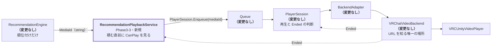

# Phase3-3: Recommendation Playback Integration 設計・実装ドキュメント

**目的は「Catalog に登録済みのおすすめ動画を自動で再生できること」です。**
Phase3-2 までに揃った部品を 1 本の再生フローにつなぎます。

```
RecommendationEngine → Queue → PlayerSession → BackendAdapter → VRChatVideoBackend
```

| 要件 | 実装 |
|---|---|
| RecommendationEngine から次の MediaId を取得する | `RecommendationPlaybackService.PickNextMediaId()`(**string だけ**を返す) |
| Queue へ自動追加する | `RecommendationPlaybackService.EnsureQueueFilled()` → `PlayerSession.Enqueue()` |
| PlayerSession から再生を開始する | `RecommendationPlaybackService.Start()` → `PlayerSession.Play()` |
| 動画終了(Ended)で次のおすすめを取得する | `OnBackendEvent(Ended)` → 補充 → `PlayerSession.Next()` が進める |
| Queue が空でも Recommendation から補充する | `Fill()`(直近の除外を緩める → カタログ補完) |

### 変更していないもの(要件どおり)

`Catalog` / `RecommendationEngine` / `Queue` / `PlayerSession` / `BackendAdapter` /
`MediaPlayer` / `BackendManager` / `VRChatVideoBackend` は **1 行も変更していません。**
今回の差分は **`AutoPlay/` の新規追加**と **`Video/Runtime/Data/` の新規追加**だけです
(`git status` で確認済み)。

外部API・StringDownloader・YouTube検索・VRCUrlInputField・URL生成・ネットワーク同期・
マルチプレイヤー同期・UI・Playlist編集・お気に入り のいずれにも触れていません。

---

## 1. 実装前に見つけた「唯一の穴」

Phase2-3(B) の `PlayerSession` は、すでにこのループのほとんどを持っています。

```csharp
// PlayerSession.EnsureQueueFilled()（既存・変更なし）
int added = EnqueueFromTracks(wanted);                       // 1. まだ流していない曲
if (added < wanted && RepeatMode == RepeatMode.All) { ... }  // 2. Repeat All
if (added < wanted && AutoQueueEnabled)
    added += RefillFromRecommendation(wanted - added);        // 3. おすすめで補う ← ここ
```

**問題は 3 番に「再生できるか」の判定が無いこと**です。
おすすめは Catalog 全体から候補を返すので、`DummyCatalogSource` では
Music が大量に返ってきます。VideoBackend しか登録していない構成でそれを積むと、
`BackendManager.LoadCurrent()` が「扱えるバックエンドがない」で失敗し、**再生が止まります**。

Phase2-4(B) のテストにも、この事実がそのまま書かれていました:

```csharp
// おすすめ補充は Music を返すので、Video アダプタだけでは再生できない。
// それでも Queue 自体は正しく積まれる。
```

**Phase3-3 が足したのは、この 1 点だけです — 「積む直前に、再生できるか確かめる」。**

---

## 2. 責務の置きどころ

「再生できるか」の判定を**どこに置かないか**が設計の中心でした。

| 置いてはいけない場所 | 理由 |
|---|---|
| `RecommendationEngine` | 「何が似ているか」だけを知るレイヤー。再生手段を知った瞬間に Catalog 以外へ依存する(asmdef 参照が `Catalog` だけである意味が消える) |
| `Queue` | 「並び」だけを持つレイヤー。積むものを選り好みし始めると Shared Queue / DJ Mode で破綻する |
| `PlayerSession` | 変更禁止。かつ「Backend の具体型を参照しない」という Phase2-3(B) の約束がある |
| `BackendAdapter` | 変更禁止。すでに `CanPlay(MediaItem)` で答える役目は果たしている |

そこで **「積む直前」に見る新しい接続層**を 1 つ足しました。



- **Recommendation からは `MediaId`(string)しか受け取りません。**
  `MediaItem` も URL も先へ流さないので、URL(VRCUrl)を知るのは引き続き VideoBackend だけです。
- **Queue へは `PlayerSession.Enqueue(mediaId)` 経由で積みます。**
  `IQueue` を直接触らないので、Queue の責務も PlayerSession の責務も動きません。
- **「次に何を再生するか」を決めるのは引き続き `PlayerSession`** です。
  この層は「選べる状態にしておく」だけで、再生の指示は出しません。

---

## 3. ディレクトリ構成(追加分)

```
Assets/SmartMediaPlatform/
├── AutoPlay/                                          ★ 新設モジュール
│   ├── Runtime/                                       ← 純粋C#(noEngineReferences: true)
│   │   ├── SmartMediaPlatform.AutoPlay.asmdef         ← Catalog/Recommendation/Queue/Backend/Player/Session
│   │   ├── IPlaybackFilter.cs                         ★ 再生可否の判定(3 実装)
│   │   └── RecommendationPlaybackService.cs           ★ 本体
│   ├── VRChat/                                        ★ SDK 依存(VRC_SDK_VRCSDK3)
│   │   ├── SmartMediaPlatform.AutoPlay.VRChat.asmdef
│   │   └── Runtime/VRChatAutoPlaySceneDemo.cs         ★ 実機 DemoScene の進行役
│   ├── Demo/RecommendationPlaybackConsoleDemo.cs      ★ ConsoleDemo(SDK 不要・4 シナリオ)
│   ├── Editor/Phase3RecommendationPlaybackSceneBuilder.cs
│   ├── Scenes/Phase3RecommendationPlaybackDemoScene.unity
│   └── Tests/EditMode/RecommendationPlaybackServiceTests.cs   ★ 39 ケース
└── Video/Runtime/Data/VideoCatalogSource.cs           ★ 動画 10 本のカタログ供給元
```

**既存モジュールのファイルは 1 つも変更していません。**

`AutoPlay/Runtime` は `noEngineReferences: true`(純粋 C#)です。
SDK 依存は `AutoPlay/VRChat`(`defineConstraints: VRC_SDK_VRCSDK3`)に分離してあるので、
SDK が無い環境でも既存テストはそのまま通ります。

---

## 4. なぜ動画カタログを追加したか

`DummyCatalogSource`(Phase1-1)は **Music 10 件 / Video 1 件**です。
動画が 1 本しかないと「おすすめで次の**動画**を選び続ける」ループを確かめられません。

そこで **`VideoCatalogSource`(動画 10 本)** を追加しました。

- **Catalog の設計は変えていません。** Phase1-1 が用意した拡張点
  `IMediaCatalogSource` を実装しただけで、`MediaCatalog` にそのまま差し込めます。
- おすすめが効くよう、アーティスト・ジャンル・タグ・`RelatedIds` に意図的な重なりを持たせています
  (Aurora Drive 3 本 / Glasshouse Signal 2 本 / Kohaku 2 本 / Yuzuriha 2 本 / The Orbit Room 1 本)。
- 併せて **`MixedCatalogSource`**(動画 + 音楽 + Podcast)も用意しました。
  「再生できない種別が混ざっても、ループが崩れない」ことを確かめるためです。

URL は `DummyCatalogSource` と同じ形式の架空アドレスです。
実機で映像を出すには実在する URL に差し替えてから `VRCUrlTable` へ焼き直してください
(実行時に VRCUrl は作れません)。

---

## 5. `RecommendationPlaybackService` の中身

### 5.1 補充の入口を 1 つに保つ

```csharp
if (takeOverAutoQueue) _session.AutoQueueEnabled = false;
```

`PlayerSession` 側のおすすめ補充にはフィルタが無いので、両方動くと
**フィルタを通る経路と通らない経路が混ざります。**
既定でこの層が補充を引き取り、`PlayerSession` 側は切ります
(`takeOverAutoQueue: false` で従来どおりにも戻せます)。

### 5.2 積む直前の判定 — Phase3-3 で足した唯一の判断

```csharp
for (int i = 0; i < ranked.Length && added < wanted; i++)
{
    var item = ranked[i].Item;

    if (!_filter.CanPlay(item)) { FilteredOutCount++; continue; }   // ← ここだけ
    if (!IsAcceptable(item.Id, avoidRecent)) continue;

    if (EnqueueId(item.Id)) { EnqueuedByRecommendation++; added++; }
}
```

`ranked` の並びには手を触れていません。**おすすめの順位付けはそのままです。**

### 5.3 `IPlaybackFilter` の 3 実装

| 実装 | 判定方法 | 使いどころ |
|---|---|---|
| `BackendPlaybackFilter` | `BackendManager.CanPlay(item)` に聞く | **推奨。** `MediaType` の分岐をどこにも書かずに済む |
| `MediaTypePlaybackFilter` | 種別を照合(既定 Video / Live) | 「動画だけにする」と明示的に決めたいとき |
| `AnyPlaybackFilter` | 何でも通す | 従来の挙動に戻したいとき |

`BackendPlaybackFilter` を使うと、**構成が挙動を決めます** —
VideoBackend だけ登録すれば動画だけのループになり、AudioBackend も登録すれば音楽も混ざります。
「Backend の種類を判断するのは BackendManager だけ」という Phase1-5 からの約束を
そのまま利用しています。

### 5.4 Ended の受け取り順

```csharp
public void RegisterBackend(IMediaBackend backend)
{
    backend.AddObserver(this);        // ← 先に購読する
    _session.RegisterBackend(backend);
}
```

通知は登録順に流れるので、`PlayerSession.Next()` が動く**前**に次の動画を積めます。
`MediaPlayer.SkipNext()` は **Queue に 2 本以上ないと `false`** を返す
(= 再生が止まる)ため、この順序が効いてきます。

ただし Queue は常に `TargetQueueCount`(既定 5)まで先に積んであるので、
**順序に頼らなくても動きます。** 取りこぼしを無くすための二重の備えです。

### 5.5 尽きたときの二段構え

```
1. おすすめ（直近に積んだものは避ける）
2. おすすめ（直近の除外を緩める）      ← AllowRepeatWhenExhausted
3. カタログの並び順から補う             ← AllowCatalogFallback（最後の手段）
```

3 は「おすすめが 1 件も返せない」異常時の保険で、使われた件数は
`EnqueuedByCatalogFallback` に別集計されます。
**おすすめが効いているかを確かめたい場合は `AllowCatalogFallback = false`** にしてください。

### 5.6 API 一覧

| API | 意味 |
|---|---|
| `Start(seedMediaId = null)` | 起点を決めて Queue を作り、`PlayerSession.Play()` で再生開始 |
| `EnsureQueueFilled()` | 不足していればおすすめで補充。毎フレーム呼んでよい |
| `PickNextMediaId(seedId = null)` | **MediaId(string)を 1 件だけ返す。**Queue には積まない |
| `RegisterBackend(IMediaBackend)` | 購読順を保証しつつ `PlayerSession` にも登録する |
| `OnBackendEvent(BackendEvent)` | Ended を受けて先に補充する |
| `MinimumQueueCount` / `TargetQueueCount` / `RecentMemory` | 補充の閾値 |
| `AllowRepeatWhenExhausted` / `AllowCatalogFallback` | 尽きたときの振る舞い |
| `SeedId` / `RefillCount` / `EnqueuedByRecommendation` / `EnqueuedByCatalogFallback` / `FilteredOutCount` / `EndedCount` / `Recent` | 診断 |
| `Describe()` | Console 用 1 行サマリ |

---

## 6. テスト方法

### A. EditMode 自動テスト(SDK 不要・最優先)

1. `Window > General > Test Runner` → **EditMode**
2. `SmartMediaPlatform.AutoPlay.Tests` を **Run All**

**39 ケース**が追加され、プロジェクト全体で **607 ケース**になります。

| 分類 | 主なテスト |
|---|---|
| Catalog から再生できる | `Start_PlaysASeedVideoFromTheCatalog` / `Start_UsesTheUrlBakedInTheCatalog` |
| Recommendation が次を決める | `PickNextMediaId_ReturnsAPlayableCatalogId` / `PickNextMediaId_NeverReturnsTheCurrentVideo` |
| Queue へ追加される | `Start_FillsTheQueueAhead` / `EnsureQueueFilled_RefillsAnEmptyQueue` |
| PlayerSession が再生する | `Start_PlaysASeedVideoFromTheCatalog` / `PlayerSession_StillRecordsHistory` |
| **Ended だけで次へ進む** | `EndedEvent_AdvancesToTheNextRecommendedVideo` / **`EndedEvent_IsTheOnlyTriggerNeededForALongLoop`** |
| Queue が空でも補充 | `EnsureQueueFilled_RefillsAnEmptyQueue` / `EnsureQueueFilled_KeepsWorkingAfterTheCatalogIsExhausted` |
| 再生できない種別を積まない | `MixedCatalog_OnlyQueuesPlayableItems` / `MixedCatalog_LoopKeepsPlayingVideosOnly` |
| 上位は無変更 | `Adapter_TranslatesEverythingAsBefore` / `BackendManager_IsStillTheOnlyPlaceThatPicksABackend` |

### B. ConsoleDemo(SDK 不要)

メニュー **Tools > Smart Media Platform > Open Phase3-3 Recommendation Playback Demo Scene** → **Play**。

| # | 内容 |
|---|---|
| 1 | Catalog の動画だけでおすすめ再生ループが回る(`Start()` 以降は **OnVideoEnd だけ**で進む) |
| 2 | Queue を強制的に空にしても、おすすめから補充される |
| 3 | Music が混ざったカタログでも、Queue には動画しか積まれない |
| 4 | Recommendation からは **MediaId(string)だけ**を受け取る |

### C. DemoScene(VRChat SDK で実際に再生)

メニュー **Tools > Smart Media Platform > Create Phase3-3 VRChat SDK Auto Play Scene (実際に再生)**。

生成される `VRCVideoPlayer` GameObject:

- `VRCUnityVideoPlayer` … 本物の動画プレイヤー
- `UdonVRCVideoEventRelay` / `UdonVideoEventPump` … Phase3-2 のイベント経路
- `VRChatVideoBackendHost` … Backend + ブリッジの組み立て
- `VRChatAutoPlaySceneDemo` … Phase3-3 の進行役

Play すると、おすすめだけで動画が次々に切り替わる様子が Console に出ます。

> `VideoCatalogSource` の URL は**架空のアドレス**です。実際に映像を出すには
> 実在する動画 URL に差し替えてから **Bake Catalog Urls Into Selected Video Host** で
> 焼き直してください。

### 成功条件の対応表

| 成功条件 | 確認方法 |
|---|---|
| Catalog 内の動画だけでおすすめ再生ループが成立する | Console B-1 / `EndedEvent_IsTheOnlyTriggerNeededForALongLoop` |
| Recommendation→Queue→PlayerSession→Backend→VideoPlayer の流れが完成する | Console B-1 / C |
| Ended イベントだけで次動画へ遷移できる | Console B-1(`Start()` 以降は `OnVideoEnd` しか呼んでいない) |
| BackendAdapter を変更していない | `git diff` に `VideoBackendAdapter.cs` の差分なし |
| PlayerSession を変更していない | `git diff` に `Session/` の差分なし |
| 既存テストがすべて成功する | EditMode 607 ケース全実行 |
| ConsoleDemo と DemoScene の両方で確認できる | B と C |

---

## 7. 確認できていないこと

- **コンパイルとテストの実行**:この作業環境に Unity / .NET SDK / VRChat SDK が無いため、
  **一度も実行検証できていません。** 括弧対応・メンバー名重複・状態遷移の机上確認のみです。
- **実機での映像再生**:`VideoCatalogSource` の URL は架空のため、SDK シーンでは
  読み込みに失敗します(`OnVideoError` の経路は動きます)。

---

## 8. Phase3-4 以降への引き継ぎ

| 項目 | 内容 |
|---|---|
| 読み込みレート制限 | VRChat は短時間の連続 `LoadURL` を `RateLimited` で弾く。おすすめ連続再生では再試行層が要る(未実装) |
| 再生失敗時のスキップ | いまは `Error` で止まる。「失敗したら次の候補へ」は Phase3-4 の候補 |
| 本番カタログ | `VideoCatalogSource` は架空データ。Catalog Builder(提案書 §7)からの生成に差し替える |
| UI | おすすめ表示・キュー表示は Phase4。この層は `PickNextMediaId()` を持っているのでそのまま使える |
| 同期 | 共有キュー・DJ モードは Phase5。`IQueue` の実装差し替えで入る想定 |
